
The action system described here is currently in the PROPOSED stage and may change based on playtesting and balance analysis. Energy costs, cooldowns, and action availability may be adjusted!


During battle, your bot performs **actions** each tick. Actions allow your bot to move, attack, defend, and gather information. All actions are constrained by a dual-resource system: energy costs and cooldowns.

**Physics Integration**: The Move action implements thrust-based movement governed by physics laws. See [ADR-0006: BattleBot Universe Physics Laws](/research_and_development/adrs/0006-battlebot-universe-physics-laws/) and [ADR-0007: Bot Movement Mechanics](/research_and_development/adrs/0007-bot-movement-mechanics/) for detailed specifications.

## Resource Management System

Actions are governed by two independent constraint systems that work together to prevent action spam while maintaining gameplay fluidity.

### Energy Pool

- **Capacity**: Limited pool of energy (TBD, can be modified by equipment)
- **Regeneration**: Energy regenerates over time at a fixed rate (TBD)
- **Consumption**: All actions consume energy
- **Constraint**: Insufficient energy prevents action execution

### Cooldown System

- **Time-Based**: Actions have cooldown periods measured in game ticks
- **Independent**: Cooldowns are separate from energy (both must be satisfied)
- **Prevents Re-Use**: Actions cannot be used again until cooldown expires
- **Varies by Action**: Powerful actions have longer cooldowns

### Dual-Constraint System

To perform an action, **both** conditions must be met:
1. Sufficient energy available
2. Action cooldown has expired

**Why Both?**
- Energy creates resource management decisions
- Cooldowns prevent burst spam even with high energy
- Basic actions (Move) have low cost and no cooldown for fluid movement
- Powerful actions (Shield) have high cost and long cooldown for balance

## Action Categories

Actions are organized into four categories:

1. **Movement** - Navigate the arena
2. **Combat** - Deal damage to opponents
3. **Defensive** - Mitigate or avoid damage
4. **Utility** - Information gathering and state modification

## Movement Actions

### Move

Applies thrust force to your bot in a specified direction within the battle space.

**Costs and Constraints**:
- Energy Cost: 5 (TBD)
- Cooldown: 0 ticks (TBD)
- Equipment Required: None (universal action)

**Parameters**:
- Direction: Specified as angle, vector, or cardinal direction
- Optional: Thrust magnitude (default: maximum thrust, clamped to bot's capacity)

**How It Works**:

Move implements thrust-based movement governed by physics laws:

1. Bot applies thrust force in the specified direction
2. Physics engine calculates net force: `F_net = F_thrust - F_friction`
3. Acceleration is calculated: `A = F_net / Mass`
4. Velocity updates: `v_new = v_current + A × dt`
5. Position updates: `pos_new = pos_current + v_new × dt`

**Key Mechanics**:

- **Continuous Thrust**: Without applying Move each tick, friction decelerates your bot
- **Mass Impact**: Heavy bots (from equipment) accelerate slower than light bots from the same thrust
- **Terminal Velocity**: Your bot reaches maximum speed when thrust equals friction
  - Light bots reach higher speeds
  - Heavy bots reach lower speeds
  - Formula: `v_max = F_thrust / (Friction Coefficient × Mass)`
- **Momentum-Based**: Your bot maintains velocity and must apply opposite thrust to decelerate

**Constraints**:
- Cannot move through obstacles or other bots (collision detection applies)
- Friction continuously opposes movement, causing natural deceleration when thrust stops
- Position clamped to arena boundaries; collisions with walls reflect velocity elastically
- Maximum thrust capacity applies (TBD value)

**Strategy Tips**:

- **Continuous Movement**: Maintain constant Move actions to sustain velocity
- **Momentum Management**: Plan your movement in advance; stopping requires active deceleration
- **Equipment Choices**: Light equipment enables rapid acceleration; heavy equipment sacrifices speed
- **Terrain Exploitation**: Variable friction zones (ice, mud) affect your maximum speed (ice faster, mud slower)

**Description**: Move is the most fundamental action, enabling positioning, pursuit, evasion, and range control. Zero cooldown and low energy cost make movement fluid and responsive, but require continuous thrust application to sustain motion.

## Combat Actions

Combat actions deal damage to opponent bots. Available combat actions depend on your equipped weapon.

### RifleShot

Single-shot, precise ranged attack.

**Costs and Constraints**:
- Energy Cost: 15 (TBD)
- Cooldown: 1 tick (TBD)
- Equipment Required: Rifle

**Parameters**:
- Target position or bot

**Effects**:
- Damage: Moderate (TBD)
- Range: Long (TBD)

**Constraints**:
- Requires line of sight to target
- Rifle must be equipped

**Description**: Consistent ranged damage with moderate energy cost and short cooldown. Reliable baseline offense for Rifle-equipped bots.

### ShotgunBlast

Spray of projectiles effective at close range with distance-based damage falloff.

```mermaid
sequenceDiagram
    participant Bot as Your Bot
    participant Server as Battle Server
    participant Opponent as Opponent Bot
    Bot->>Server: Submit RifleShot action
    Server->>Server: Validate energy (15 available?)
    Server->>Server: Validate cooldown (ready?)
    Server->>Server: Validate equipment (Rifle equipped?)
    Server->>Server: Validate line of sight
    Server->>Opponent: Apply damage
    Server->>Bot: Action result + updated state
    Server->>Opponent: Damage notification + updated state
```

**Costs and Constraints**:
- Energy Cost: 20 (TBD)
- Cooldown: 2 ticks (TBD)
- Equipment Required: Shotgun

**Parameters**:
- Target position or bot

**Effects**:
- Damage: High at close range, decreases with distance (TBD)
- Range: Short to medium (TBD)

**Constraints**:
- Shotgun must be equipped
- Damage falloff reduces effectiveness at range

**Description**: High burst damage at close range. Longer cooldown and higher energy cost than RifleShot. Positioning is critical to maximize damage output.

## Defensive Actions

Defensive actions reduce or avoid incoming damage. These are universal actions available regardless of equipment.

### Block

Reduces damage from incoming attacks for one tick.

**Costs and Constraints**:
- Energy Cost: 10 (TBD)
- Cooldown: 2 ticks (TBD)
- Equipment Required: None (universal)

**Effects**:
- Damage Reduction: X% of incoming damage (TBD)
- Duration: Active for current tick only

**Constraints**:
- Must be activated before damage is received (prediction required)

**Description**: Reduces incoming damage by a percentage. Active for only one tick, requiring anticipation of opponent actions.

### Evade

Attempts to dodge incoming attacks with a chance-based mechanism.

**Costs and Constraints**:
- Energy Cost: 15 (TBD)
- Cooldown: Variable (TBD)
- Equipment Required: None (universal)

**Effects**:
- Success Chance: TBD (may depend on bot Speed characteristic)
- Duration: Active for current tick only

**Constraints**:
- Success is not guaranteed (chance-based)
- Higher energy cost than Block

**Description**: Chance to completely avoid an attack. Higher risk than Block but potentially higher reward. Success rate may be influenced by bot characteristics.

### Shield

Activates energy shield that absorbs damage over multiple ticks.

**Costs and Constraints**:
- Energy Cost: 20 initial + ongoing drain per tick (TBD)
- Cooldown: Variable (TBD)
- Equipment Required: None (universal)

**Effects**:
- Damage Absorption: Up to threshold (TBD)
- Duration: Sustained across multiple ticks with ongoing energy drain

**Constraints**:
- Ongoing energy cost while active may limit other actions
- Most expensive defensive action

**Description**: Extended damage mitigation over multiple ticks. High initial and ongoing energy cost. Creates temporary window of increased survivability.

## Utility Actions

Utility actions provide information gathering and state modification capabilities.

### Scan

Gathers information about environment and nearby bots.

**Costs and Constraints**:
- Energy Cost: 5 (TBD)
- Cooldown: Variable (TBD)
- Equipment Required: None (recommended: Sensor Array module for enhanced range)

**Effects**:
- Returns information about nearby entities (positions, health, etc.)
- Detection Range: Limited radius, enhanced by Sensor Array equipment (TBD)

**Constraints**:
- Only reveals information within detection range

**Description**: Information gathering about nearby bots and environment. Low energy cost. Detection range may be enhanced by optional equipment modules.

### Charge

Increases energy regeneration rate temporarily.

**Costs and Constraints**:
- Energy Cost: Variable (may cost initial energy or pause regen - TBD)
- Cooldown: Variable (TBD)
- Equipment Required: None (universal)

**Effects**:
- Boosts energy regeneration for duration (TBD)
- Duration: Multiple ticks (TBD)

**Constraints**:
- Bot may be vulnerable while charging (cannot perform other actions - TBD)

**Description**: Enhances energy economy by boosting regeneration. Tradeoff between immediate action capability and future energy availability.

## Equipment-Dependent Actions

Some actions require specific equipment modules. These are optional enhancements beyond the base weapon and armor system.

### Boost

Temporary speed increase for repositioning.

**Costs and Constraints**:
- Energy Cost: Variable (TBD)
- Cooldown: Variable (TBD)
- Equipment Required: Boost Engine module

**Effects**:
- Increases Speed temporarily (TBD)

**Description**: Rapid repositioning capability. Requires optional Boost Engine equipment module.

### Repair

Limited self-repair during combat.

**Costs and Constraints**:
- Energy Cost: Variable (TBD)
- Cooldown: Variable (TBD)
- Equipment Required: Repair Kit module

**Effects**:
- Restores HP (amount and usage limits TBD)

**Description**: Self-healing capability. Requires optional Repair Kit equipment module.

### Cloak

Reduces detection range by enemies.

**Costs and Constraints**:
- Energy Cost: Variable (TBD)
- Cooldown: Variable (TBD)
- Equipment Required: Stealth Module

**Effects**:
- Reduces enemy detection range temporarily (TBD)

**Description**: Stealth capability. Requires optional Stealth Module equipment.

## Action Execution and Processing

### Action Submission

- Bots submit actions via the SDK each tick
- Actions are queued and processed during the next game tick
- Multiple parallel actions may be possible (TBD)

### Action Validation

The server validates three conditions before executing actions:

1. **Energy Available**: Sufficient energy in pool?
2. **Cooldown Ready**: Action cooldown has expired?
3. **Equipment Requirement**: Required equipment equipped?

If any validation fails, the action is rejected with error feedback.

### Action Resolution

- Actions are resolved during the game tick cycle
- Action outcomes are broadcast to all bots
- State changes (damage, position, energy) are updated and synchronized

## Energy and Cooldown Management

### Managing Energy

- Monitor your current energy level
- Plan action sequences within energy budget
- Balance high-cost actions (combat, defense) with energy regeneration
- Consider Charge action for energy recovery

### Managing Cooldowns

- Track cooldowns for critical actions (combat, defense)
- Don't rely on repeated use of actions with long cooldowns
- Plan alternative actions while waiting for cooldowns

### Dual-Constraint Strategy

The dual-constraint system creates decision-making:
- Can't spam powerful actions even with energy (cooldowns prevent)
- Can't spam actions rapidly without energy (energy limits)
- Basic actions (Move) remain fluid with low cost and no cooldown

## Action Reference Table

| Action | Category | Energy | Cooldown | Equipment | Description |
|--------|----------|--------|----------|-----------|-------------|
| Move | Movement | 5 | 0 | None | Reposition in arena |
| RifleShot | Combat | 15 | 1 tick | Rifle | Moderate damage, long range |
| ShotgunBlast | Combat | 20 | 2 ticks | Shotgun | High damage close range |
| Block | Defensive | 10 | 2 ticks | None | Reduce incoming damage |
| Evade | Defensive | 15 | Variable | None | Chance to avoid attack |
| Shield | Defensive | 20 + drain | Variable | None | Multi-tick damage absorption |
| Scan | Utility | 5 | Variable | None | Gather information |
| Charge | Utility | Variable | Variable | None | Boost energy regen |

*All values are TBD and subject to balance adjustments.*

## Summary

The action system provides:
- **Dual-Constraint Resources**: Energy + cooldowns govern action usage
- **4 Action Categories**: Movement, Combat, Defensive, Utility
- **Universal Actions**: Available to all bots regardless of equipment
- **Equipment-Dependent Actions**: Enabled by specific equipment choices
- **Fluid Movement**: Move action has low cost and no cooldown
- **Balanced Power**: Powerful actions have high costs and long cooldowns

Understanding action costs, cooldowns, and equipment requirements is essential for implementing effective bot logic and resource management.
