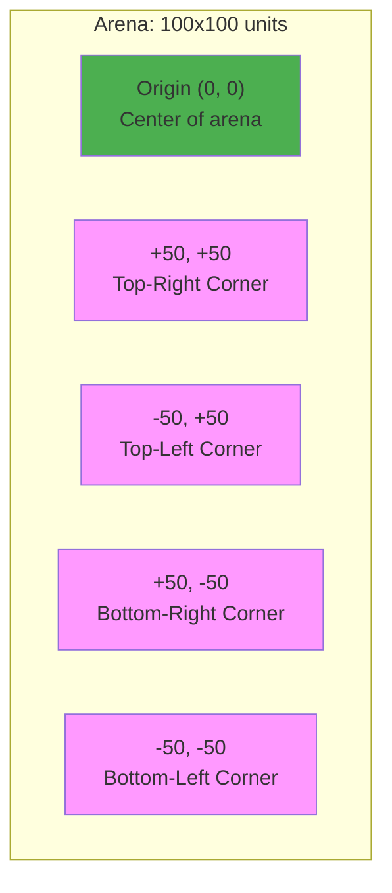
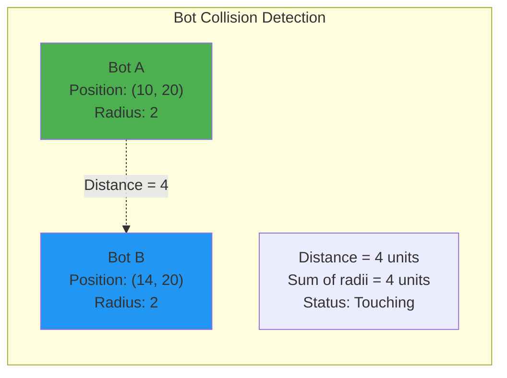
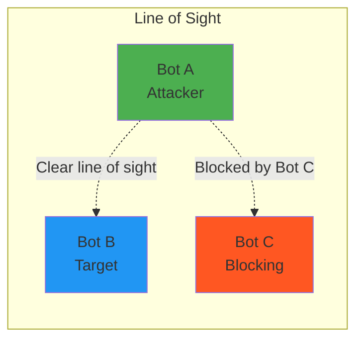

1v1 battles take place in a 2D rectangular arena with defined boundaries. The arena uses a Cartesian coordinate system and applies physics rules for movement, collision, and friction.

> **About Arenas**: A Battle Arena is a configured instance of the BattleBot Universe with specific properties: terrain type (biome), boundary dimensions, visibility rules, starting positions, and win conditions. Different battles may use different arena configurations. For complete technical specification, see **[ADR-0011: 1v1 Battles](/research_and_development/adrs/0011-1v1-battles.md)**.

## Coordinate System

The arena uses a **2D Cartesian coordinate system** - the same (x, y) coordinates you learned in math class.



### Key Properties

- **Origin (0, 0)**: Located at the center of the arena
- **X-axis**: Horizontal axis
  - Positive values extend to the right
  - Negative values extend to the left
  - Range: -50 to +50
- **Y-axis**: Vertical axis
  - Positive values extend upward
  - Negative values extend downward
  - Range: -50 to +50
- **Units**: Abstract spatial units (not meters or pixels)
- **Precision**: Floating-point coordinates allow sub-unit positioning

### Distance Calculation

Distance between two points uses the Pythagorean theorem:

```
distance = √((x₂ - x₁)² + (y₂ - y₁)²)
```

Your SDK provides helper functions for distance calculations.

## Arena Boundaries

The battle space is bounded by a **100 × 100 unit** rectangular arena.

### Boundary Rules

- **X-axis boundaries**: x = -50 (left wall) and x = +50 (right wall)
- **Y-axis boundaries**: y = -50 (bottom wall) and y = +50 (top wall)
- **Movement clamping**: Bots cannot move outside boundaries; position is clamped to the edge
- **No wrapping**: Coordinates do not wrap around (leaving right side doesn't place you on left)
- **No wall damage**: Colliding with walls does not cause damage
- **Elastic collisions**: Bots stop at the wall without bouncing

## Bot Positioning and Collision

Each bot occupies a circular area in the arena.

### Bot Footprint

- **Bot radius**: 2 units
- **Center position**: Bot coordinates (x, y) represent the center of its circular footprint
- **No overlap**: Bots cannot overlap; their circular areas must not intersect



### Collision Detection

**Bot-to-Bot Collision**:
- Two bots collide when the distance between their centers is less than the sum of their radii
- For identical bots: collision occurs when distance < 4 units (2 + 2)
- Collision prevents movement through the other bot

**Bot-to-Wall Collision**:
- **Left wall**: `x - radius < -50`
- **Right wall**: `x + radius > 50`
- **Bottom wall**: `y - radius < -50`
- **Top wall**: `y + radius > 50`

### Collision Resolution

The arena uses **elastic collisions** where momentum is conserved based on bot masses.

**Bot-to-Bot Collision**:
- Bots transfer momentum based on their masses (determined by equipment loadout)
- Heavier bots push lighter bots more effectively
- Velocity is updated along the collision normal (line connecting bot centers)
- Perpendicular velocity components are preserved
- No damage is applied from collision

**Bot-to-Wall Collision**:
- Walls have infinite mass and reflect bots elastically
- Velocity component perpendicular to wall is reversed
- Velocity component parallel to wall is preserved
- Example: hitting the right wall (x = +50) reverses x-velocity while preserving y-velocity

## Physics

The arena applies physics laws that govern bot movement, collisions, and projectile behavior. See [ADR-0006: BattleBot Universe Physics Laws](/research_and_development/adrs/0006-battlebot-universe-physics-laws/) and [ADR-0007: Bot Movement Mechanics](/research_and_development/adrs/0007-bot-movement-mechanics/) for detailed specifications.

### Thrust-Based Movement

Bots control their movement by **applying thrust force**. The game engine calculates acceleration, velocity, and position based on physics laws.

#### Movement Model

Each game tick, the physics engine performs:

1. **Collect forces**: Bot's thrust command, friction opposing movement, and any collision forces
2. **Calculate friction**: `F_friction = μ(position) × M × |v|` where M is bot mass and v is velocity
3. **Calculate net force**: `F_net = F_thrust - F_friction` (friction opposes thrust)
4. **Calculate acceleration**: `A = F_net / M` (heavier bots accelerate slower)
5. **Update velocity**: `v_new = v_current + A × dt`
6. **Update position**: `pos_new = pos_current + v_new × dt`
7. **Apply boundaries and collisions**: Clamp position to arena edges and resolve collisions

#### Key Movement Properties

- **Continuous Thrust Required**: Without applying thrust each tick, friction decelerates your bot to a stop
- **Mass-Based Mobility**: Heavy equipment increases mass (M), reducing acceleration from the same thrust
- **Terminal Velocity**: When thrust force equals friction force, bots reach maximum speed:
  ```
  v_terminal = F_thrust / (μ(position) × M)
  ```
  - Heavier bots reach **lower** terminal velocity
  - Light bots reach **higher** terminal velocity
  - Variable friction zones affect terminal velocity (ice = higher speed, mud = lower speed)

#### Friction Mechanics

- **Surface Friction**: Position-dependent friction coefficient μ(position) resists bot movement
- **Velocity-Dependent**: Friction force magnitude depends on bot's current velocity
- **Natural Deceleration**: Without continuous thrust, friction gradually slows bot to stop
- **Equipment Impact**: Heavy equipment increases mass, requiring more sustained thrust to overcome friction

#### Variable Friction Zones

- **Biome-specific friction**: The selected arena biome determines friction throughout the arena. Different biomes have different terrain types with varying friction coefficients.
  - **Ice zones**: Low friction (coefficient ~0.2) - faster movement, less control
  - **Grass zones**: Medium friction (coefficient ~0.5) - balanced movement
  - **Mud zones**: High friction (coefficient ~1.2) - slower movement, more control
- **Example biomes**: Desert (sand, rock, gravel), Arctic (ice, snow), Forest (grass, swamps, dirt)
- **Future biomes**: Additional biomes will be defined in future versions to provide more terrain variety

## Line of Sight

Line of sight determines whether your bot can "see" or target the opponent bot.



### Line of Sight Rules

1. **Direct path**: Line of sight exists if an unobstructed straight line can be drawn between bot centers
2. **Obstacle blocking**: Other bots block line of sight if the line passes through their circular area
3. **Walls don't block**: Boundary walls do not block line of sight (though weapons may have their own rules)

### Line of Sight Calculation

To determine if Bot A has line of sight to Bot B:

1. Draw a line segment from A's center to B's center
2. For each other bot C in the arena:
   - Calculate the perpendicular distance from C's center to the line segment
   - If this distance is less than C's radius, line of sight is blocked

## Movement Constraints

- **No teleportation**: Bots cannot instantly jump to new positions; all movement follows continuous paths
- **Terminal velocity**: Bots reach maximum speed when thrust force equals friction force (determined by mass and equipment)
- **Collision blocking**: Cannot move through other bots or walls; momentum transfer via elastic collisions
- **Friction decay**: Velocity naturally decreases without continuous thrust application
- **Continuous control**: Each game tick requires explicit thrust commands to sustain movement

## Summary

The 1v1 battle arena is a 100×100 unit rectangular space with:
- 2D Cartesian coordinates centered at origin (0, 0)
- Bounded by walls at x=±50 and y=±50
- Bots as circular footprints with 2-unit radius
- Elastic collisions with momentum transfer based on bot mass
- Thrust-based movement with continuous friction opposing motion
- Terminal velocity determined by thrust, friction, and bot mass
- Line of sight for targeting and detection

For detailed physics specifications, see [ADR-0006: BattleBot Universe Physics Laws](/research_and_development/adrs/0006-battlebot-universe-physics-laws/) and [ADR-0007: Bot Movement Mechanics](/research_and_development/adrs/0007-bot-movement-mechanics/).

Understanding these spatial and physics mechanics is essential for implementing effective bot movement, positioning, and targeting logic.
