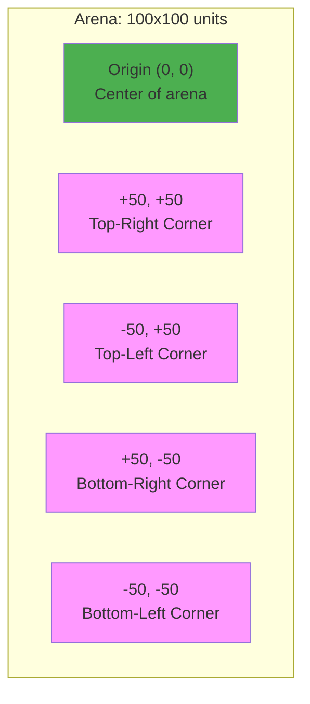
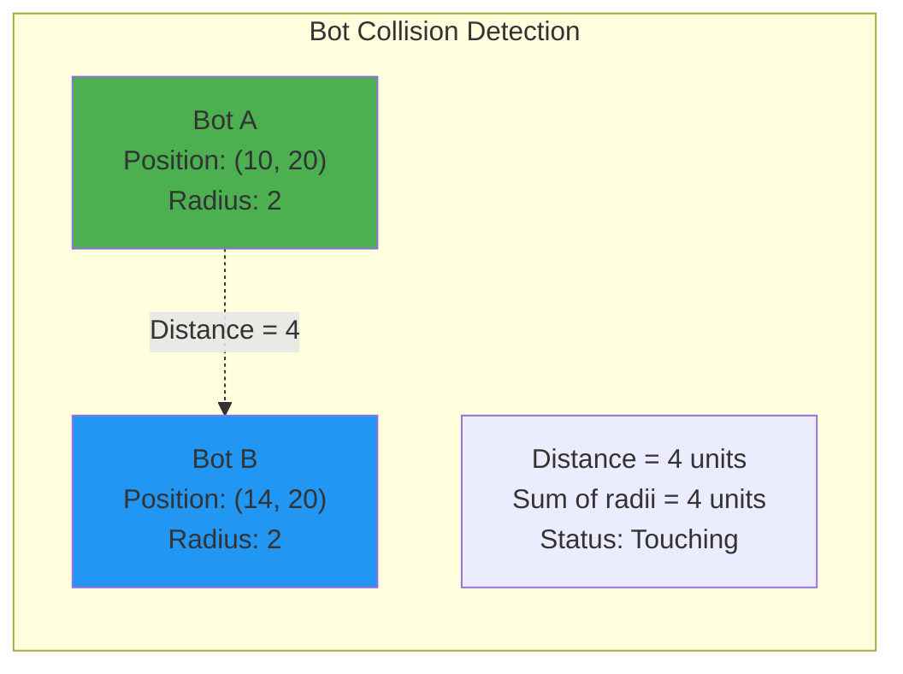

1v1 battles take place in a 2D rectangular arena with defined boundaries. The arena uses a Cartesian coordinate system and applies physics rules for movement, collision, and friction.

> **About Arenas**: A Battle Arena is a configured instance of the BattleBot Universe with specific properties: terrain type (biome), boundary dimensions, visibility rules, starting positions, and win conditions. Different battles may use different arena configurations. For complete technical specification, see **[ADR-0011: 1v1 Battles](/research_and_development/adrs/0011-1v1-battles.md)**.

## Coordinate System

The arena uses a **2D Cartesian coordinate system** - the same (x, y) coordinates you learned in math class.



### Key Properties

- **Origin (0, 0)**: Located at the center of the arena
- **X-axis**: Horizontal axis
  - Positive values extend to the right
  - Negative values extend to the left
  - Range: -50 to +50
- **Y-axis**: Vertical axis
  - Positive values extend upward
  - Negative values extend downward
  - Range: -50 to +50
- **Units**: Abstract spatial units (not meters or pixels)
- **Precision**: Floating-point coordinates allow sub-unit positioning

### Distance Calculation

Distance between two points uses the Pythagorean theorem:

```
distance = √((x₂ - x₁)² + (y₂ - y₁)²)
```

Your SDK provides helper functions for distance calculations.

## Arena Boundaries

The battle space is bounded by a **100 × 100 unit** rectangular arena.

### Boundary Rules

- **X-axis boundaries**: x = -50 (left wall) and x = +50 (right wall)
- **Y-axis boundaries**: y = -50 (bottom wall) and y = +50 (top wall)
- **Movement clamping**: Bots cannot move outside boundaries; position is clamped to the edge
- **No wrapping**: Coordinates do not wrap around (leaving right side doesn't place you on left)
- **No wall damage**: Colliding with walls does not cause damage
- **Elastic collisions**: Bots bounce off walls with velocity reversal (horizontal velocity reversed on vertical walls, vertical velocity reversed on horizontal walls)
- **Selectable**: The 100×100 rectangular boundary is the default configuration. Future versions may offer different arena sizes (75×75, 150×150) and shapes (circular, hexagonal) as selectable options.

## Bot Positioning and Collision

Each bot occupies a circular area in the arena.

### Bot Footprint

- **Bot radius**: 2 units
- **Center position**: Bot coordinates (x, y) represent the center of its circular footprint
- **No overlap**: Bots cannot overlap; their circular areas must not intersect



### Collision Detection

**Bot-to-Bot Collision**:
- Two bots collide when the distance between their centers is less than the sum of their radii
- For identical bots: collision occurs when distance < 4 units (2 + 2)
- Collision prevents movement through the other bot

**Bot-to-Wall Collision**:
- **Left wall**: `x - radius < -50`
- **Right wall**: `x + radius > 50`
- **Bottom wall**: `y - radius < -50`
- **Top wall**: `y + radius > 50`

### Collision Resolution

The arena uses **elastic collisions** where momentum is conserved based on bot masses.

**Bot-to-Bot Collision**:
- Bots transfer momentum based on their masses (determined by equipment loadout)
- Heavier bots push lighter bots more effectively
- Velocity is updated along the collision normal (line connecting bot centers)
- Perpendicular velocity components are preserved
- No damage is applied from collision

**Bot-to-Wall Collision**:
- Walls have infinite mass and reflect bots elastically
- Velocity component perpendicular to wall is reversed (bounce)
- Velocity component parallel to wall is preserved
- Example: Bot moving right hits right wall → x-velocity reversed (bounces left), y-velocity preserved
- Corner collisions reverse both velocity components

## Physics

The arena applies physics laws that govern bot movement, collisions, and projectile behavior. See [ADR-0006: BattleBot Universe Physics Laws](/research_and_development/adrs/0006-battlebot-universe-physics-laws/) and [ADR-0007: Bot Movement Mechanics](/research_and_development/adrs/0007-bot-movement-mechanics/) for detailed specifications.

### Thrust-Based Movement

Bots control their movement by **applying thrust force**. The game engine calculates acceleration, velocity, and position based on physics laws.

#### Movement Model

Each game tick, the physics engine performs:

1. **Collect forces**: Bot's thrust command, friction opposing movement, and any collision forces
2. **Calculate friction**: `F_friction = μ(position) × M × |v|` where M is bot mass and v is velocity
3. **Calculate net force**: `F_net = F_thrust - F_friction` (friction opposes thrust)
4. **Calculate acceleration**: `A = F_net / M` (heavier bots accelerate slower)
5. **Update velocity**: `v_new = v_current + A × dt`
6. **Update position**: `pos_new = pos_current + v_new × dt`
7. **Apply boundary constraints**:
   - Clamp bot position to arena edges (prevents moving outside boundaries)
   - If wall collision detected, apply elastic collision (reverse perpendicular velocity component)
   - Resolve bot-to-bot collisions with momentum transfer

#### Key Movement Properties

- **Continuous Thrust Required**: Without applying thrust each tick, friction decelerates your bot to a stop
- **Mass-Based Mobility**: Heavy equipment increases mass (M), reducing acceleration from the same thrust
- **Terminal Velocity**: When thrust force equals friction force, bots reach maximum speed:
  ```
  v_terminal = F_thrust / (μ(position) × M)
  ```
  - Heavier bots reach **lower** terminal velocity
  - Light bots reach **higher** terminal velocity
  - Variable friction zones affect terminal velocity (ice = higher speed, mud = lower speed)

#### Friction Mechanics

- **Surface Friction**: Position-dependent friction coefficient μ(position) resists bot movement
- **Velocity-Dependent**: Friction force magnitude depends on bot's current velocity
- **Natural Deceleration**: Without continuous thrust, friction gradually slows bot to stop
- **Equipment Impact**: Heavy equipment increases mass, requiring more sustained thrust to overcome friction

#### Variable Friction Zones

- **Biome Selection**: Before battle, you select an arena biome that determines the friction topology (terrain distribution) throughout the arena. Different biomes create different tactical environments through position-dependent friction.
- **Example friction zones** (from future biome implementations):
  - **Ice zones**: Low friction (coefficient ~0.2) - faster movement, less control
  - **Grass zones**: Medium friction (coefficient ~0.5) - balanced movement
  - **Mud zones**: High friction (coefficient ~1.2) - slower movement, more control
- **Planned biomes** (not yet implemented): Desert (sand, rock, gravel), Arctic (ice, snow), Forest (grass, swamps, dirt)
- **Initial implementation**: MVP may support only uniform friction (constant across arena) until concrete biome ADRs are defined
- **Selectable property**: Different battles can use different biomes to create varied tactical challenges

## Visibility System

The visibility system determines what information your bot receives about opponents.

### Full Visibility (Current Implementation)

1v1 battles currently use **full visibility** - your bot has complete information about the opponent at all times:

- **Complete position**: Opponent's exact (x, y) coordinates
- **Complete state**: Opponent's health, velocity, equipment loadout
- **No restrictions**: No fog of war, visibility radius, or line-of-sight limitations
- **Deterministic gameplay**: Complete information enables pure strategic decision-making

This visibility mode is chosen for the initial implementation to validate core combat mechanics without visibility complexity.

### Future Visibility Modes

Future versions may introduce alternative visibility systems:

- **Fog of War**: Limited visibility radius around your bot (e.g., 30 units)
- **Line of Sight**: Obstacles blocking vision between bots
- **Vanishing Fog**: Explored areas remain visible after initial scouting

These advanced visibility modes will be defined in future ADRs after the full visibility baseline is validated through gameplay.

## Start Positioning

At the beginning of each battle, bots are placed at random positions within the arena boundaries.

### Random Positioning Rules

- **Random coordinates**: Each bot is assigned a random (x, y) position within the arena
- **Valid placement range**: Bot centers spawn within x ∈ [-48, 48] and y ∈ [-48, 48] (accounting for 2-unit bot radius)
- **Minimum separation**: Bots spawn at least 20 units apart (subject to playtesting adjustment)
- **Collision-free**: Position generator ensures no bots spawn overlapping or touching
- **Deterministic**: Seed-based randomness enables exact battle replay with same starting positions

### Why Random Positioning?

Random start positions force bot adaptability:

- **No hardcoded openings**: Bots cannot exploit fixed spawn points with pre-programmed strategies
- **General-purpose AI**: Bot logic must work from any starting position
- **Fair and balanced**: Uniform probability distribution ensures no positional advantage
- **Varied gameplay**: Each battle starts differently, creating diverse tactical situations

Your bot must be prepared to start anywhere in the arena and adapt its initial strategy accordingly.

## Movement Constraints

- **No teleportation**: Bots cannot instantly jump to new positions; all movement follows continuous paths
- **Terminal velocity**: Bots reach maximum speed when thrust force equals friction force (determined by mass and equipment)
- **Collision blocking**: Cannot move through other bots or walls; momentum transfer via elastic collisions
- **Friction decay**: Velocity naturally decreases without continuous thrust application
- **Continuous control**: Each game tick requires explicit thrust commands to sustain movement

## Summary

The 1v1 battle arena provides a configured battle environment with:

**Spatial System**:
- 2D Cartesian coordinates centered at origin (0, 0)
- Default 100×100 unit rectangular boundary (selectable property, other sizes planned)
- Bounded by walls at x=±50 and y=±50
- Bots as circular footprints with 2-unit radius

**Physics and Movement**:
- Thrust-based movement with continuous friction opposing motion
- Terminal velocity determined by thrust, friction, and bot mass
- Elastic collisions: walls bounce bots (velocity reversal), bot-to-bot collisions transfer momentum

**Battle Configuration**:
- **Biome selection**: Choose terrain friction topology (planned feature, MVP may use uniform friction)
- **Full visibility**: Complete information about opponent position and state
- **Random start positions**: Bots spawn randomly with 20-unit minimum separation

For detailed physics specifications, see [ADR-0006: BattleBot Universe Physics Laws](/research_and_development/adrs/0006-battlebot-universe-physics-laws/) and [ADR-0007: Bot Movement Mechanics](/research_and_development/adrs/0007-bot-movement-mechanics/). For complete arena property definitions, see [ADR-0011: 1v1 Battles](/research_and_development/adrs/0011-1v1-battles/).

Understanding these spatial and physics mechanics is essential for implementing effective bot movement, positioning, and targeting logic.
