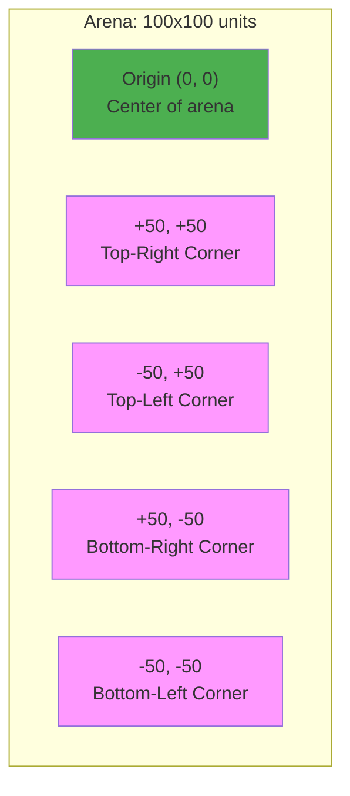
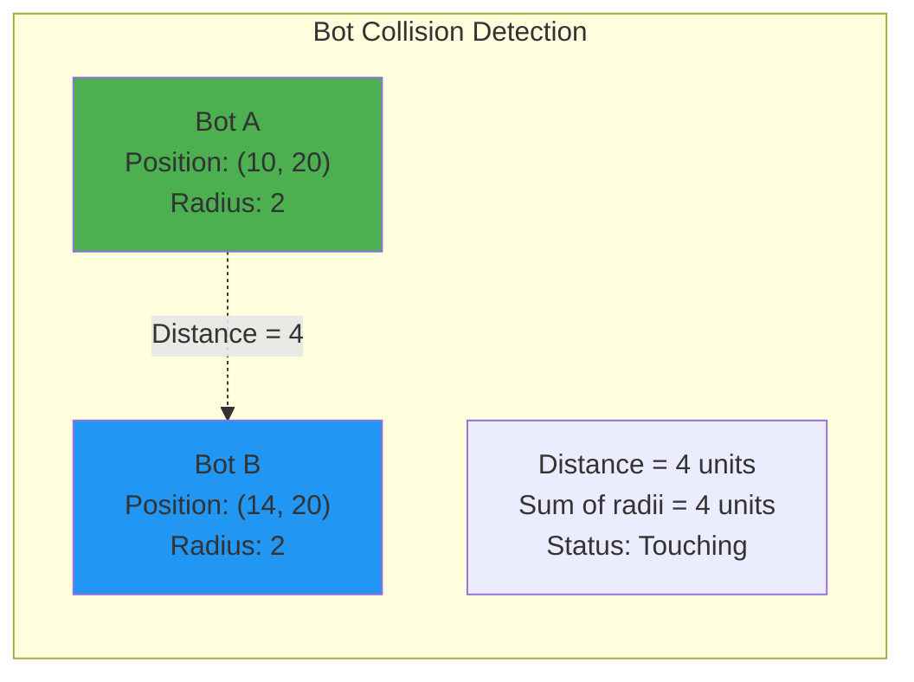
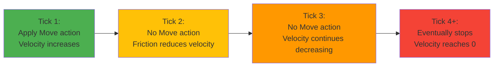
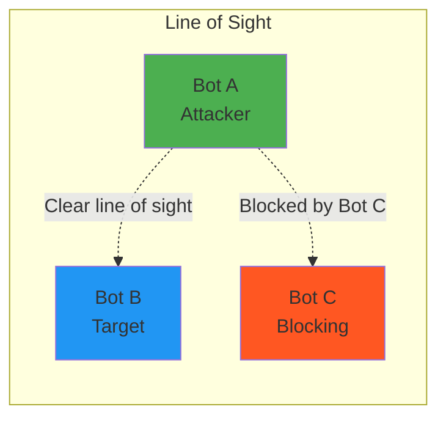

## Arena Overview

1v1 battles take place in a 2D rectangular arena with defined boundaries. The arena uses a Cartesian coordinate system and applies physics rules for movement, collision, and friction.

## Coordinate System

The arena uses a **2D Cartesian coordinate system** - the same (x, y) coordinates you learned in math class.



### Key Properties

- **Origin (0, 0)**: Located at the center of the arena
- **X-axis**: Horizontal axis
  - Positive values extend to the right
  - Negative values extend to the left
  - Range: -50 to +50
- **Y-axis**: Vertical axis
  - Positive values extend upward
  - Negative values extend downward
  - Range: -50 to +50
- **Units**: Abstract spatial units (not meters or pixels)
- **Precision**: Floating-point coordinates allow sub-unit positioning

### Distance Calculation

Distance between two points uses the Pythagorean theorem:

```
distance = √((x₂ - x₁)² + (y₂ - y₁)²)
```

Your SDK provides helper functions for distance calculations.

## Arena Boundaries

The battle space is bounded by a **100 × 100 unit** rectangular arena.

### Boundary Rules

- **X-axis boundaries**: x = -50 (left wall) and x = +50 (right wall)
- **Y-axis boundaries**: y = -50 (bottom wall) and y = +50 (top wall)
- **Movement clamping**: Bots cannot move outside boundaries; position is clamped to the edge
- **No wrapping**: Coordinates do not wrap around (leaving right side doesn't place you on left)
- **No wall damage**: Colliding with walls does not cause damage
- **Elastic collisions**: Bots stop at the wall without bouncing

## Bot Positioning and Collision

Each bot occupies a circular area in the arena.

### Bot Footprint

- **Bot radius**: 2 units
- **Center position**: Bot coordinates (x, y) represent the center of its circular footprint
- **No overlap**: Bots cannot overlap; their circular areas must not intersect



### Collision Detection

**Bot-to-Bot Collision**:
- Two bots collide when the distance between their centers is less than the sum of their radii
- For identical bots: collision occurs when distance < 4 units (2 + 2)
- Collision prevents movement through the other bot

**Bot-to-Wall Collision**:
- **Left wall**: `x - radius < -50`
- **Right wall**: `x + radius > 50`
- **Bottom wall**: `y - radius < -50`
- **Top wall**: `y + radius > 50`

### Collision Resolution

When collision is detected:
1. Movement is adjusted to place the bot at the point of contact
2. Bots stop at the obstacle without pushing or displacement
3. No damage is applied from collision

## Physics

### Friction

The arena applies **friction** to all moving bots, affecting their velocity over time.



#### Friction Mechanics

- **Friction coefficient (μ)**: 0.1 (subject to balance tuning)
- **Velocity decay**: Each tick, friction reduces your bot's velocity
- **Natural stopping**: Without continuous thrust, your bot will gradually slow to a stop
- **Continuous movement**: Maintaining velocity requires repeated Move actions

#### Friction Formula

```
friction_force = -μ × velocity
new_velocity = velocity + friction_force
```

The negative sign indicates friction opposes the direction of movement.

#### Variable Friction Zones

- **Uniform friction**: By default, the entire arena has uniform friction (μ = 0.1)
- **Future feature**: Specific areas may have different friction values (slippery or rough surfaces)

## Line of Sight

Line of sight determines whether your bot can "see" or target the opponent bot.



### Line of Sight Rules

1. **Direct path**: Line of sight exists if an unobstructed straight line can be drawn between bot centers
2. **Obstacle blocking**: Other bots block line of sight if the line passes through their circular area
3. **Walls don't block**: Boundary walls do not block line of sight (though weapons may have their own rules)

### Line of Sight Calculation

To determine if Bot A has line of sight to Bot B:

1. Draw a line segment from A's center to B's center
2. For each other bot C in the arena:
   - Calculate the perpendicular distance from C's center to the line segment
   - If this distance is less than C's radius, line of sight is blocked

## Movement Constraints

- **No teleportation**: Bots cannot instantly jump to new positions; all movement follows continuous paths
- **Speed limits**: Bots have maximum movement speeds (defined by bot characteristics and equipment)
- **Collision blocking**: Cannot move through other bots or walls
- **Friction decay**: Velocity naturally decreases without continuous thrust

## Summary

The 1v1 battle arena is a 100×100 unit rectangular space with:
- 2D Cartesian coordinates centered at origin (0, 0)
- Bounded by walls at x=±50 and y=±50
- Bots as circular footprints with 2-unit radius
- Collision detection preventing overlap
- Friction (μ=0.1) causing velocity decay
- Line of sight for targeting and detection

Understanding these spatial mechanics is essential for implementing effective bot movement, positioning, and targeting logic.
