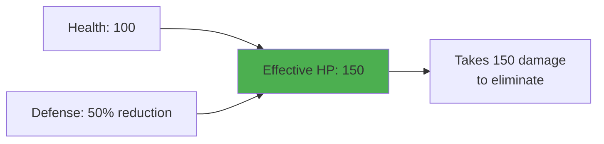
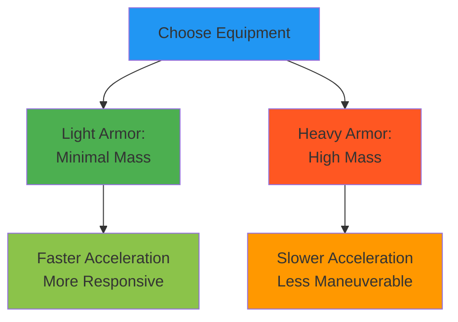

Your bot's capabilities are defined by three core characteristics: **Health**, **Defense**, and **Mass**. These stats determine your survivability, damage mitigation, and movement properties.

## Health

Health (HP) is your bot's survivability pool - the total amount of damage your bot can sustain before being eliminated.

### Key Properties

- **HP Pool**: Total damage your bot can take before destruction
  - Range: 100-500 HP (placeholder values, subject to balance tuning)
- **Destruction**: Bot is eliminated when Health reaches 0
- **No Regeneration**: Health does not regenerate during battle (current design)

### Gameplay Impact

- Higher Health allows your bot to stay in battles longer
- Low-Health bots must rely on damage avoidance through mobility or defensive actions
- Health works multiplicatively with Defense to create Effective HP (see below)

## Defense

Defense represents your bot's ability to mitigate incoming damage. It reduces the effective damage from enemy attacks.

### Key Properties

- **Damage Reduction**: Reduces incoming damage by a percentage or flat amount
  - Range: 1-10 Defense (placeholder values, subject to balance tuning)
- **Applies to All Damage**: Affects all incoming damage sources (current design)
- **No Evasion**: Defense reduces damage taken, not hit chance

### Gameplay Impact

- Each point of Defense makes your Health more valuable
- Defense and Health combine multiplicatively to increase effective survivability
- Higher Defense enables sustained engagements

## Effective HP

Health and Defense work together to determine your **true survivability**:



### Effective HP Formula

```
Effective HP = Health × (1 + Defense modifier)
```

**Example**: A bot with 100 Health and 50% Defense has 150 Effective HP - it takes 150 points of damage to destroy.

### Why This Matters

- Balanced allocation of Health and Defense is more effective than stacking one stat
- Example: 100 Health + 50% Defense (150 Effective HP) provides better burst damage resistance than 150 Health + 0% Defense

## Mass

Mass represents your bot's total weight, determined by your equipment loadout. **Mass is not directly allocated** - it's calculated from your equipped items.

### Key Properties

- **Equipment-Derived**: `Total Mass = Base Mass + Equipment Mass`
- **Dynamic Value**: Changes based on equipped weapons, armor, and modules
- **Movement Impact**: Higher Mass reduces acceleration (more force needed to overcome inertia and friction)
- **No Direct Damage Scaling**: Mass affects mobility, not offensive capability



### Gameplay Impact

- Heavy equipment (powerful weapons, heavy armor) increases Mass, reducing mobility
- Light equipment maintains mobility but sacrifices offensive/defensive power
- Mass cannot be optimized independently - it's a consequence of equipment choices
- Higher Mass requires sustained thrust to overcome friction and maintain velocity

### Equipment Examples

- **Weapons**: Heavy weapons (high Mass) vs. light weapons (low Mass)
- **Armor**: Heavy plating (high Mass) vs. light armor (low Mass)
- Each equipment choice contributes to your total Mass profile

## Stat Interactions

Bot characteristics don't operate in isolation - they combine to create complex gameplay dynamics.

### Effective Durability

Health and Defense multiply together to determine true survivability:

- **Formula**: `Effective HP = Health × (1 + Defense modifier)`
- **Optimization**: Balanced allocation is more efficient than single-stat stacking
- **Example**: 100 Health + 50% Defense (150 Effective HP) is more effective against burst damage than 150 Health + 0% Defense

### Mass and Mobility

Mass directly impacts movement capability:

- **Thrust Relationship**: `Acceleration = Thrust Force / Mass`
- **Friction Impact**: Higher Mass requires more sustained thrust to overcome arena friction (μ=0.1)
- **Equipment Tradeoff**: Heavy equipment increases power but reduces positioning flexibility

### Survivability Tradeoffs

Defensive investment creates build choices:

- **High Health + Low Defense**: Vulnerable to sustained damage
- **Low Health + High Defense**: Vulnerable to burst damage
- **High Mass**: Defense from heavy armor reduces mobility, increasing thrust requirements

## Summary

Bot characteristics create a three-stat system:

- **Health**: Your survivability pool (how much damage you can take)
- **Defense**: Damage mitigation (makes each Health point more valuable)
- **Mass**: Equipment weight (affects acceleration and mobility)

These stats interact to create diverse bot profiles. Your equipment choices (covered in [Equipment](equipment/)) determine your final stat allocation and Mass.

Understanding these characteristics is essential for configuring effective bot loadouts and implementing smart combat logic.
