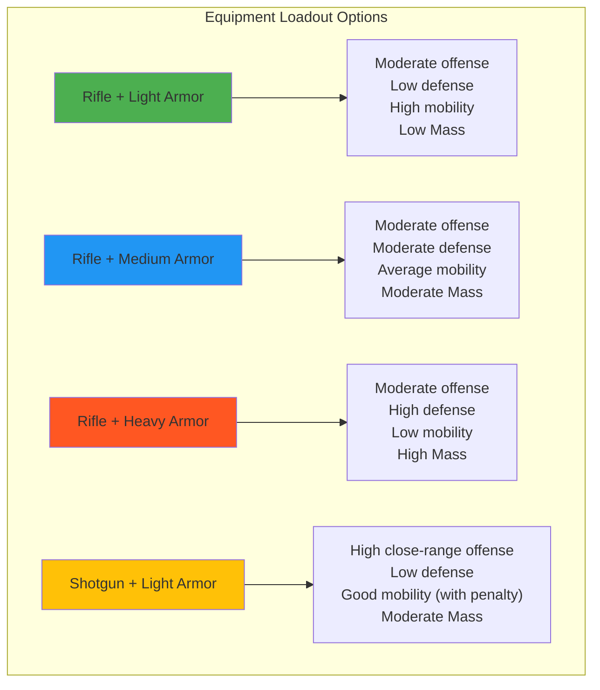


The equipment system described here is currently in the PROPOSED stage and may change based on playtesting and balance analysis. Check back for updates!


## Equipment System Overview

Before battle, you configure your bot's **loadout** by selecting equipment. Equipment modifies your bot's characteristics and determines which actions are available during battle.

### Loadout Slots

Each bot equips:
- **1 Weapon** - Determines available combat actions
- **1 Armor** - Modifies Defense and Speed characteristics

All equipment contributes to your bot's total Mass, which affects movement acceleration.

## Weapons

Weapons enable combat actions and determine offensive capabilities. Each weapon provides unique attack actions with different energy costs, damage patterns, and range characteristics.

### Rifle

Standard precision weapon enabling reliable ranged attacks.

**Stat Effects**:
- No stat modifications (baseline weapon)
- Mass Contribution: TBD (baseline weapon mass)

**Characteristics**:
- Enables: RifleShot action
- Damage: Moderate (TBD)
- Range: Long (TBD)
- Energy Cost: 15 per shot (TBD)
- Cooldown: 1 tick (TBD)

**Profile**: Versatile baseline option suitable for various loadouts. No stat penalties, maintains mobility. Effective at medium to long range with consistent damage output.

### Shotgun

Close-range weapon enabling devastating burst damage with distance-based damage falloff.

**Stat Effects**:
- Speed Penalty: -1 (TBD)
- Range Penalty: -1 (TBD)
- Mass Contribution: TBD (higher than Rifle)

**Characteristics**:
- Enables: ShotgunBlast action
- Damage: High at close range, decreases with distance (TBD)
- Range: Short to medium (TBD)
- Energy Cost: 20 per shot (TBD)
- Cooldown: 2 ticks (TBD)

**Profile**: High burst damage at close range. Weight penalty reduces mobility. Requires positioning to maximize effectiveness. Ineffective at long range due to damage falloff.

## Armor

Armor provides defensive bonuses and damage mitigation. Armor modifies Defense and Speed characteristics, creating tradeoffs between survivability and mobility. All armor contributes to bot Mass.

### Light Armor

Minimal protection that maintains mobility.

**Stat Effects**:
- Defense: +1 (TBD)
- Speed: No penalty (TBD)
- Mass Contribution: TBD (minimal)

**Profile**: Minimal defense bonus with no speed penalty. Preserves mobility for positioning-focused loadouts. Relies on movement rather than damage absorption.

### Medium Armor

Balanced protection with moderate defensive bonus and minor speed penalty.

**Stat Effects**:
- Defense: +2 (TBD)
- Speed: -1 (TBD)
- Mass Contribution: TBD (moderate)

**Profile**: Reasonable defense without severe mobility cost. Versatile option for balanced loadouts. Moderate survivability increase with manageable speed reduction.

### Heavy Armor

Maximum protection with significant defensive bonus and substantial speed penalty.

**Stat Effects**:
- Defense: +3 (TBD)
- Speed: -2 (TBD)
- Mass Contribution: TBD (high)

**Profile**: Maximum damage reduction. Significant speed penalty limits mobility. Enables sustained engagements and damage absorption. Requires positional awareness due to low mobility.

## Equipment Combinations

Here are example equipment combinations showing how weapons and armor create different bot profiles. These are presented as factual loadout options, not as recommendations.



### Rifle + Light Armor

**Stat Profile**:
- Offense: Moderate (long-range precision)
- Defense: Low (+1 from Light Armor)
- Mobility: High (no speed penalties)
- Mass: Low (minimal equipment weight)

**Characteristics**: Maintains mobility with consistent ranged damage. No speed penalties. Low defensive capability. Relies on positioning and movement.

### Rifle + Medium Armor

**Stat Profile**:
- Offense: Moderate (long-range precision)
- Defense: Moderate (+2 from Medium Armor)
- Mobility: Average (-1 from Medium Armor)
- Mass: Moderate

**Characteristics**: Balanced offensive and defensive capabilities. Slight speed reduction. Versatile loadout with no extreme strengths or weaknesses.

### Rifle + Heavy Armor

**Stat Profile**:
- Offense: Moderate (long-range precision)
- Defense: High (+3 from Heavy Armor)
- Mobility: Low (-2 from Heavy Armor)
- Mass: High

**Characteristics**: High damage reduction with sustained survivability. Significant mobility penalty. Reliable ranged offense. Positioning is critical due to low mobility.

### Shotgun + Light Armor

**Stat Profile**:
- Offense: High at close range (burst damage)
- Defense: Low (+1 from Light Armor)
- Mobility: Good (Shotgun -1 penalty, no armor penalty)
- Mass: Moderate (Shotgun has higher mass than Rifle)

**Characteristics**: High burst damage potential at close range. Reduced effectiveness at distance. Relatively mobile despite shotgun weight. Low survivability requires damage avoidance.

## Equipment and Actions

Equipment determines which actions are available:

- **Rifle**: Enables RifleShot action
- **Shotgun**: Enables ShotgunBlast action
- **Universal Actions**: Move, Block, Evade, Shield, Scan, Charge are available regardless of equipment

See the [Actions](actions/) page for complete action details.

## Equipment and Mass

All equipment contributes to your bot's total Mass:

```
Total Mass = Base Mass + Weapon Mass + Armor Mass
```

Higher Mass reduces acceleration (you need more force to move the same speed). This creates a natural tradeoff where powerful equipment inherently reduces mobility.

**Example Mass Impacts**:
- Light loadout (Rifle + Light Armor): Fast acceleration, responsive movement
- Heavy loadout (Shotgun + Heavy Armor): Slow acceleration, requires sustained thrust to overcome friction

Mass calculations and specific values are TBD pending balance testing.

## Configuration

Equipment is configured before battle begins:

```python
loadout = {
    "weapon": "Rifle",        # or "Shotgun"
    "armor": "Light Armor"    # or "Medium Armor" or "Heavy Armor"
}
```

Equipment cannot be changed during battle.

## Summary

The equipment system provides:
- **2 Weapon Options**: Rifle (baseline precision), Shotgun (close-range burst)
- **3 Armor Options**: Light (mobility), Medium (balanced), Heavy (survivability)
- **4 Example Combinations**: Demonstrating different stat profiles
- **Mass Tradeoffs**: Heavy equipment reduces mobility through increased Mass
- **Action Enablement**: Equipment determines available combat actions

Equipment choices define your bot's capabilities before battle. Understanding these tradeoffs is essential for effective loadout configuration.
