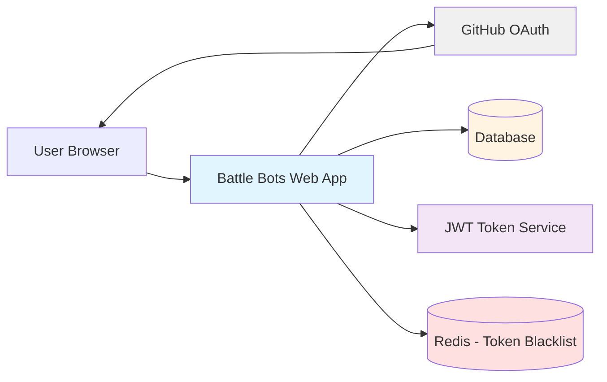

<!--
ADR Categories:
- strategic: High-level architectural decisions (frameworks, auth strategies, cross-cutting patterns)
- user-journey: Solutions for specific user journey problems (feature implementation approaches)
- api-design: API endpoint design decisions (pagination, filtering, bulk operations)
-->

## Context and Problem Statement

Users need a way to register and authenticate with the Battle Bots platform to create and manage their autonomous bots. The registration process should be secure, user-friendly, and minimize friction for developers who are our target audience.

How should we implement user registration and authentication for the Battle Bots platform?

## Decision Drivers

* User experience: Minimize registration friction for developer audience
* Security: Ensure secure authentication without managing passwords
* Implementation complexity: Reduce development and maintenance burden
* Timeline: Need to launch quickly with minimal authentication infrastructure
* Trust: Leverage existing identity providers that developers already use
* Bot deployment: Need to tie bot ownership to verified user accounts

## Considered Options

* GitHub OAuth authentication
* Email/password registration with JWT
* Google OAuth authentication
* Support multiple OAuth providers (GitHub, Google, GitLab)

## Decision Outcome

Chosen option: "GitHub OAuth authentication with stateless JWT tokens", because it best meets our decision drivers:

* **User experience**: Developers already have GitHub accounts - minimal registration friction
* **Security**: Leverages GitHub's OAuth 2.0 without password management burden
* **Implementation complexity**: Single OAuth provider reduces development time
* **Timeline**: Fastest path to launch with proven technology
* **Trust**: GitHub is the natural identity provider for our developer audience
* **Scalability**: Stateless JWT tokens enable horizontal scaling without session synchronization

The implementation uses GitHub OAuth for initial authentication, then converts the GitHub access token to internal JWT tokens for stateless API authentication. This hybrid approach provides OAuth convenience with JWT scalability.

### Consequences

* Good, because no server-side session state enables horizontal scalability
* Good, because JWT tokens reduce database lookups (user info in token claims)
* Good, because stateless architecture simplifies microservices integration
* Good, because developers trust GitHub as identity provider
* Good, because refresh token rotation provides security without UX friction
* Neutral, because requires implementing JWT token service (RS256 signing/validation)
* Neutral, because GitHub OAuth is OAuth 2.0, not OIDC (must generate our own ID tokens)
* Bad, because vendor dependency on GitHub for initial authentication
* Bad, because requires token blacklist for immediate revocation (adds some state)
* Bad, because limits to users with GitHub accounts (acceptable for developer audience)

### Confirmation

Implementation compliance will be confirmed through:

1. **Security Testing**: Penetration testing validates XSS/CSRF protection, token validation, and PKCE implementation
2. **Integration Tests**: Automated tests verify complete OAuth flow and JWT token generation/validation
3. **Code Review**: Security-focused review of JWT signing, token storage, and refresh token rotation
4. **Load Testing**: Horizontal scalability validated with 10,000+ concurrent users across multiple servers
5. **Documentation Review**: Architecture diagrams and sequence diagrams accurately reflect stateless JWT implementation

<!-- This is an optional element. Feel free to remove. -->
## Pros and Cons of the Options

### GitHub OAuth authentication

Single OAuth provider (GitHub) for registration and authentication.

* Good, because target audience (developers) already have GitHub accounts
* Good, because no password management or reset flows needed
* Good, because GitHub's OAuth is well-documented and reliable
* Good, because reduces implementation complexity and time to launch
* Good, because GitHub identity ties naturally to developer workflows
* Neutral, because limits to users with GitHub accounts (acceptable for developer audience)
* Bad, because vendor dependency on GitHub
* Bad, because no fallback if GitHub OAuth is unavailable

#### Implementation Visualization

**Architecture Diagram:**

**Note**: Session Store has been replaced with stateless JWT Token Service. Redis is optional for token revocation blacklist.

**REST API Endpoints:**

| Method | Endpoint | Auth Required | Purpose |
|--------|----------|---------------|---------|
| `GET` | `/auth/github/login` | No | Initiates GitHub OAuth flow with PKCE by generating code_challenge and CSRF state token, redirecting to GitHub authorization page |
| `GET` | `/auth/github/callback` | No | Handles OAuth callback from GitHub, exchanges auth code for GitHub access token, fetches user profile, creates/updates account, **generates internal JWT access token + refresh token**, sets httpOnly cookies |
| `POST` | `/auth/terms/accept` | JWT (Cookie) | Accepts terms of service for new user accounts (called before account creation) |
| `POST` | `/auth/refresh` | Refresh Token (Cookie) | Exchanges valid refresh token for new JWT access token + new refresh token (rotation), updates httpOnly cookies |
| `GET` | `/auth/session` | JWT (Cookie) | Returns current authenticated user information from JWT claims (no database lookup) |
| `POST` | `/auth/logout` | JWT (Cookie) | Revokes refresh token in database, optionally blacklists JWT, clears authentication cookies |

**Sequence Diagram - Registration/Login Flow:**

### Email/password registration with JWT

Traditional registration with email/password and JWT tokens.

* Good, because no dependency on external OAuth providers
* Good, because works for users without third-party accounts
* Good, because full control over authentication flow
* Bad, because requires implementing password reset, email verification
* Bad, because need to securely store and hash passwords
* Bad, because higher implementation and maintenance complexity
* Bad, because more friction in registration process
* Bad, because security burden of password management

#### Implementation Visualization

**Architecture Diagram:**

**REST API Endpoints:**

*Authentication Endpoints:*

| Method | Endpoint | Auth Required | Purpose |
|--------|----------|---------------|---------|
| `POST` | `/auth/register` | No | Register new user account with email, password, and username. Sends verification email. |
| `POST` | `/auth/login` | No | Authenticate with email/password credentials. Returns JWT access token (15min) and refresh token (7 day). |
| `POST` | `/auth/logout` | JWT | Invalidates refresh token and terminates user session. |
| `POST` | `/auth/refresh` | Refresh Token | Exchanges valid refresh token for new access token. |

*Email Verification Endpoints:*

| Method | Endpoint | Auth Required | Purpose |
|--------|----------|---------------|---------|
| `GET` | `/auth/verify-email` | No | Verifies email address using token from verification email (query param: `token`). |
| `POST` | `/auth/resend-verification` | No | Resends verification email to user's registered email address. |

*Password Management Endpoints:*

| Method | Endpoint | Auth Required | Purpose |
|--------|----------|---------------|---------|
| `POST` | `/auth/forgot-password` | No | Requests password reset. Sends reset email if account exists (always returns success to prevent enumeration). |
| `POST` | `/auth/reset-password` | No | Resets password using token from reset email. Requires `token` and `new_password` in request body. |
| `POST` | `/auth/change-password` | JWT | Changes password for authenticated user. Requires `current_password` and `new_password`. |

**Sequence Diagram - Registration Flow:**

**Sequence Diagram - Login Flow:**

**Sequence Diagram - Password Reset Flow:**

### Google OAuth authentication

Single OAuth provider (Google) for registration and authentication.

* Good, because most users have Google accounts
* Good, because no password management needed
* Good, because Google OAuth is reliable and well-documented
* Neutral, because less aligned with developer-focused audience than GitHub
* Bad, because vendor dependency on Google
* Bad, because no fallback if Google OAuth is unavailable

#### Implementation Visualization

**Architecture Diagram:**

**REST API Endpoints:**

| Method | Endpoint | Auth Required | Purpose |
|--------|----------|---------------|---------|
| `GET` | `/auth/google/login` | No | Initiates Google OAuth flow by generating CSRF state token and redirecting to Google authorization page |
| `GET` | `/auth/google/callback` | No | Handles OAuth callback from Google, exchanges auth code for access token, validates ID token, fetches user profile, creates/updates account |
| `POST` | `/auth/terms/accept` | Session | Accepts terms of service for new user accounts (called before account creation) |
| `GET` | `/auth/session` | Session | Returns current authenticated user information and session status |
| `POST` | `/auth/logout` | Session | Terminates user session and clears authentication cookies/tokens |

**Sequence Diagram - Registration/Login Flow:**

### Support multiple OAuth providers (GitHub, Google, GitLab)

Allow users to choose from multiple OAuth providers.

* Good, because provides user choice and flexibility
* Good, because reduces single vendor dependency
* Good, because accommodates different user preferences
* Bad, because significantly higher implementation complexity
* Bad, because need to handle account linking/merging
* Bad, because increases testing surface area
* Bad, because delays time to launch
* Bad, because more complex user experience (choice paralysis)

#### Implementation Visualization

**Architecture Diagram:**

**REST API Endpoints:**

*OAuth Authentication Endpoints (Provider-Agnostic):*

| Method | Endpoint | Auth Required | Purpose |
|--------|----------|---------------|---------|
| `GET` | `/auth/:provider/login` | No | Initiates OAuth flow for specified provider (`:provider` = `github`, `google`, or `gitlab`). Generates CSRF state and redirects. |
| `GET` | `/auth/:provider/callback` | No | Handles OAuth callback from specified provider. Exchanges code for token, fetches profile, handles account creation/linking logic. |
| `POST` | `/auth/terms/accept` | Session | Accepts terms of service for new user accounts (called before account creation). |
| `GET` | `/auth/session` | Session | Returns current authenticated user information, session status, and list of linked providers. |
| `POST` | `/auth/logout` | Session | Terminates user session and clears authentication cookies/tokens. |

*Provider Management Endpoints:*

| Method | Endpoint | Auth Required | Purpose |
|--------|----------|---------------|---------|
| `GET` | `/auth/providers` | Session (optional) | Lists available OAuth providers. If authenticated, includes which providers are linked to current user's account. |
| `POST` | `/auth/link/:provider` | Session | Initiates OAuth flow to link an additional provider to the authenticated user's existing account. |
| `DELETE` | `/auth/unlink/:provider` | Session | Unlinks specified provider from authenticated user's account. Requires at least one provider to remain linked. |

**Sequence Diagram - Provider Selection and Registration:**

**Sequence Diagram - Account Linking (Authenticated User):**

**Key Implementation Considerations:**

- **Provider Strategy Pattern**: Each OAuth provider (GitHub, Google, GitLab) has its own strategy implementing a common interface for authorization, token exchange, and profile fetching
- **Account Linking Logic**: Must handle cases where users authenticate with different providers but share the same email
- **Data Model**: Requires `linked_providers` table with columns: `user_id`, `provider`, `provider_user_id`, `provider_username`, `linked_at`
- **Testing Complexity**: Need integration tests for each provider plus account linking scenarios
- **User Experience**: Clear messaging when email conflicts occur across providers

<!-- This is an optional element. Feel free to remove. -->
## More Information

Related to User Journey 0001 (User Registration and Authentication).

This decision focuses on the initial launch strategy. Future ADRs may address:
- Adding additional OAuth providers based on user feedback
- Account migration strategies if switching providers
- Service account or API key authentication for bot deployments
