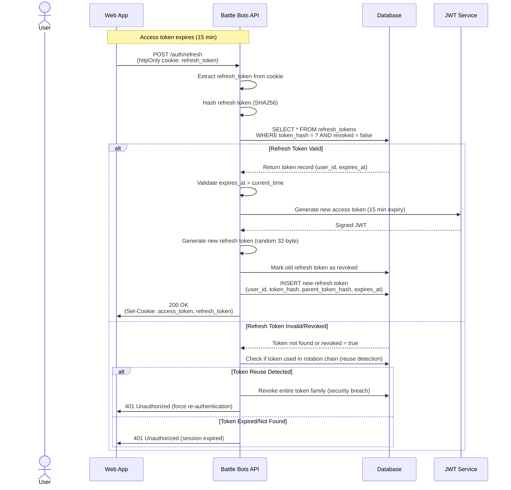

<!--
ADR Categories:
- strategic: High-level architectural decisions (frameworks, auth strategies, cross-cutting patterns)
- user-journey: Solutions for specific user journey problems (feature implementation approaches)
- api-design: API endpoint design decisions (pagination, filtering, bulk operations)
-->

## Context and Problem Statement

After users authenticate via GitHub OAuth (ADR-0002), the platform needs to authenticate subsequent API requests. Traditional session-based authentication stores user state on the server, requiring session lookup on every request and creating horizontal scaling challenges. How should the Battle Bots platform authenticate API requests in a scalable, secure manner without server-side session state?

## Decision Drivers

* **Horizontal Scalability**: Need to scale across multiple servers without session synchronization
* **Performance**: Minimize database lookups on every API request
* **Security**: Protect against XSS, CSRF, token replay, and unauthorized access
* **User Experience**: Seamless authentication without frequent re-login
* **Token Revocation**: Ability to invalidate tokens when needed (logout, security breach)
* **Microservices Architecture**: Enable stateless token validation across multiple services
* **Developer Experience**: Simple implementation with well-supported libraries
* **Cost**: Minimize infrastructure overhead (no distributed session store required)

## Considered Options

* **Option 1**: JWT tokens with RS256 signing and httpOnly cookies
* **Option 2**: Server-side sessions with distributed session store (Redis)
* **Option 3**: OAuth2 opaque tokens with token introspection endpoint
* **Option 4**: JWT tokens with HS256 signing and localStorage

## Decision Outcome

Chosen option: **"Option 1: JWT tokens with RS256 signing and httpOnly cookies"**, because it provides the best balance of security, scalability, and developer experience for our use case.

The implementation uses:
- **Access Tokens**: Short-lived (15 min) JWT tokens signed with RS256, stored in httpOnly cookies
- **Refresh Tokens**: Long-lived (7 days) random tokens with rotation, stored in httpOnly cookies
- **CSRF Protection**: CSRF tokens in separate cookies, validated via request headers
- **Token Revocation**: Optional Redis blacklist for immediate revocation needs

### Consequences

* Good, because stateless tokens enable horizontal scaling without session synchronization
* Good, because JWT claims eliminate database lookups for user identity on every request
* Good, because RS256 allows signature verification with public key (multiple services can validate)
* Good, because httpOnly cookies protect tokens from XSS attacks
* Good, because short-lived access tokens limit exposure window if compromised
* Good, because refresh token rotation detects and prevents token theft
* Good, because mature JWT libraries available in all languages (Go, JavaScript, Python)
* Good, because tokens can be shared across multiple microservices
* Neutral, because requires implementing JWT signing/validation service
* Neutral, because token blacklist adds minimal state for revocation (optional, TTL-based)
* Bad, because tokens valid until expiry (requires short expiry or blacklist for revocation)
* Bad, because JWT tokens larger than session IDs (network overhead)
* Bad, because clock skew between servers requires tolerance window in validation

### Confirmation

Implementation compliance will be confirmed through:

1. **Unit Tests**: JWT generation, validation, signature verification, claim validation, token rotation
2. **Security Tests**: XSS prevention (httpOnly cookies), CSRF prevention (SameSite + tokens), token replay protection, expiry enforcement
3. **Integration Tests**: Complete OAuth → JWT flow, token refresh with rotation, logout and revocation
4. **Performance Tests**: JWT validation latency < 1ms, horizontal scaling across multiple servers
5. **Code Review**: Security-focused review of cryptographic operations, token storage, and validation logic

## Pros and Cons of the Options

### Option 1: JWT tokens with RS256 signing and httpOnly cookies

Use JSON Web Tokens signed with RSA asymmetric keys (RS256), stored in httpOnly cookies with CSRF protection.

**Access Token Strategy**:
- Format: JWT with standard claims (iss, sub, aud, exp, iat, jti) + custom claims (github_id, username, email, roles)
- Signing: RS256 (private key signs, public key verifies)
- Storage: httpOnly, secure, SameSite=strict cookie
- Expiry: 15 minutes
- Validation: Signature + claims validation on every request

**Refresh Token Strategy**:
- Format: Random 32-byte cryptographic token (NOT JWT)
- Storage: httpOnly, secure, SameSite=strict cookie (path: /auth/refresh)
- Database: Hashed token stored with user_id, created_at, expires_at, revoked flag
- Expiry: 7 days
- Rotation: New refresh token issued on every refresh, old token revoked

**CSRF Protection**:
- CSRF token in separate cookie (readable by JavaScript)
- Required in X-CSRF-Token header for state-changing requests
- SameSite=strict prevents cross-site cookie sending

**Token Revocation**:
- Short expiry (15 min) limits exposure window
- Refresh tokens revoked in database on logout
- Optional: Redis blacklist for immediate JWT revocation (Key: `revoked:jwt:{jti}`, TTL: token expiry)

* Good, because stateless - any server can validate JWT with public key
* Good, because RS256 allows key rotation without redeploying all services
* Good, because httpOnly cookies prevent XSS token theft
* Good, because SameSite=strict + CSRF tokens prevent CSRF attacks
* Good, because refresh token rotation detects theft (reuse triggers revocation)
* Good, because JWT claims include user identity (no database lookup on every request)
* Good, because mature libraries (golang-jwt/jwt, lestrrat-go/jwx)
* Good, because tokens portable across microservices
* Neutral, because requires key management (generate, store, rotate RSA keys)
* Neutral, because optional Redis for blacklist adds minimal infrastructure
* Bad, because JWT size larger than session ID (250-500 bytes vs 32 bytes)
* Bad, because requires clock synchronization between servers (allow 5-min skew)
* Bad, because token claims fixed until expiry (can't update roles mid-session)

### Option 2: Server-side sessions with distributed session store (Redis)

Store user session data in Redis, use session IDs in httpOnly cookies for lookup.

**Session Strategy**:
- Session ID: Random 32-byte token in httpOnly cookie
- Session Data: User identity, roles, permissions stored in Redis
- Expiry: Sliding window (e.g., 24 hours of inactivity)
- Validation: Lookup session data from Redis on every request

* Good, because session data mutable (can update roles immediately)
* Good, because session IDs small (32 bytes)
* Good, because mature session management libraries
* Good, because easy to revoke individual sessions (delete from Redis)
* Good, because httpOnly cookies prevent XSS
* Neutral, because requires Redis infrastructure (additional cost, complexity)
* Bad, because every request requires Redis lookup (latency, cost)
* Bad, because Redis becomes single point of failure (requires HA setup)
* Bad, because horizontal scaling requires session replication across regions
* Bad, because Redis memory costs scale with active users
* Bad, because network hop to Redis on every request adds latency (1-5ms)
* Bad, because each service needs Redis access (violates stateless architecture)

### Option 3: OAuth2 opaque tokens with token introspection endpoint

Use opaque access tokens from GitHub OAuth, validate via token introspection on every request.

**Token Strategy**:
- Access Token: GitHub OAuth opaque token stored in httpOnly cookie
- Validation: Call token introspection endpoint on every request
- Introspection: Returns user identity, scopes, expiry

* Good, because no custom token generation needed
* Good, because GitHub manages token lifecycle
* Good, because httpOnly cookies prevent XSS
* Neutral, because introspection endpoint can be cached (reduces calls)
* Bad, because GitHub API rate limits apply (5,000 requests/hour)
* Bad, because network call to GitHub on every request (latency, availability risk)
* Bad, because vendor dependency - GitHub outage blocks all authentication
* Bad, because no control over token expiry or claims
* Bad, because difficult to add custom claims (roles, permissions)
* Bad, because doesn't scale for high-traffic applications

### Option 4: JWT tokens with HS256 signing and localStorage

Use JSON Web Tokens signed with HMAC symmetric key (HS256), stored in browser localStorage.

**Token Strategy**:
- Format: JWT with standard + custom claims
- Signing: HS256 (shared secret key)
- Storage: Browser localStorage
- Transmission: Authorization: Bearer header

* Good, because stateless - no session lookup
* Good, because simple shared secret (no key pair management)
* Good, because localStorage survives browser refresh
* Good, because explicit Authorization header (RESTful)
* Neutral, because requires CORS configuration
* Bad, because localStorage vulnerable to XSS attacks (JavaScript can read token)
* Bad, because HS256 requires shared secret across all services (key rotation difficult)
* Bad, because shared secret leak compromises entire system
* Bad, because no CSRF protection from browser (requires manual implementation)
* Bad, because tokens in localStorage exposed if XSS vulnerability exists
* Bad, because key rotation requires redeploying all services simultaneously

## More Information

### Related ADRs
- [ADR-0002: User Registration via GitHub OAuth](/r&d/adrs/0002-user-registration-via-github-oauth/) - Defines initial OAuth authentication flow

### Related User Journeys
- [User Journey 0001: User Registration](/r&d/user-journeys/0001-user-registration/) - Specifies authentication requirements

### JWT Token Structure

**Access Token Claims**:
```json
{
  "iss": "https://auth.battlebots.com",
  "sub": "github:87654321",
  "aud": "battlebots-api",
  "exp": 1735689600,
  "iat": 1735686000,
  "nbf": 1735686000,
  "jti": "unique-token-id-abc123",
  "github_id": "87654321",
  "github_username": "bot_master_3000",
  "email": "user@example.com",
  "username": "bot_master_3000",
  "roles": ["user"],
  "permissions": ["bot:create", "bot:deploy", "competition:join"]
}
```

**Validation Requirements**:
1. Verify signature using RSA public key
2. Validate `exp` > current_time (allow 5-min clock skew)
3. Validate `nbf` <= current_time (allow 5-min clock skew)
4. Validate `iss` matches expected issuer (allow-list)
5. Validate `aud` matches service identifier
6. Validate algorithm is RS256 (prevent algorithm substitution)
7. Optional: Check JWT ID (`jti`) not in revocation blacklist

### Refresh Token Flow



### Cookie Configuration

**Access Token Cookie**:
```
Set-Cookie: access_token=eyJhbGc...;
  HttpOnly;
  Secure;
  SameSite=Strict;
  Path=/;
  Max-Age=900
```

**Refresh Token Cookie**:
```
Set-Cookie: refresh_token=a1b2c3d4...;
  HttpOnly;
  Secure;
  SameSite=Strict;
  Path=/auth/refresh;
  Max-Age=604800
```

**CSRF Token Cookie**:
```
Set-Cookie: csrf_token=x9y8z7...;
  Secure;
  SameSite=Strict;
  Path=/;
  Max-Age=900
```

### Security Best Practices

1. **Use RS256, not HS256**: Asymmetric keys allow public verification without secret sharing
2. **Store tokens in httpOnly cookies**: Prevents XSS token theft
3. **Set SameSite=Strict**: Prevents CSRF attacks via cross-site requests
4. **Require CSRF tokens**: Defense-in-depth for state-changing requests
5. **Use short expiry**: 15-minute access tokens limit exposure window
6. **Rotate refresh tokens**: Detect and prevent token theft via reuse detection
7. **Hash refresh tokens**: Protect against database leaks (store SHA256 hash, not plaintext)
8. **Implement token blacklist**: Enable immediate revocation for critical scenarios
9. **Validate all claims**: Verify signature, exp, iss, aud, alg on every request
10. **Allow clock skew**: 5-minute tolerance for time-based claims (exp, nbf)
11. **Use cryptography libraries**: Never implement JWT validation manually
12. **Monitor authentication events**: Log and alert on unusual patterns
13. **Rotate signing keys**: Annual rotation or immediately after security incident
14. **Rate limit auth endpoints**: Prevent brute-force attacks
15. **Use PKCE for OAuth**: Prevent authorization code interception

### Database Schema

**refresh_tokens table**:
```sql
CREATE TABLE refresh_tokens (
  id BIGSERIAL PRIMARY KEY,
  user_id BIGINT NOT NULL REFERENCES users(id) ON DELETE CASCADE,
  token_hash VARCHAR(64) NOT NULL,  -- SHA256 hash
  parent_token_hash VARCHAR(64),     -- For rotation chain tracking
  created_at TIMESTAMP NOT NULL DEFAULT NOW(),
  expires_at TIMESTAMP NOT NULL,
  revoked BOOLEAN NOT NULL DEFAULT false,
  revoked_at TIMESTAMP,
  user_agent TEXT,
  ip_address INET,

  INDEX idx_token_hash (token_hash),
  INDEX idx_user_id (user_id),
  INDEX idx_expires_at (expires_at)
);
```

### Performance Characteristics

**JWT Validation Latency**:
- Signature verification (RS256): < 1ms
- Claims validation: < 0.1ms
- Total: < 1ms per request

**Refresh Token Rotation**:
- Database writes: 2 (revoke old + insert new)
- Database reads: 1 (validate old token)
- Total latency: 5-10ms

**Scalability**:
- Horizontal: Unlimited (stateless validation with shared public key)
- Vertical: 10,000+ requests/second per server
- Multi-region: Public key replication, no state synchronization needed

### Implementation Libraries (Go)

**JWT Libraries**:
- `github.com/golang-jwt/jwt/v5` - Standard, widely used
- `github.com/lestrrat-go/jwx/v2` - More features, better performance, JWK support

**Crypto**:
- `crypto/rsa` - RSA key generation and signing
- `crypto/sha256` - Refresh token hashing
- `crypto/rand` - Cryptographically secure random token generation

**Recommended**: `github.com/lestrrat-go/jwx/v2` for production (better JWK handling, key rotation support)

### Future Enhancements

- **API Keys**: Separate authentication mechanism for bot deployments (long-lived, scoped tokens)
- **Service Accounts**: Machine-to-machine authentication for CI/CD pipelines
- **MFA**: Multi-factor authentication for high-value accounts
- **WebAuthn**: Passwordless authentication with security keys
- **Account Linking**: Support multiple OAuth providers per user
- **Geographic Token Pinning**: Detect and alert on suspicious location changes
- **Device Fingerprinting**: Track and manage authenticated devices
- **Step-up Authentication**: Require re-authentication for sensitive operations

### References

- [RFC 7519: JSON Web Token (JWT)](https://datatracker.ietf.org/doc/html/rfc7519)
- [RFC 7518: JSON Web Algorithms (JWA)](https://datatracker.ietf.org/doc/html/rfc7518)
- [RFC 6749: OAuth 2.0 Authorization Framework](https://datatracker.ietf.org/doc/html/rfc6749)
- [OWASP JWT Cheat Sheet](https://cheatsheetseries.owasp.org/cheatsheets/JSON_Web_Token_for_Java_Cheat_Sheet.html)
- [OWASP Session Management Cheat Sheet](https://cheatsheetseries.owasp.org/cheatsheets/Session_Management_Cheat_Sheet.html)
