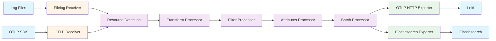

## Overview

The OpenTelemetry Collector provides comprehensive support for collecting, processing, and exporting log data from various sources to multiple backends. Unlike traditional logging agents that focus on specific formats or destinations, the Collector treats logs as first-class observability signals alongside metrics and traces.

The Collector's log support enables correlation between logs and traces through shared execution context (TraceId and SpanId), allowing unified observability across all three signal types. This correlation is particularly valuable for debugging complex distributed systems where understanding both the quantitative measurements and the detailed event context is essential.

Key capabilities include parsing structured and unstructured log formats, enriching logs with resource attributes, filtering and transforming log content, and routing logs to multiple backends simultaneously.

## Key Concepts

### OTLP Logs Data Model

OpenTelemetry defines a standardized [log data model](https://opentelemetry.io/docs/specs/otel/logs/) to establish a common understanding of what a LogRecord is and what data needs to be recorded, transferred, stored, and interpreted by logging systems.

**LogRecord Structure:**

A LogRecord contains several key components:

- **Timestamp**: The moment in time when the event occurred
- **TraceId and SpanId**: Execution context identifiers enabling correlation between logs and traces
- **Resource**: Describes the origin of the log (host name, container name, pod name, etc.)
- **Instrumentation Scope**: Identifies the library or component that generated the log
- **Severity**: Indicates the importance or criticality of the log entry
- **Body**: The actual log message content (string, structured data, or binary)
- **Attributes**: Structured key-value pairs providing additional context

This standardized model allows logs from different sources to be processed uniformly while preserving correlation capabilities.

### Log Correlation

The logs data model enables correlation across three dimensions:

1. **Temporal correlation**: Based on timestamp alignment
2. **Execution context correlation**: Using TraceId and SpanId to link logs to specific trace spans
3. **Origin correlation**: Through Resource context describing the source infrastructure and application

This unified approach allows observability backends to perform exact and unambiguous correlation between logs, metrics, and traces.

## Log Receivers

Receivers collect log data from various sources and convert it into the OpenTelemetry logs data model.

### Filelog Receiver

The [filelog receiver](https://github.com/open-telemetry/opentelemetry-collector-contrib/tree/main/receiver/filelogreceiver) tails and parses logs from files, making it ideal for collecting logs from applications that write to local disk.

**Key Capabilities:**

- **File monitoring**: Tracks multiple log files using glob patterns for inclusion and exclusion
- **Automatic rotation handling**: Detects and follows rotated log files and symlinks
- **Compression support**: Reads gzip-compressed files with auto-detection
- **Multiline support**: Combines log entries spanning multiple lines using custom patterns
- **Format parsing**: Built-in parsers for JSON, regex patterns, and structured text
- **Metadata extraction**: Parses timestamps, severity levels, and custom fields
- **Persistent offsets**: Maintains file positions across collector restarts

**Example use cases:**
- Collecting application logs written to `/var/log/`
- Parsing container logs from Kubernetes
- Reading structured JSON logs from microservices

**Configuration note**: The filelog receiver uses a pipeline of operators that transform raw file content into structured LogRecords. Each operator performs a specific transformation (parsing, extraction, modification) before passing data to the next operator.

### OTLP Receiver

The OTLP receiver accepts log data transmitted using the [OpenTelemetry Protocol](https://opentelemetry.io/docs/specs/otlp/).

**Supported transports:**

- **gRPC** (default port 4317): Uses unary requests with ExportLogsServiceRequest messages
- **HTTP** (default port 4318): POST requests to `/v1/logs` endpoint

**Encoding formats:**
- Binary Protobuf (`application/x-protobuf`)
- JSON Protobuf (proto3 JSON mapping)

**Use when**: Collecting logs directly from applications instrumented with OpenTelemetry SDKs or from upstream OpenTelemetry Collectors in a multi-tier deployment.

### Syslog Receiver

The syslog receiver listens for syslog messages over TCP or UDP, supporting RFC 3164 and RFC 5424 formats.

**Use cases:**
- Collecting system logs from Linux/Unix hosts
- Receiving logs from network devices (routers, switches, firewalls)
- Integrating with legacy applications that use syslog

### Other Log Receivers

The OpenTelemetry Collector ecosystem includes receivers for:

- **journald**: Reads logs from systemd journal
- **tcplog/udplog**: Generic TCP/UDP log receivers
- **windowseventlog**: Collects Windows Event Logs
- **kafka**: Consumes logs from Kafka topics

For a comprehensive list, see the [Receiver Components](https://opentelemetry.io/docs/collector/components/receiver/) documentation.

## Log Processors

Processors transform, filter, and enrich log data as it flows through the pipeline.

### Attributes Processor

The [attributes processor](https://github.com/open-telemetry/opentelemetry-collector-contrib/blob/main/processor/attributesprocessor/README.md) modifies attributes of log records.

**Capabilities:**
- Insert new attributes
- Update existing attributes
- Delete attributes
- Hash attribute values for privacy
- Extract values from one attribute to another

**Common use cases:**
- Adding environment labels (e.g., `environment=production`)
- Removing sensitive data from log attributes
- Normalizing attribute names across different sources

For more details, see the [Mastering the OpenTelemetry Attributes Processor](https://www.dash0.com/guides/opentelemetry-attributes-processor) guide.

### Filter Processor

The [filter processor](https://www.dash0.com/guides/opentelemetry-filter-processor) drops log records that match specified conditions using the OpenTelemetry Transformation Language (OTTL).

**Capabilities:**
- Filter by log severity level
- Drop logs matching specific patterns
- Exclude logs from certain resources
- Reduce log volume by dropping debug logs in production

**Example scenarios:**
- Dropping health check logs to reduce noise
- Filtering out logs below a certain severity threshold
- Excluding logs from specific namespaces or services

See also the [Filter Processor for OpenTelemetry Collector](https://docs.honeycomb.io/manage-data-volume/filter/filter-processor/) documentation.

### Transform Processor

The [transform processor](https://github.com/open-telemetry/opentelemetry-collector-contrib/blob/main/processor/transformprocessor/README.md) modifies log records using OTTL statements.

**Capabilities:**
- Parse log body content into structured attributes
- Modify log severity based on content
- Extract values using regex or JSON path
- Compute new attributes from existing ones
- Normalize timestamps

**Use cases:**
- Converting unstructured log messages to structured attributes
- Extracting user IDs or request IDs from log text
- Standardizing log formats from multiple sources

For transformation guidance, see [Transforming telemetry](https://opentelemetry.io/docs/collector/transforming-telemetry/).

### Resource Detection Processor

The resource detection processor enriches logs with metadata about their execution environment:

- Cloud provider information (AWS, GCP, Azure)
- Kubernetes metadata (pod, namespace, node)
- Container information (Docker, containerd)
- Host information (hostname, OS, architecture)

This automatic enrichment enables filtering and grouping logs by infrastructure context without manual configuration.

### Batch Processor

The batch processor groups log records before sending to exporters, improving throughput and reducing network overhead.

**Configuration considerations:**
- Timeout: Maximum time to wait before sending a batch
- Batch size: Number of log records per batch
- Memory limits: Prevents excessive memory usage

Batching is recommended for production deployments to optimize resource usage.

## Log Exporters

Exporters send processed log data to observability backends and storage systems.

### OTLP HTTP Exporter

The OTLP HTTP exporter is the **recommended exporter** for modern observability backends that support native OTLP ingestion.

**Supported destinations:**

- **Grafana Loki** (v3+): Send logs to Loki's native OTLP endpoint at `http://loki:3100/otlp`
- **Elasticsearch**: Use OTLP-compatible endpoints
- **Commercial backends**: Datadog, New Relic, Honeycomb, Dynatrace

**Important**: The Loki-specific exporter is deprecated. Use the standard `otlphttp/logs` exporter for Loki v3+ which supports [native OTLP ingestion](https://grafana.com/docs/loki/latest/send-data/otel/).

For setup guidance, see [Getting started with the OpenTelemetry Collector and Loki tutorial](https://grafana.com/docs/loki/latest/send-data/otel/otel-collector-getting-started/).

### Elasticsearch Exporter

The [Elasticsearch exporter](https://pkg.go.dev/github.com/open-telemetry/opentelemetry-collector-contrib/exporter/elasticsearchexporter) sends logs, metrics, traces, and profiles directly to Elasticsearch.

**Supported versions:**
- Elasticsearch 7.17.x
- Elasticsearch 8.x
- Elasticsearch 9.x

**Features:**
- Index routing based on log attributes
- Dynamic index naming with time-based patterns
- Bulk API for efficient ingestion

### File Exporter

The file exporter writes logs to local files, useful for:

- Debugging collector pipelines
- Creating log archives
- Forwarding to systems that process files

**Note**: Not recommended for production logging backends—use OTLP or dedicated exporters instead.

### Logging Exporter

The logging (debug) exporter writes logs to the collector's standard output. Use this for:

- Development and testing
- Troubleshooting pipeline configuration
- Verifying data transformation

For additional exporters, see the [Exporter Components](https://opentelemetry.io/docs/collector/components/exporter/) documentation.

## Log Pipeline Flow

A typical log pipeline in the Collector follows this pattern:



## Configuration Considerations

### Multiline Log Handling

Many applications emit logs spanning multiple lines (e.g., stack traces, JSON objects). The filelog receiver supports multiline patterns to combine these entries:

```yaml
receivers:
  filelog:
    include: [/var/log/app/*.log]
    multiline:
      line_start_pattern: '^\d{4}-\d{2}-\d{2}'
```

### Parsing Structured Logs

For JSON-formatted logs, configure the filelog receiver with JSON parsing:

```yaml
receivers:
  filelog:
    include: [/var/log/app/*.log]
    operators:
      - type: json_parser
        timestamp:
          parse_from: attributes.time
          layout: '%Y-%m-%dT%H:%M:%S.%fZ'
```

### Log Volume Management

High log volumes can overwhelm collectors and backends. Strategies include:

- **Sampling**: Use the probabilistic sampler processor to keep a percentage of logs
- **Filtering**: Drop debug/trace logs in production using the filter processor
- **Batching**: Configure appropriate batch sizes to balance latency and throughput
- **Tail sampling**: Keep only logs associated with interesting traces

### Performance Tuning

For high-throughput log collection:

- Increase the number of concurrent file readers in filelog receiver
- Tune batch processor settings (size, timeout)
- Use multiple collector instances with load balancing
- Consider gateway deployment to centralize processing

## Integration Points

### BattleBots Log Collection

For the BattleBots platform, log collection would capture:

- **Game events**: Bot actions, state transitions, match outcomes
- **System logs**: Server startup, configuration changes, errors
- **Client logs**: User actions, connection events, performance issues

The filelog receiver can parse structured JSON logs from the game server while the OTLP receiver collects logs directly from instrumented Go services.

### Log-Trace Correlation

When both logs and traces are collected, correlation enables:

- Finding all logs for a specific trace (query by TraceId)
- Jumping from a log entry to its parent trace span
- Identifying logs that occurred during slow requests

This requires applications to inject trace context into log records, which OpenTelemetry SDKs handle automatically.

### Cross-Signal Analysis

Logs complement metrics and traces:

- **Metrics** show aggregate patterns (error rate spike)
- **Traces** show request flow (which service failed)
- **Logs** show detailed context (exception message, variable values)

The Collector's unified data model enables seamless correlation across all three signals.

## Further Reading

### Official Documentation

- [OpenTelemetry Logs Specification](https://opentelemetry.io/docs/specs/otel/logs/)
- [OTLP Specification](https://opentelemetry.io/docs/specs/otlp/)
- [Receiver Components](https://opentelemetry.io/docs/collector/components/receiver/)
- [Processor Components](https://opentelemetry.io/docs/collector/components/processor/)
- [Exporter Components](https://opentelemetry.io/docs/collector/components/exporter/)
- [Transforming Telemetry](https://opentelemetry.io/docs/collector/transforming-telemetry/)

### Component-Specific Resources

- [Filelog Receiver](https://github.com/open-telemetry/opentelemetry-collector-contrib/tree/main/receiver/filelogreceiver)
- [Attributes Processor Guide](https://www.dash0.com/guides/opentelemetry-attributes-processor)
- [Filter Processor Guide](https://www.dash0.com/guides/opentelemetry-filter-processor)
- [Transform Processor](https://github.com/open-telemetry/opentelemetry-collector-contrib/blob/main/processor/transformprocessor/README.md)
- [Elasticsearch Exporter](https://pkg.go.dev/github.com/open-telemetry/opentelemetry-collector-contrib/exporter/elasticsearchexporter)

### Integration Guides

- [Ingesting logs to Loki using OpenTelemetry Collector](https://grafana.com/docs/loki/latest/send-data/otel/)
- [Getting started with the OpenTelemetry Collector and Loki tutorial](https://grafana.com/docs/loki/latest/send-data/otel/otel-collector-getting-started/)
- [Honeycomb Filter Processor Documentation](https://docs.honeycomb.io/manage-data-volume/filter/filter-processor/)

### Related Analysis Documents

- [OpenTelemetry Collector Overview](opentelemetry-collector-overview.md) - Core architecture and concepts
- [Metrics Support](otel-collector-metrics.md) - How the Collector handles metrics
- [Traces Support](otel-collector-traces.md) - How the Collector handles distributed traces
- [Self-Monitoring](otel-collector-self-monitoring.md) - Observing the Collector itself
