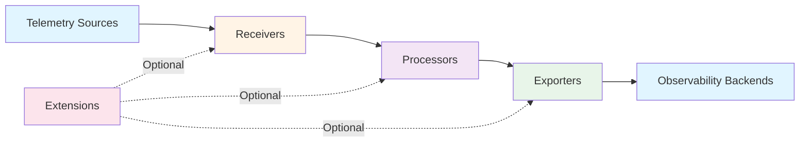

## Overview

The OpenTelemetry Collector is a vendor-agnostic application that receives, processes, and exports telemetry data (traces, metrics, and logs). It serves as a centralized component in observability architectures, removing the need to run multiple agents or collectors for different telemetry formats and backends.

The Collector supports open-source observability data formats including Jaeger, Prometheus, Fluent Bit, and others, while providing a unified approach to telemetry handling. It enables services to offload telemetry data quickly while the Collector handles retries, batching, encryption, and sensitive data filtering.

Key benefits include vendor independence, reduced operational complexity, and the ability to route telemetry data to multiple backends simultaneously without modifying application code.

## Key Concepts

The Collector is built around five guiding principles:

- **Usability**: Provides functional defaults with support for popular protocols out-of-the-box
- **Performance**: Maintains stability under varying loads with predictable resource usage
- **Observability**: Designed as an observable service itself, exposing its own metrics and health status
- **Extensibility**: Allows customization through plugins without requiring modifications to core code
- **Unification**: Single codebase supporting all three telemetry signals (traces, metrics, logs)

## Core Architecture

The Collector uses a pipeline-based architecture where data flows through three primary component types, orchestrated by a configuration file.



### Data Flow

Telemetry data flows unidirectionally through the Collector:

1. **Receivers** accept incoming telemetry in various formats (OTLP, Jaeger, Prometheus)
2. **Processors** transform, filter, or enrich the data in a sequential chain
3. **Exporters** send processed data to one or more backend destinations

This pipeline architecture allows the same data to be simultaneously:
- Sampled differently for different backends
- Enriched with environment-specific attributes
- Routed to multiple observability platforms

### Components

#### Receivers

Receivers gather telemetry data through two mechanisms:
- **Push-based**: Listen on network endpoints for incoming data
- **Pull-based**: Actively scrape metrics from instrumented services

Multiple receivers can feed into a single pipeline, with their outputs merged before reaching processors. Common receivers include:
- `otlp` - OpenTelemetry Protocol (gRPC/HTTP)
- `prometheus` - Prometheus metrics scraping
- `jaeger` - Jaeger trace data
- `filelog` - Log file collection

For comprehensive receiver documentation, see the [OpenTelemetry Collector Receivers](https://opentelemetry.io/docs/collector/components/#receivers).

#### Processors

Processors form a sequential chain that transforms data between receivers and exporters. Each processor in the chain operates on the data before passing it to the next processor.

Common operations include:
- Adding or removing attributes
- Sampling (probabilistic, tail-based)
- Batching for efficient transmission
- Filtering unwanted telemetry
- Resource detection (cloud provider, Kubernetes metadata)

**Important**: Each pipeline maintains independent processor instances, even when referencing the same configuration name across multiple pipelines. This prevents unintended state sharing between pipelines.

For comprehensive processor documentation, see the [OpenTelemetry Collector Processors](https://opentelemetry.io/docs/collector/components/#processors).

#### Exporters

Exporters forward processed data to external destinations, typically by sending to network endpoints or writing to logging systems. Multiple exporters can receive identical data copies through a fan-out mechanism, enabling simultaneous transmission to different backends.

Common exporters include:
- `otlp` - OpenTelemetry Protocol destinations
- `prometheus` - Prometheus remote write
- `jaeger` - Jaeger backend
- `logging` - Standard output for debugging
- `file` - Local file storage

For comprehensive exporter documentation, see the [OpenTelemetry Collector Exporters](https://opentelemetry.io/docs/collector/components/#exporters).

#### Connectors

Connectors enable inter-pipeline communication and data flow between different telemetry signal types. A connector acts as both an exporter (for one pipeline) and a receiver (for another pipeline).

Use cases include:
- Generating metrics from trace spans
- Creating logs from metric anomalies
- Correlating signals for enhanced observability

For more information, see the [OpenTelemetry Collector Connectors](https://opentelemetry.io/docs/collector/components/#connectors).

#### Extensions

Extensions provide auxiliary functionality that doesn't directly process telemetry data but supports Collector operations:

- `health_check` - HTTP endpoint for health monitoring
- `pprof` - Go profiling endpoint for performance analysis
- `zpages` - In-process debugging pages
- `ballast` - Memory ballast for GC optimization

Extensions are optional but highly recommended for production deployments. See [self-monitoring documentation](0005-otel-collector-self-monitoring.md) for more details.

## Configuration

The Collector uses YAML configuration files (default: `/etc/otelcol/config.yaml`) with four main sections:

```yaml
receivers:
  # Define how to collect telemetry

processors:
  # Define how to transform telemetry

exporters:
  # Define where to send telemetry

service:
  pipelines:
    # Connect receivers → processors → exporters
```

### Pipeline Types

Three pipeline types handle different telemetry signals:
- **traces**: Distributed tracing data
- **metrics**: Time-series measurements
- **logs**: Event records

Each pipeline independently connects receivers to exporters through an optional processor chain. The same receiver can feed multiple pipelines simultaneously, though this creates a potential bottleneck if one processor blocks.

### Configuration Best Practices

- Validate configurations before deployment: `otelcol validate --config=file.yaml`
- Use environment variables for sensitive values: `${env:API_KEY}`
- Bind endpoints to `localhost` for local-only access
- Apply TLS certificates for production environments
- Use the `type/name` syntax for multiple instances of the same component type

For detailed configuration guidance, see the [Configuration Documentation](https://opentelemetry.io/docs/collector/configuration/).

## Deployment Patterns

The Collector supports multiple deployment models based on operational requirements and scale.

### Agent Mode

In agent mode, lightweight Collector instances run as daemons alongside applications (on the same host, container, or Kubernetes pod). This pattern:

- Collects telemetry from co-located services
- Performs local sampling and aggregation
- Reduces network overhead by local processing
- Simplifies application configuration (default OTLP exporters assume `localhost:4317`)

**Use when**: You need local collection with per-host resource limits and want to offload telemetry handling from application processes.

### Gateway Mode

In gateway mode, centralized Collector instances receive data from distributed agents and application libraries, then route to backend systems. This pattern:

- Provides centralized control over data transformation
- Enables consistent sampling decisions across services
- Supports complex routing logic to multiple backends
- Allows for sensitive data filtering before egress

**Use when**: You need centralized policy enforcement, multi-backend routing, or want to isolate backend credentials from application environments.

### Hybrid Mode

Many production deployments use both agent and gateway patterns:
- Agents perform local collection and basic processing
- Gateways handle aggregation, complex transformations, and backend routing

This hybrid approach balances local efficiency with centralized control.

### No Collector

For development environments or initial experimentation, services can export directly to backends using OTLP. However, this approach loses the benefits of buffering, retries, and transformation capabilities.

## When to Use the Collector

### Recommended Use Cases

Deploy a Collector when you need to:

- Support multiple telemetry formats (Jaeger, Prometheus, custom formats)
- Route telemetry to multiple backends simultaneously
- Perform data transformation or enrichment before export
- Sample or filter telemetry based on configurable rules
- Isolate backend credentials from application deployments
- Buffer telemetry during backend outages
- Offload retry and batching logic from applications

### Direct Export Scenarios

Direct service-to-backend export may be sufficient for:

- Development and testing environments
- Single-backend deployments with no transformation needs
- Prototyping and proof-of-concept work
- Very small-scale deployments

## Integration Points

### BattleBots Observability Requirements

For the BattleBots platform, the Collector would support:

- **Battle Event Tracking**: Collecting logs of bot actions and game state changes
- **Performance Metrics**: Gathering metrics on bot response times and system resource usage
- **Distributed Tracing**: Tracking request flows across client/server or P2P architectures

See [User Journey 0001: POC](../../user-journeys/0001-poc.md) for observability requirements context.

### Multi-Signal Correlation

The Collector enables correlation between:
- Trace spans and related logs (via trace context)
- Metrics and traces (via exemplars)
- Resource attributes across all signals

This correlation is particularly valuable for debugging battle scenarios where you need to understand both the timeline of events (traces), the quantitative measurements (metrics), and the detailed context (logs).

## Further Reading

### Official Documentation

- [OpenTelemetry Collector Main Documentation](https://opentelemetry.io/docs/collector/)
- [Collector Architecture](https://opentelemetry.io/docs/collector/architecture/)
- [Configuration Reference](https://opentelemetry.io/docs/collector/configuration/)
- [Component Registry](https://opentelemetry.io/docs/collector/components/)

### Specifications

- [OTLP Specification](https://opentelemetry.io/docs/specs/otlp/)
- [OpenTelemetry Specification](https://opentelemetry.io/docs/specs/otel/)

### Implementation Resources

- [Collector GitHub Repository](https://github.com/open-telemetry/opentelemetry-collector)
- [Collector Contrib Repository](https://github.com/open-telemetry/opentelemetry-collector-contrib) (additional components)

### Related Analysis Documents

- [Logs Support](otel-collector-logs.md) - How the Collector handles log data
- [Metrics Support](otel-collector-metrics.md) - How the Collector handles metrics
- [Traces Support](otel-collector-traces.md) - How the Collector handles distributed traces
- [Self-Monitoring](otel-collector-self-monitoring.md) - Observing the Collector itself
