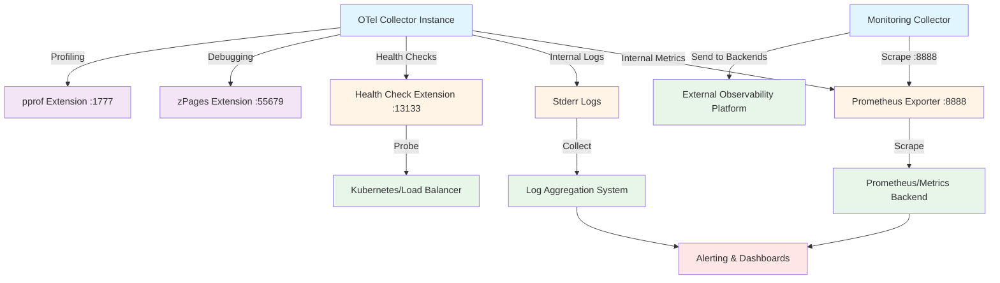

## Overview

The OpenTelemetry Collector is designed as an observable service itself, following the principle that observability infrastructure must be observable. The Collector exposes its own telemetry (metrics, logs, and optionally traces) to enable monitoring health, diagnosing issues, and optimizing performance.

Self-monitoring is critical for production deployments—without visibility into the Collector's operation, data loss or performance degradation can go undetected. The Collector provides built-in telemetry, diagnostic extensions, and debugging capabilities to ensure reliable operation at scale.

Key capabilities include internal metrics exposed via Prometheus endpoints, health check endpoints for liveness/readiness probes, diagnostic extensions for real-time inspection, and structured logging for troubleshooting pipeline issues.

## Key Concepts

### Internal Telemetry

The [OpenTelemetry Collector generates internal telemetry](https://opentelemetry.io/docs/collector/internal-telemetry/) by default to expose its operational state. This self-generated observability data helps operators monitor Collector health and performance.

**Telemetry types:**

- **Metrics**: Quantitative measurements of Collector operation (default: Prometheus format on port 8888)
- **Logs**: Structured event records emitted to stderr by default
- **Traces**: Optional internal tracing of data flow through pipelines

Internal telemetry enables:
- Real-time health monitoring
- Capacity planning and resource optimization
- Troubleshooting data loss or pipeline issues
- Performance profiling and bottleneck identification

### Observability vs. Debugging

The Collector provides two complementary approaches:

**Observability** (production):
- Continuous metrics collection
- Health check endpoints
- Structured logging
- External monitoring integration

**Debugging** (development/troubleshooting):
- zPages for live data inspection
- pprof for performance profiling
- Debug exporters for pipeline validation
- Verbose logging modes

## Internal Metrics

The Collector exposes comprehensive metrics about its operation through a Prometheus-compatible endpoint.

### Metrics Endpoint

By default, the Collector exposes metrics at `http://localhost:8888/metrics` in Prometheus format. This endpoint can be scraped by Prometheus or any compatible metrics collector.

**Configuration:**

```yaml
service:
  telemetry:
    metrics:
      address: 0.0.0.0:8888
      level: detailed  # Options: none, basic, normal, detailed
```

### Key Metrics Categories

#### Data Ingress Metrics

Monitor data received by receivers:

- `otelcol_receiver_accepted_log_records` - Log records accepted
- `otelcol_receiver_accepted_spans` - Spans accepted
- `otelcol_receiver_accepted_metric_points` - Metric points accepted
- `otelcol_receiver_refused_*` - Refused data (errors)

These metrics help identify:
- Data ingestion rates
- Receiver errors or rejections
- Source-specific throughput patterns

#### Data Egress Metrics

Monitor data sent by exporters:

- `otelcol_exporter_sent_log_records` - Log records sent
- `otelcol_exporter_sent_spans` - Spans sent
- `otelcol_exporter_sent_metric_points` - Metric points sent
- `otelcol_exporter_send_failed_*` - Failed export attempts

These metrics reveal:
- Export success rates
- Backend connectivity issues
- Data loss from failed exports

#### Queue Metrics

Monitor internal buffer state:

- `otelcol_exporter_queue_capacity` - Queue capacity in batches
- `otelcol_exporter_queue_size` - Current queue utilization
- `otelcol_exporter_enqueue_failed_*` - Failed enqueues (buffer full)

**Alert on**: Queue size approaching capacity indicates backpressure from slow exporters or high ingestion rates.

#### Processor Metrics

Monitor processor operation:

- `otelcol_processor_batch_batch_send_size` - Batch sizes sent
- `otelcol_processor_batch_timeout_trigger_send` - Timeouts triggering sends
- Processor-specific metrics (sampling rates, dropped data, etc.)

#### Resource Metrics

Monitor Collector resource usage:

- `process_runtime_*` - Go runtime metrics (memory, goroutines)
- `process_cpu_seconds_total` - CPU time consumed
- `process_resident_memory_bytes` - Memory usage

For comprehensive metric details, see [Internal telemetry](https://opentelemetry.io/docs/collector/internal-telemetry/) and [How to Monitor Open Telemetry Collector Performance](https://opstree.com/blog/2025/06/10/monitor-open-telemetry-collector-performance/).

### Self-Monitoring Dashboards

Several platforms provide pre-built dashboards for Collector monitoring:

- [Dynatrace OpenTelemetry Collector Self-Monitoring](https://www.dynatrace.com/news/blog/introducing-opentelemetry-collector-self-monitoring-dashboards/) (June 2025 release)
- Grafana dashboards from the community
- Vendor-specific monitoring integrations

## Extensions for Observability

Extensions provide auxiliary functionality that supports Collector operation and debugging.

### Health Check Extension

The [health_check extension](https://github.com/open-telemetry/opentelemetry-collector-contrib/blob/main/extension/healthcheckextension/README.md) enables an HTTP endpoint that can be probed to check the Collector's status.

**Configuration:**

```yaml
extensions:
  health_check:
    endpoint: 0.0.0.0:13133
    path: /health/status
    check_collector_pipeline:
      enabled: false  # Not recommended—use at own risk

service:
  extensions: [health_check]
```

**Endpoints:**

- `/health/status` - Returns 200 OK if the Collector is running

**Important note**: The `check_collector_pipeline` feature is **not working as expected and should not be used**. Use metrics-based monitoring instead for pipeline health.

**Use cases:**
- Kubernetes liveness probes
- Load balancer health checks
- Container orchestration health monitoring
- Service mesh integration

For more details, see [Health Check Monitoring With OpenTelemetry](https://signoz.io/blog/health-check-monitoring-with-opentelemetry/).

### zPages Extension

The [zpages extension](https://github.com/open-telemetry/opentelemetry-collector/blob/main/extension/zpagesextension/README.md) serves HTTP endpoints that provide live data for debugging different components without depending on external backends.

**Configuration:**

```yaml
extensions:
  zpages:
    endpoint: 0.0.0.0:55679

service:
  extensions: [zpages]
```

**Available pages:**

- `/debug/servicez` - Service summary and version information
- `/debug/pipelinez` - Pipeline configuration and status
- `/debug/extensionz` - Loaded extensions
- `/debug/tracez` - Sample trace data (if internal tracing enabled)

**Use cases:**
- Inspecting live data flowing through pipelines
- Validating configuration changes
- Debugging data transformation issues
- In-process diagnostics during development

zPages are particularly useful for answering questions like "Is the Collector receiving data?" and "What does the data look like after processing?"

For detailed usage, see [Monitoring and Debugging the OpenTelemetry Collector](https://betterstack.com/community/guides/observability/monitoring-otel-collector/).

### pprof Extension

The [pprof extension](https://pkg.go.dev/go.opentelemetry.io/collector/extension) enables the Go `net/http/pprof` endpoint for performance profiling.

**Configuration:**

```yaml
extensions:
  pprof:
    endpoint: 0.0.0.0:1777

service:
  extensions: [pprof]
```

**Available profiles:**

- `/debug/pprof/profile` - CPU profile
- `/debug/pprof/heap` - Memory allocation profile
- `/debug/pprof/goroutine` - Goroutine stack traces
- `/debug/pprof/block` - Blocking profile
- `/debug/pprof/mutex` - Mutex contention profile

**Use cases:**
- Investigating CPU hotspots
- Analyzing memory leaks
- Identifying goroutine leaks
- Profiling lock contention

**Collecting profiles:**

```bash
# CPU profile (30 seconds)
curl http://localhost:1777/debug/pprof/profile?seconds=30 > cpu.prof

# Heap profile
curl http://localhost:1777/debug/pprof/heap > heap.prof

# Analyze with pprof
go tool pprof cpu.prof
```

**Security note**: pprof endpoints should only be exposed internally, never to the public internet, as they can reveal sensitive information and consume resources.

## Logging and Debugging

### Structured Logging

The Collector emits structured logs to stderr by default, which can be redirected to files or collected by log aggregation systems.

**Log levels:**
- `debug` - Verbose debugging information
- `info` - General operational messages (default)
- `warn` - Warning conditions
- `error` - Error conditions

**Configuration:**

```yaml
service:
  telemetry:
    logs:
      level: info
      encoding: json  # Options: json, console
```

**Common log patterns:**
- Receiver connection failures
- Exporter send failures
- Processor errors
- Configuration validation warnings

### Debug Exporter

The debug (logging) exporter writes telemetry data to the Collector's standard output, useful for confirming that data is being received, processed, and exported correctly.

**Configuration:**

```yaml
exporters:
  debug:
    verbosity: detailed  # Options: basic, normal, detailed

service:
  pipelines:
    traces:
      receivers: [otlp]
      exporters: [debug, otlp]  # Add debug alongside production exporters
```

**Use cases:**
- Validating pipeline configuration
- Inspecting data transformations
- Troubleshooting receiver issues
- Confirming data format

**Warning**: Debug exporters should be removed or disabled in production due to performance impact and log volume.

For troubleshooting guidance, see the [Troubleshooting](https://opentelemetry.io/docs/collector/troubleshooting/) documentation.

## Common Issues and Troubleshooting

### Data Loss

**Symptoms:**
- `otelcol_exporter_send_failed_*` metrics increasing
- Queue size approaching capacity
- Export errors in logs

**Common causes:**
1. Exporter destination unavailable or slow
2. Collector under-provisioned (insufficient CPU/memory)
3. Network connectivity issues
4. Backend rate limiting

**Solutions:**
- Increase queue size and retry parameters
- Scale Collector instances horizontally
- Add buffering through load balancers
- Implement backpressure handling

### High Memory Usage

**Symptoms:**
- `process_resident_memory_bytes` continuously increasing
- OOM kills in container environments
- Slow garbage collection

**Common causes:**
1. Large batch sizes
2. Tail sampling buffer accumulation
3. Queue size too large
4. Memory leaks in processors

**Solutions:**
- Reduce batch size and timeout
- Tune tail sampling buffer limits
- Enable memory limiting in batch processor
- Update to latest Collector version (bug fixes)
- Use pprof to identify memory leaks

**Note**: Memory usage increases in steps due to Go's garbage collection characteristics, which is normal.

### CPU Spikes

**Symptoms:**
- `process_cpu_seconds_total` rate spikes
- Request latency increases
- Throttled container CPU

**Common causes:**
1. Batch processing overhead
2. Complex processor logic
3. High ingestion rates
4. Inefficient regex patterns in processors

**Solutions:**
- Optimize processor configuration
- Distribute load across multiple instances
- Use simpler transformation patterns
- Profile with pprof to identify hotspots

For detailed debugging workflows, see [Guide — How to Debug OpenTelemetry Pipelines](https://last9.io/guides/opentelemetry/how-to-debug-opentelemetry-pipelines/).

## Self-Monitoring Architecture

A production self-monitoring setup exports Collector telemetry to external systems:



## Configuration Best Practices

### Production Monitoring Setup

**1. Enable comprehensive internal metrics:**

```yaml
service:
  telemetry:
    metrics:
      address: 0.0.0.0:8888
      level: detailed
    logs:
      level: info
      encoding: json
```

**2. Deploy monitoring Collector:**

Create a dedicated Collector instance to scrape other Collectors:

```yaml
receivers:
  prometheus:
    config:
      scrape_configs:
        - job_name: otel-collector
          scrape_interval: 15s
          static_configs:
            - targets: ['collector-1:8888', 'collector-2:8888']

exporters:
  otlp:
    endpoint: monitoring-backend:4317

service:
  pipelines:
    metrics:
      receivers: [prometheus]
      exporters: [otlp]
```

**3. Configure health checks:**

```yaml
extensions:
  health_check:
    endpoint: 0.0.0.0:13133

service:
  extensions: [health_check]
```

**4. Set up alerts:**

Key alerts to configure:
- Queue size > 80% capacity
- Export failure rate > 1%
- Memory usage > 80% limit
- CPU throttling detected
- Receiver refused rate > 0

### Development/Debugging Setup

**Enable all diagnostic extensions:**

```yaml
extensions:
  health_check:
    endpoint: 0.0.0.0:13133
  zpages:
    endpoint: 0.0.0.0:55679
  pprof:
    endpoint: 0.0.0.0:1777

service:
  extensions: [health_check, zpages, pprof]
  telemetry:
    logs:
      level: debug
```

**Add debug exporters:**

```yaml
exporters:
  debug:
    verbosity: detailed

service:
  pipelines:
    traces:
      receivers: [otlp]
      exporters: [debug, jaeger]  # Debug alongside production
```

### Security Considerations

- **Restrict extension endpoints** to internal networks only
- **Never expose pprof** to the internet
- **Use TLS** for metrics endpoints in production
- **Implement authentication** for sensitive endpoints
- **Rate limit** health check endpoints to prevent DoS

## Integration Points

### BattleBots Collector Monitoring

For the BattleBots platform, Collector self-monitoring would track:

**Operational metrics:**
- Game event ingestion rate (log records/second)
- Battle trace throughput (spans/second)
- Bot performance metric collection (metric points/second)

**Health indicators:**
- Export success rate to observability backends
- Queue utilization during peak match activity
- Resource usage (CPU, memory) per Collector instance

**Alerting scenarios:**
- Queue capacity exceeded during tournament events
- Export failures to game analytics backend
- High latency in telemetry pipeline affecting real-time dashboards

### Kubernetes Integration

In Kubernetes deployments:

**Liveness probe:**
```yaml
livenessProbe:
  httpGet:
    path: /health/status
    port: 13133
  initialDelaySeconds: 30
  periodSeconds: 10
```

**Readiness probe:**
```yaml
readinessProbe:
  httpGet:
    path: /health/status
    port: 13133
  initialDelaySeconds: 5
  periodSeconds: 5
```

**Metrics scraping:**
```yaml
annotations:
  prometheus.io/scrape: "true"
  prometheus.io/port: "8888"
  prometheus.io/path: "/metrics"
```

## Further Reading

### Official Documentation

- [Internal telemetry](https://opentelemetry.io/docs/collector/internal-telemetry/)
- [Troubleshooting](https://opentelemetry.io/docs/collector/troubleshooting/)
- [Configuration](https://opentelemetry.io/docs/collector/configuration/)
- [Extensions README](https://github.com/open-telemetry/opentelemetry-collector/blob/main/extension/README.md)

### Extension Documentation

- [Health Check Extension](https://github.com/open-telemetry/opentelemetry-collector-contrib/blob/main/extension/healthcheckextension/README.md)
- [zPages Extension](https://github.com/open-telemetry/opentelemetry-collector/blob/main/extension/zpagesextension/README.md)
- [Collector Observability Documentation](https://github.com/open-telemetry/opentelemetry-collector/blob/main/docs/observability.md)

### Guides and Best Practices

- [Monitoring and Debugging the OpenTelemetry Collector](https://betterstack.com/community/guides/observability/monitoring-otel-collector/)
- [How to Monitor Open Telemetry Collector Performance](https://opstree.com/blog/2025/06/10/monitor-open-telemetry-collector-performance/)
- [Guide — How to Debug OpenTelemetry Pipelines](https://last9.io/guides/opentelemetry/how-to-debug-opentelemetry-pipelines/)
- [Health Check Monitoring With OpenTelemetry](https://signoz.io/blog/health-check-monitoring-with-opentelemetry/)

### Vendor Resources

- [Dynatrace: Introducing OpenTelemetry Collector Self-Monitoring Dashboards](https://www.dynatrace.com/news/blog/introducing-opentelemetry-collector-self-monitoring-dashboards/)
- [Dynatrace: OpenTelemetry Collector self-monitoring](https://docs.dynatrace.com/docs/ingest-from/opentelemetry/collector/self-monitoring)
- [OpenTelemetry Collector from A to Z: A Production-Ready Guide](https://signoz.io/blog/opentelemetry-collector-complete-guide/)

### Related Analysis Documents

- [OpenTelemetry Collector Overview](opentelemetry-collector-overview.md) - Core architecture and concepts
- [Logs Support](otel-collector-logs.md) - How the Collector handles log data
- [Metrics Support](otel-collector-metrics.md) - How the Collector handles metrics
- [Traces Support](otel-collector-traces.md) - How the Collector handles distributed traces
