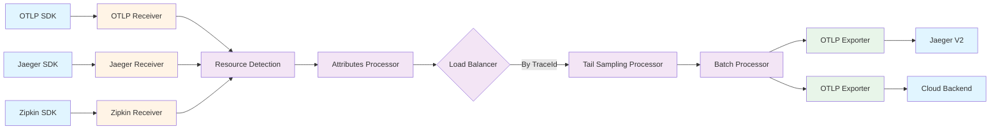

## Overview

The OpenTelemetry Collector provides comprehensive support for distributed tracing, enabling collection, processing, and export of trace data from multiple sources to various backend systems. Distributed tracing tracks requests as they flow through distributed systems, providing visibility into service interactions, latency bottlenecks, and error propagation paths.

The Collector acts as a central hub for trace data, accepting traces in multiple formats (OTLP, Jaeger, Zipkin), performing intelligent sampling decisions, and routing to multiple tracing backends simultaneously. This unified approach simplifies observability infrastructure while preserving the ability to use best-of-breed tools for different use cases.

Key capabilities include protocol translation between trace formats, sophisticated sampling strategies (head-based and tail-based), trace enrichment with resource and span attributes, and correlation with metrics and logs through shared context identifiers.

## Key Concepts

### Traces and Spans

A [trace represents the full journey](https://opentelemetry.io/docs/concepts/signals/traces/) of one request or transaction across services, while a span is a timed unit of work inside that journey such as a function call, database query, or external API call.

**Trace structure:**
- A trace consists of one or more spans organized in a tree structure
- Each span represents an operation with a start time and duration
- Spans have parent-child relationships forming the call graph
- The root span represents the initial request entry point

**Span characteristics:**
- Name: Describes the operation (e.g., "GET /api/battles")
- Start time and duration: Timing information
- Status: Success, error, or unset
- Span kind: Client, server, internal, producer, or consumer

### Span Context and Propagation

[Span context](https://opentelemetry.io/docs/concepts/context-propagation/) is the portion of a span that must be serialized and propagated between services to maintain trace continuity.

**Context components:**
- **TraceId**: Unique identifier for the entire trace (shared across all spans)
- **SpanId**: Unique identifier for the specific span
- **TraceFlags**: Sampling and other flags
- **TraceState**: System-specific trace state values

**Propagation mechanism:**

[Context propagation](https://betterstack.com/community/guides/observability/otel-context-propagation/) transmits context between services via protocols such as HTTP headers, gRPC metadata, or message queues. The default propagator uses the [W3C TraceContext specification](https://opentelemetry.io/docs/concepts/context-propagation/) with `traceparent` and `tracestate` headers.

Example HTTP headers:
```
traceparent: 00-4bf92f3577b34da6a3ce929d0e0e4736-00f067aa0ba902b7-01
tracestate: vendor1=value1,vendor2=value2
```

For detailed propagation concepts, see [An overview of Context Propagation in OpenTelemetry](https://signoz.io/blog/opentelemetry-context-propagation/).

### Span Attributes

Attributes provide additional context about the operation represented by a span. They are key-value pairs that describe request parameters, database queries, HTTP methods, status codes, and other relevant details.

**Common attribute categories:**
- HTTP attributes: `http.method`, `http.status_code`, `http.route`
- Database attributes: `db.system`, `db.statement`, `db.name`
- RPC attributes: `rpc.service`, `rpc.method`
- Network attributes: `net.peer.name`, `net.peer.port`

**Best practice**: Set attributes at span creation rather than later, since samplers can only consider information present during span creation.

### Span Events

[Span events](https://opentelemetry.io/docs/concepts/signals/traces/) are structured log messages or annotations on a span, typically used to denote meaningful singular points in time during the span's duration.

**Use cases:**
- Exception events (including stack traces)
- Checkpoint markers in long operations
- State transitions
- Cache hits/misses
- Retry attempts

Events include a name, timestamp, and optional attributes, providing detailed debugging context without creating separate spans for every sub-operation.

### Span Links

Span links establish relationships between spans in different traces or between causally-related but non-parent-child spans. Common scenarios include:

- Batch processing where one span processes multiple input messages
- Following redirects across multiple traces
- Async operations spawned from a parent request

## Trace Receivers

Receivers collect trace data from various sources and convert it into the OpenTelemetry traces data model.

### OTLP Receiver

The OTLP receiver accepts trace data transmitted using the OpenTelemetry Protocol, the native and recommended format for OpenTelemetry traces.

**Supported transports:**
- **gRPC** (default port 4317): High-performance binary protocol
- **HTTP** (default port 4318): RESTful endpoint at `/v1/traces`

**Configuration example:**

```yaml
receivers:
  otlp:
    protocols:
      grpc:
        endpoint: 0.0.0.0:4317
      http:
        endpoint: 0.0.0.0:4318
```

**Use cases:**
- Collecting traces from OpenTelemetry-instrumented applications
- Multi-tier collector deployments (agent → gateway)
- Modern observability architectures

**Important**: Jaeger V2 [natively supports OTLP](https://docs.dapr.io/operations/observability/tracing/otel-collector/open-telemetry-collector-jaeger/), making OTLP the recommended protocol for Jaeger backends.

### Jaeger Receiver

The [Jaeger receiver](https://aws-otel.github.io/docs/components/jaeger-zipkin-receiver/) receives trace data in Jaeger format and translates it to OpenTelemetry format. This enables migration from Jaeger-instrumented applications without requiring code changes.

**Supported protocols:**
- **gRPC** (default port 14250): Binary Jaeger protocol
- **thrift_compact** (default port 6831): UDP-based compact Thrift
- **thrift_http** (default port 14268): HTTP-based Thrift
- **thrift_binary**: TCP-based binary Thrift

**Configuration example:**

```yaml
receivers:
  jaeger:
    protocols:
      grpc:
        endpoint: 0.0.0.0:14250
      thrift_http:
        endpoint: 0.0.0.0:14268
      thrift_compact:
        endpoint: 0.0.0.0:6831
```

**Use cases:**
- Migrating from Jaeger agent/collector infrastructure
- Supporting legacy applications instrumented with Jaeger SDKs
- Gradual transition to OpenTelemetry

### Zipkin Receiver

The [Zipkin receiver](https://aws-otel.github.io/docs/components/jaeger-zipkin-receiver/) receives spans in Zipkin V1 and V2 formats and translates them to OpenTelemetry format.

**Configuration example:**

```yaml
receivers:
  zipkin:
    endpoint: 0.0.0.0:9411
```

**Use cases:**
- Migrating from Zipkin instrumentation
- Supporting applications instrumented with Zipkin libraries
- Integration with Zipkin-compatible systems

### Protocol Translation

The Collector acts as a protocol translator, accepting traces in one format and exporting in another. This enables:

- Jaeger-instrumented apps → OTLP export to modern backends
- OpenTelemetry apps → Zipkin export for legacy systems
- Unified collection from heterogeneous instrumentation

## Sampling Strategies

Sampling controls which traces are retained for analysis, balancing observability value with storage costs and performance impact.

### Head Sampling

[Head sampling](https://opentelemetry.io/docs/concepts/sampling/) makes sampling decisions at trace creation time, before seeing the complete trace. The decision applies to the entire trace and propagates to downstream services.

**Common algorithms:**

- **Always On**: Sample 100% of traces (development/debugging)
- **Always Off**: Sample 0% of traces (disable tracing)
- **TraceID Ratio**: Sample a percentage based on TraceId hash (e.g., 10%)
- **Rate Limiting**: Sample at most N traces per second

**Advantages:**
- Low latency decision (immediate)
- Low memory overhead (no buffering)
- Consistent across distributed services

**Limitations:**
- Cannot make decisions based on complete trace data
- Cannot guarantee capturing all error traces
- Cannot sample based on span attributes or duration

For consistent probability sampling details, see [OpenTelemetry Sampling](https://uptrace.dev/opentelemetry/sampling).

### Tail Sampling

[Tail sampling](https://github.com/open-telemetry/opentelemetry-collector-contrib/blob/main/processor/tailsamplingprocessor/README.md) makes sampling decisions after seeing all or most spans in a trace, enabling more intelligent sampling based on trace characteristics.

**Available policies:**

- **Latency**: Sample traces exceeding duration threshold
- **Status code**: Always sample traces with errors
- **Numeric attribute**: Sample based on attribute values (min/max thresholds)
- **Probabilistic**: Sample a percentage of traces
- **String attribute**: Sample traces matching string attributes
- **Rate limiting**: Limit traces per second per policy
- **Composite**: Combine multiple policies (AND/OR logic)

**Configuration example:**

```yaml
processors:
  tail_sampling:
    policies:
      - name: errors-policy
        type: status_code
        status_code:
          status_codes: [ERROR]
      - name: slow-requests
        type: latency
        latency:
          threshold_ms: 1000
      - name: sample-10-percent
        type: probabilistic
        probabilistic:
          sampling_percentage: 10
```

**Architecture requirements:**

All spans for a given trace **MUST** be received by the same collector instance for effective sampling decisions. This requires:

1. **Load balancing exporter**: Routes spans by TraceId to consistent collectors
2. **Two-tier architecture**: Agent collectors → tail sampling gateway collectors

For implementation guidance, see [Tail Sampling with OpenTelemetry and New Relic](https://newrelic.com/blog/best-practices/open-telemetry-tail-sampling) and [Sampling at scale with OpenTelemetry](https://www.gouthamve.dev/sampling-at-scale-with-opentelemetry/).

**Advantages:**
- Sample all error traces regardless of volume
- Capture slow requests while dropping fast ones
- Make sampling decisions based on complete trace data

**Challenges:**
- Higher memory overhead (buffering complete traces)
- Increased latency (waiting for trace completion)
- Requires stateful, coordinated collectors

### Sampling Best Practices

For production deployments:

1. Use **head sampling** for baseline traffic reduction (e.g., 10% sampling)
2. Add **tail sampling** to always capture errors and slow traces
3. Implement **two-tier architecture** for tail sampling at scale
4. Monitor sampled vs. unsampled trace ratios
5. Adjust policies based on traffic patterns and costs

For recent sampling updates, see [OpenTelemetry Sampling update](https://opentelemetry.io/blog/2025/sampling-milestones/).

## Trace Processors

Processors transform and enrich trace data as it flows through pipelines.

### Span Processor

The span processor modifies span names, attributes, and other properties.

**Common operations:**
- Rename spans for consistency
- Add/remove span attributes
- Set span status
- Modify span kind

### Attributes Processor

Adds, updates, or deletes span and resource attributes, enabling:
- Environment labeling
- Team ownership tags
- PII removal
- Attribute normalization

### Resource Detection Processor

Enriches traces with environment metadata:
- Cloud provider information (AWS, GCP, Azure)
- Kubernetes metadata (pod, namespace, node)
- Container information
- Host details

This automatic enrichment enables filtering and grouping traces by infrastructure context.

### Batch Processor

Groups spans before export, improving throughput and reducing network overhead. Recommended for all production deployments.

### Service Graph Processor

Generates metrics representing service call relationships from trace data, creating:
- Request rate between services
- Error rate between services
- Latency between services

These derived metrics enable service dependency visualization without query-time trace aggregation.

## Trace Exporters

Exporters send processed trace data to observability backends and storage systems.

### OTLP Exporter (Recommended)

The [OTLP exporter](https://uptrace.dev/opentelemetry/collector/exporters) sends traces using the OpenTelemetry Protocol to OTLP-compatible backends. OTLP is **the recommended choice** for new deployments as it's designed with the OpenTelemetry data model in mind, emitting trace data without loss of information.

**Supported destinations:**
- Jaeger V2 (native OTLP support)
- Commercial platforms (Datadog, New Relic, Honeycomb, Dynatrace)
- Cloud vendor endpoints (AWS X-Ray, Google Cloud Trace, Azure Monitor)
- Open source backends (Uptrace, Grafana Tempo)

**Configuration example:**

```yaml
exporters:
  otlp:
    endpoint: jaeger:4317
    tls:
      insecure: false
```

For Jaeger V2 integration, see [Using OpenTelemetry to send traces to Jaeger V2](https://docs.dapr.io/operations/observability/tracing/otel-collector/open-telemetry-collector-jaeger/).

### Jaeger Exporter

The Jaeger exporter sends traces to Jaeger backends using the Jaeger gRPC protocol.

**Note**: For Jaeger V2, use the OTLP exporter instead. The dedicated Jaeger exporter is maintained for backward compatibility with Jaeger V1 deployments.

### Zipkin Exporter

The Zipkin exporter sends traces to Zipkin-compatible backends.

**Use cases:**
- Legacy Zipkin deployments
- Systems expecting Zipkin format
- Gradual migration scenarios

### Logging Exporter

Writes traces to collector standard output for debugging and development.

For comprehensive exporter documentation, see [OpenTelemetry Collector Exporters](https://uptrace.dev/opentelemetry/collector/exporters).

## Trace Pipeline Flow

A sophisticated trace pipeline with multiple receivers, sampling, and multi-backend export:



## Configuration Considerations

### Context Propagation

Ensure consistent propagation across all services:

- Configure the same propagators in all SDKs
- Use W3C TraceContext (standard default)
- Include Baggage propagation if using cross-cutting concerns
- Test propagation across language boundaries

### Sampling Trade-offs

Balance observability and cost:

- **High sampling (50-100%)**: Development, debugging, low-traffic systems
- **Medium sampling (10-30%)**: Production with moderate traffic
- **Low sampling (1-10%)**: High-traffic production systems
- **Tail sampling**: Always capture errors regardless of base rate

### Performance Tuning

For high-throughput trace collection:

- Enable batching with appropriate size/timeout
- Use multiple collector instances with load balancing
- Configure adequate memory for tail sampling buffers
- Monitor collector CPU and memory usage
- Consider two-tier architecture (agent + gateway)

### Storage Optimization

Manage trace storage costs:

- Implement retention policies in backends
- Use sampling to reduce volume
- Drop high-cardinality attributes if needed
- Compress trace data before export

## Integration Points

### BattleBots Trace Collection

For the BattleBots platform, distributed tracing would track:

**Request flows:**
- Client WebSocket connection → authentication → game state sync
- Player action → validation → state update → broadcast
- Match creation → bot pairing → game initialization

**Service interactions:**
- API gateway → game service → persistence layer
- Event publisher → message broker → subscriber services
- Load balancer → multiple game server instances

**Timing analysis:**
- End-to-end battle action latency
- Database query performance
- WebSocket message propagation time

The OTLP receiver collects traces from Go services instrumented with the OpenTelemetry Go SDK, while Jaeger/Zipkin receivers support any legacy instrumentation.

### Trace-Log Correlation

Connecting traces and logs enables powerful debugging workflows:

1. **Start with trace**: Identify slow or failing request
2. **Find associated logs**: Query logs by TraceId and SpanId
3. **Examine context**: Read detailed log messages and exceptions
4. **Understand causation**: See timeline of events leading to issue

This requires applications to inject trace context into log records, which OpenTelemetry SDKs handle automatically when both signals are instrumented.

### Trace-Metric Correlation

Link traces and metrics through exemplars:

- Histogram buckets contain sample trace IDs
- Click from high-latency metric to example slow trace
- Correlate error rate spike with specific failing traces
- Validate fixes by monitoring metrics and inspecting traces

## Further Reading

### Official Documentation

- [OpenTelemetry Traces Specification](https://opentelemetry.io/docs/concepts/signals/traces/)
- [Context Propagation](https://opentelemetry.io/docs/concepts/context-propagation/)
- [Sampling](https://opentelemetry.io/docs/concepts/sampling/)
- [Receiver Components](https://opentelemetry.io/docs/collector/components/receiver/)
- [Processor Components](https://opentelemetry.io/docs/collector/components/processor/)
- [Exporter Components](https://opentelemetry.io/docs/collector/components/exporter/)

### Sampling Resources

- [Tail Sampling Processor](https://github.com/open-telemetry/opentelemetry-collector-contrib/blob/main/processor/tailsamplingprocessor/README.md)
- [OpenTelemetry Sampling](https://uptrace.dev/opentelemetry/sampling)
- [Tail Sampling with OpenTelemetry and New Relic](https://newrelic.com/blog/best-practices/open-telemetry-tail-sampling)
- [Sampling at scale with OpenTelemetry](https://www.gouthamve.dev/sampling-at-scale-with-opentelemetry/)
- [OpenTelemetry Sampling update](https://opentelemetry.io/blog/2025/sampling-milestones/)

### Integration Guides

- [Getting Started with the Jaeger and Zipkin Receivers](https://aws-otel.github.io/docs/components/jaeger-zipkin-receiver/)
- [Using OpenTelemetry to send traces to Jaeger V2](https://docs.dapr.io/operations/observability/tracing/otel-collector/open-telemetry-collector-jaeger/)
- [OpenTelemetry Collector Exporters](https://uptrace.dev/opentelemetry/collector/exporters)

### Context Propagation Deep Dives

- [An overview of Context Propagation in OpenTelemetry](https://signoz.io/blog/opentelemetry-context-propagation/)
- [OpenTelemetry Context Propagation Explained](https://betterstack.com/community/guides/observability/otel-context-propagation/)

### Related Analysis Documents

- [OpenTelemetry Collector Overview](opentelemetry-collector-overview.md) - Core architecture and concepts
- [Logs Support](otel-collector-logs.md) - How the Collector handles log data
- [Metrics Support](otel-collector-metrics.md) - How the Collector handles metrics
- [Self-Monitoring](otel-collector-self-monitoring.md) - Observing the Collector itself
