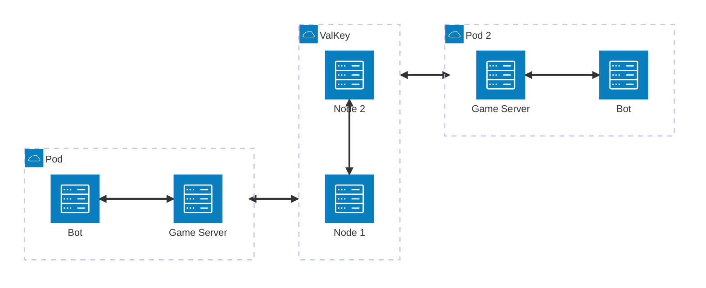

## Design

```mermaid
architecture-beta
    group pod(cloud)[Pod]
    service bot(server)[Bot] in pod
    service gameserver(server)[Game Server] in pod

    group pod2(cloud)[Pod 2]
    service bot2(server)[Bot] in pod2
    service gameserver2(server)[Game Server] in pod2

    group valkey(cloud)[ValKey]
    service node1(server)[Node 1] in valkey
    service node2(server)[Node 2] in valkey

    bot:R <--> L:gameserver
    bot2:L <--> R:gameserver2
    node1:T <--> B:node2
    gameserver{group}:R <--> L:node1{group}
    gameserver2{group}:L <--> R:node2{group}
```