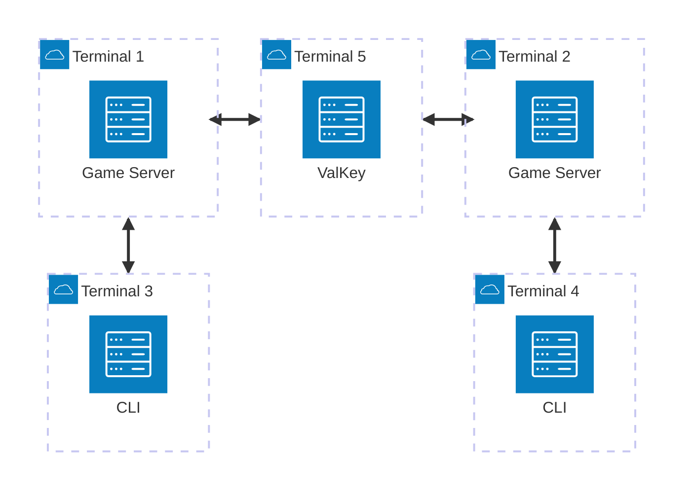
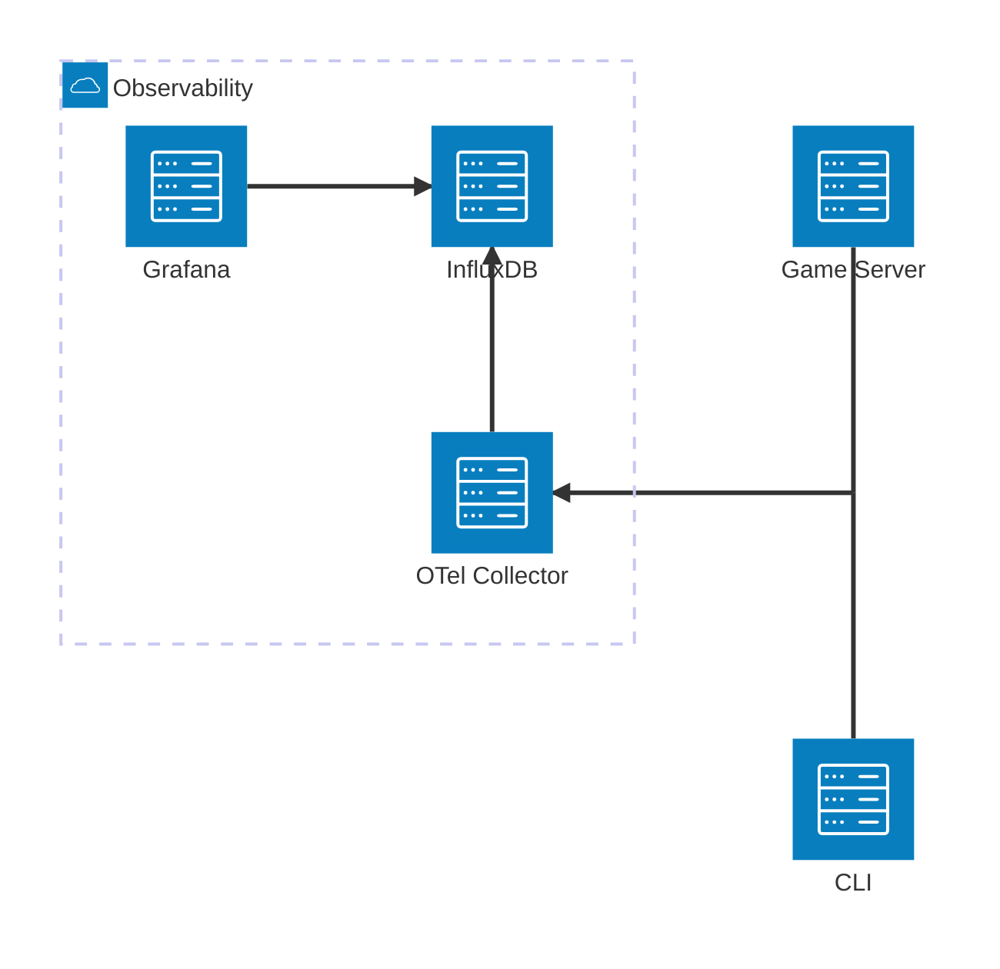

## Goals

- Be able to perform a basic action
- Communicate state events to another game server
- Collect telemetry on entire end-to-end flow of actions and state events
- At the end, telemetry data should be used to evaluate effectiveness of this POC

## Tech Stack

- [gRPC](https://grpc.io/) - for game server API
- [ValKey Streams](https://valkey.io/topics/streams-intro/) - for distributed pub/sub between the game servers
- [OTel Collector](https://opentelemetry.io/docs/collector/) - for ingesting telemetry signals from everything
- [InfluxDB](https://www.influxdata.com/) - for storing and indexing telemetry signals from collector
- [Grafana](https://grafana.com/) - for visualizing telemetry signals

## Design

### Observability

## Steps

### Step 0

Define game server interface with support for:

- One action, `Move`
- One state event, `Position`

### Step 1

Implement CLI tool for manually performing `Move` action
and receiving `Position` updates.

### Step 2

Implement a game server with support for one action, `Move`, and
one state event, `Position`.

### Step 3

Run ValKey in local container runtime

### Step 4

Integrate game server with ValKey

### Step 5

Run OTel collector, InfluxDB, Grafana locally

### Step 6

Integrate CLI and game server with OTel collector

### Step 7

In multiple local terminals, run 2 game servers and use 2 CLIs to perform `Move`s

## Results

*TBD: once the POC is completed screenshots and a write up should be put here*