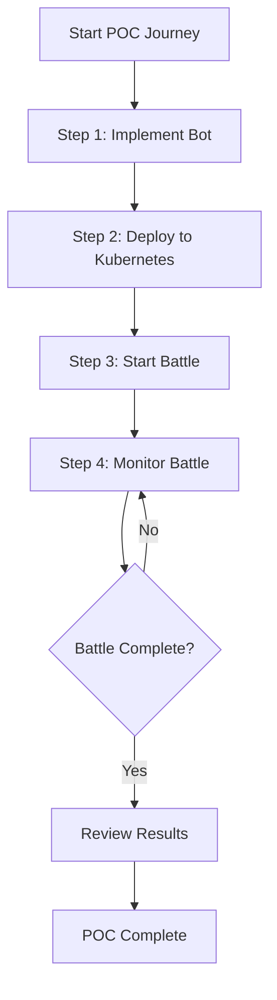
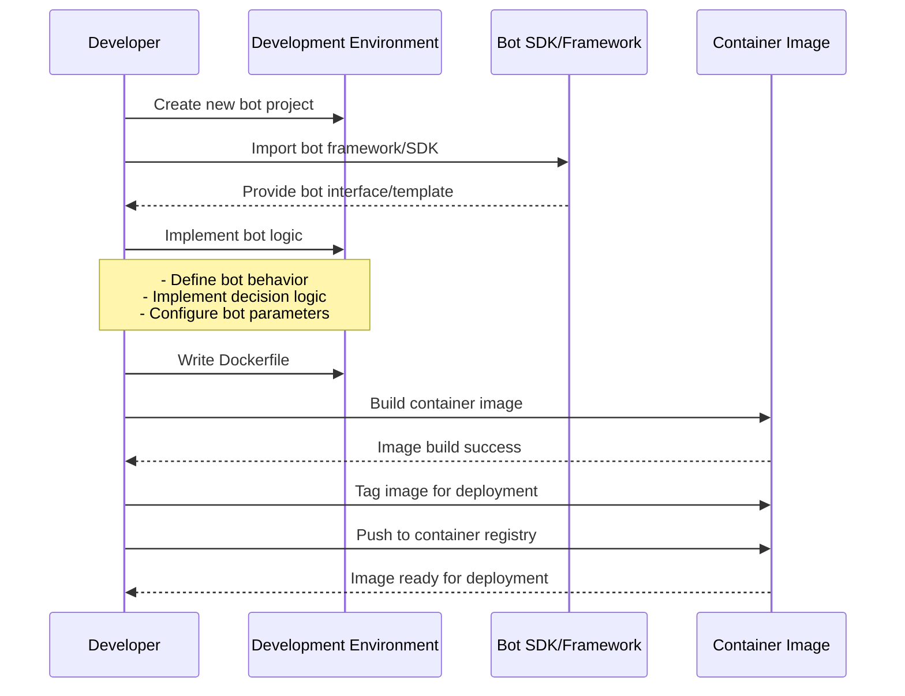
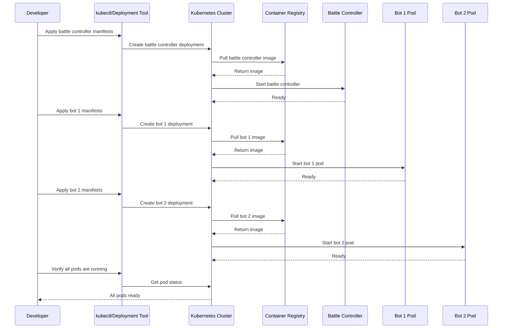
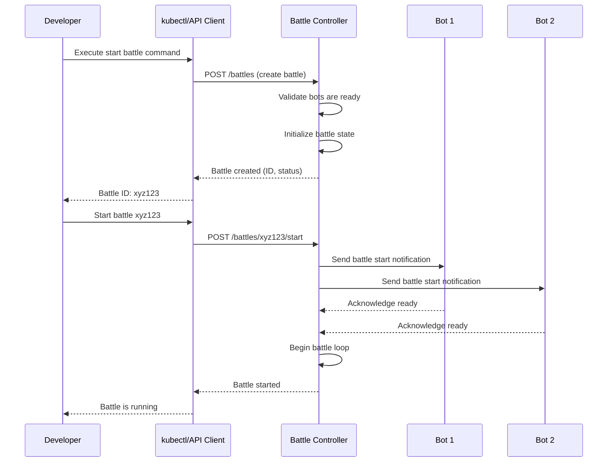
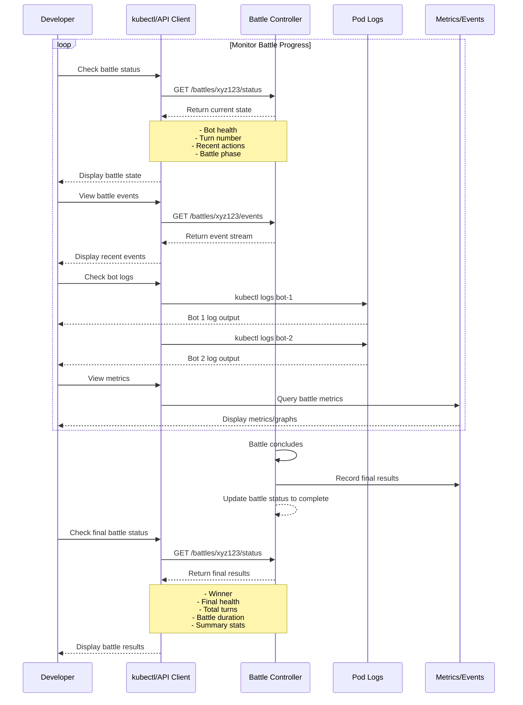

## Overview

The POC User Journey describes the end-to-end flow for demonstrating the core BattleBots platform capabilities. This journey focuses on the minimal viable experience: two containerized bots deployed to Kubernetes engaging in a 1v1 battle. The POC validates the fundamental technical architecture and user experience before expanding to more complex features like tournaments, leaderboards, and advanced bot management.

This journey serves as the foundation for understanding the essential workflows and technical requirements that will inform all future platform development.

## User Personas

**Primary Persona**: POC Developer/Tester
- **Description**: A developer or team member evaluating the BattleBots platform concept through a minimal proof of concept deployment
- **Goals**:
  - Quickly implement and test a basic bot
  - Deploy the POC environment to Kubernetes with minimal configuration
  - Initiate and observe a 1v1 battle between two bots
  - Validate that the core battle mechanics work as expected
  - Identify technical and UX issues before full platform development
- **Pain Points**:
  - Complex deployment processes that obscure core functionality
  - Unclear bot implementation requirements or APIs
  - Lack of visibility into battle state and progress
  - Difficulty debugging when battles don't start or fail mid-execution

## Journey Flow Diagram

## Step 1: User Implementing a Bot

This step covers the developer experience of creating a bot that can participate in battles.

**Flow Narrative**:

1. **Project Setup**: Developer creates a new bot project using the provided bot SDK or framework
2. **Bot Interface**: SDK provides the necessary interface, base classes, or templates that define how bots interact with the battle system
3. **Bot Implementation**: Developer writes the bot's decision logic including:
   - Attack strategies
   - Defense mechanisms
   - Resource management
   - State tracking
4. **Containerization**: Developer creates a Dockerfile to package the bot as a container
5. **Build & Test**: Developer builds the container image locally to verify it compiles and runs
6. **Registry Push**: Developer pushes the container image to a registry accessible by the Kubernetes cluster

## Step 2: User Deploying the POC to Kubernetes

This step covers deploying both the battle infrastructure and the two competing bots to a Kubernetes cluster.

**Flow Narrative**:

1. **Battle Controller Deployment**: Developer deploys the battle controller service that will orchestrate the 1v1 battle
   - Applies Kubernetes manifests (Deployment, Service, ConfigMap)
   - Controller pulls from container registry
   - Controller initializes and becomes ready
2. **Bot 1 Deployment**: Developer deploys the first bot
   - Applies bot 1 Kubernetes manifests
   - Pod pulls bot container image
   - Bot initializes and registers with battle controller
3. **Bot 2 Deployment**: Developer deploys the second bot
   - Applies bot 2 Kubernetes manifests
   - Pod pulls bot container image
   - Bot initializes and registers with battle controller
4. **Verification**: Developer verifies all components are running
   - Checks pod status
   - Confirms bots are registered and ready
   - Validates network connectivity between components

## Step 3: User Starting the Battle

This step covers initiating the 1v1 battle between the two deployed bots.

**Flow Narrative**:

1. **Battle Creation**: Developer initiates battle creation
   - Executes command via kubectl, API, or CLI tool
   - Specifies the two bots to participate
   - Battle controller validates both bots are available
2. **Battle Initialization**: Battle controller sets up the battle
   - Creates battle instance with unique ID
   - Initializes battle state (health, resources, turn counters)
   - Establishes communication channels with both bots
3. **Bot Notification**: Controller notifies bots that battle is starting
   - Sends battle parameters and rules
   - Bots acknowledge readiness
4. **Battle Commencement**: Controller begins the battle loop
   - Starts turn-based or real-time battle execution
   - Returns battle ID and status to developer
5. **Confirmation**: Developer receives confirmation that battle has started
   - Can use battle ID to monitor progress

## Step 4: User Monitoring the Battle

This step covers how the developer observes the battle as it progresses and reviews the final outcome.

**Flow Narrative**:

1. **Status Monitoring**: Developer polls battle status
   - Queries battle controller API for current state
   - Views bot health, resources, and turn count
   - Sees which bot is currently acting
2. **Event Streaming**: Developer watches battle events in real-time
   - Queries event stream from battle controller
   - Views actions taken by each bot
   - Sees damage dealt, resources consumed, state changes
3. **Log Inspection**: Developer examines bot logs
   - Uses kubectl to tail bot pod logs
   - Sees bot decision-making process
   - Identifies any errors or unexpected behavior
4. **Metrics Visualization**: Developer views battle metrics
   - Accesses metrics dashboard or API
   - Views health over time, action frequency, etc.
   - Monitors resource utilization of pods
5. **Battle Completion**: Battle controller determines winner
   - One bot's health reaches zero, or
   - Maximum turn limit reached, or
   - Timeout occurs
6. **Results Review**: Developer retrieves final battle results
   - Queries final battle status
   - Reviews winner, final statistics, and battle summary
   - Exports or saves results for analysis

## Requirements

### Access Control

#### REQ-AC-001
- **Priority**: P1
- **Description**: Battle controller must authenticate requests to start/stop battles
- **Rationale**: Prevents unauthorized users from interfering with running battles or starting battles without permission

#### REQ-AC-002
- **Priority**: P1
- **Description**: Bot pods should run with minimal Kubernetes RBAC permissions
- **Rationale**: Limits potential damage from compromised or malicious bot code by restricting access to cluster resources

#### REQ-AC-003
- **Priority**: P2
- **Description**: Battle status and logs should be accessible to the developer who initiated the battle
- **Rationale**: Ensures developers can monitor and debug their battles while maintaining privacy between different users

### Analytics

#### REQ-AN-001
- **Priority**: P0
- **Description**: Track battle lifecycle events (created, started, completed, failed)
- **Rationale**: Essential for understanding battle flow, identifying failures, and measuring platform reliability

#### REQ-AN-002
- **Priority**: P0
- **Description**: Record bot actions and decisions during battle
- **Rationale**: Enables replay, debugging, and analysis of bot behavior and battle dynamics

#### REQ-AN-003
- **Priority**: P1
- **Description**: Track battle duration and turn counts
- **Rationale**: Helps identify performance issues, endless battles, and validates that battles complete in reasonable timeframes

#### REQ-AN-004
- **Priority**: P1
- **Description**: Monitor resource utilization (CPU, memory) of bot pods during battles
- **Rationale**: Ensures bots don't consume excessive resources and helps right-size pod resource requests/limits

#### REQ-AN-005
- **Priority**: P2
- **Description**: Track deployment success rates and pod startup times
- **Rationale**: Identifies infrastructure issues and measures deployment reliability

## Success Metrics

Success for the POC User Journey is measured by how effectively the proof of concept demonstrates core platform capabilities and validates technical feasibility.

**Quantitative Metrics:**
- **Deployment Success Rate**: Target 95%+ of deployments complete without errors
  - Measures: Number of successful deployments / Total deployment attempts
- **Battle Completion Rate**: Target 90%+ of started battles complete successfully
  - Measures: Number of completed battles / Number of started battles
- **Battle Duration**: Target battles complete within 5 minutes
  - Measures: Median time from battle start to completion
- **Bot Responsiveness**: Target <1 second average response time per bot action
  - Measures: Time between battle controller requesting action and bot responding
- **Pod Startup Time**: Target <30 seconds for bot pods to become ready
  - Measures: Time from pod creation to ready status

**Qualitative Metrics:**
- **POC Validation Success**: Target: POC successfully demonstrates core battle mechanics
  - How it will be gathered: Stakeholder review and sign-off that POC meets objectives
- **Developer Experience**: Target: Developers can complete entire flow without external help
  - How it will be gathered: Observation of POC execution, documentation review, developer feedback

## Related Documentation

**Existing ADRs:**
- (No existing ADRs yet - this is the foundational POC journey)

**Required ADRs (Not Yet Created):**
- **Bot SDK Architecture** - Design of the bot interface, SDK, and communication protocol between bots and battle controller
- **Battle Controller Design** - Architecture of the battle controller, state management, and battle loop implementation
- **Kubernetes Deployment Strategy** - Pod specifications, resource limits, networking, and service discovery approach for POC
- **Battle State Management** - How battle state is stored, updated, and synchronized between components
- **Container Registry Selection** - Choice of container registry for bot images (Docker Hub, GCR, ECR, private registry)
- **Monitoring and Observability** - Approach for logging, metrics collection, and battle event streaming
- **Bot Communication Protocol** - API/protocol for battle controller to bot communication (REST, gRPC, WebSocket, message queue)

**Related User Journeys:**
- (To be created) Bot Development and Testing
- (To be created) Multi-Bot Tournament
- (To be created) Battle Replay and Analysis
- (To be created) Bot Registration and Management

**API Documentation:**
- (To be created) Battle Controller API specification
- (To be created) Bot SDK API reference

## Notes

**Future Enhancements:**
- Web-based battle visualization showing real-time battle state
- Battle replay functionality to review completed battles
- Support for more than 2 bots in a single battle (free-for-all or team modes)
- Automated bot testing framework for local development
- CI/CD pipeline for bot builds and deployments
- Persistent battle history and statistics database
- Leaderboard and ranking system based on battle results
- Bot versioning and rollback capabilities
- Pre-battle validation and simulation mode
- Resource limits and fairness controls to ensure balanced battles

**Technical Considerations:**
- Battle controller should be stateless where possible, storing battle state externally (database, ConfigMap, CRD)
- Consider using Kubernetes Custom Resources (CRDs) to represent battles as native K8s objects
- Bot containers should have resource limits to prevent resource exhaustion
- Network policies may be needed to control communication between bots and battle controller
- Consider using a sidecar pattern for battle observability (logging, metrics collection)
- Battle timeout mechanism needed to prevent infinite battles
- Health checks and readiness probes essential for reliable pod lifecycle management
- Consider using Kubernetes Jobs or CronJobs for battle execution rather than long-running Deployments
- Event streaming could use Kubernetes events, or separate event bus (NATS, Kafka)
- Bot SDK should handle retries and graceful degradation for network issues
- Consider battle controller horizontal scaling for multiple concurrent battles in future

**Business Considerations:**
- POC success is critical for securing continued investment in platform development
- Simple, clear demonstration is more valuable than feature-rich complexity for POC
- POC should validate key technical risks: containerization, Kubernetes orchestration, bot communication
- Developer experience during POC will inform platform UX priorities
- POC timeline and resource requirements should be minimal to reduce cost and risk
- Successful POC demonstrates value proposition for target users (battlebot developers)
- POC should be easily repeatable and demonstrable to stakeholders
- Consider POC as foundation for future platform architecture decisions
