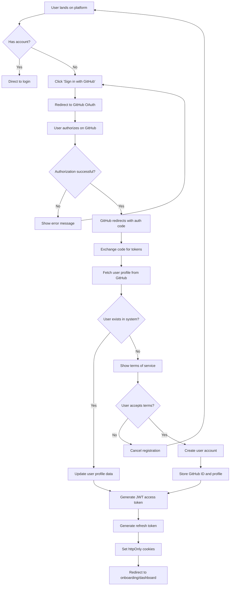

## Overview

The User Registration journey describes how new users create an account on the Battlebots platform. This is the first step in a user's experience and sets the foundation for their identity, access control, and personalization throughout the platform. A smooth registration process is critical for user acquisition and reduces friction in getting started with battlebots.

## User Personas

**Primary Persona**: New Battlebot Developer
- **Description**: A developer or team looking to deploy and compete with their battlebots in automated competitions
- **Goals**:
  - Quickly create an account to start deploying battlebots
  - Understand what access and capabilities they'll have
  - Feel confident their data and bots are secure
  - Avoid creating yet another username/password combination
- **Pain Points**:
  - Concern about granting OAuth permissions without understanding what data is accessed
  - Unclear terms of service or data usage policies
  - Friction if they need to create a GitHub account first (rare for developer audience)

## Journey Flow Diagram

Use Mermaid syntax to create a flowchart representing the user journey:

**Flow Narrative**:

1. **Entry Point**: User arrives at the platform homepage or a direct registration link
2. **Account Check**: System determines if user already has an account; if yes, redirects to login flow
3. **GitHub OAuth Initiation**: User clicks "Sign in with GitHub" button
4. **OAuth Redirect**: System redirects user to GitHub's OAuth authorization page with:
   - Client ID for the Battlebots application
   - Requested scopes (user:email, read:user)
   - State parameter for CSRF protection
   - Callback URL for return redirect
5. **GitHub Authorization**: User reviews permissions and authorizes the Battlebots application on GitHub
6. **OAuth Callback**: GitHub redirects back to Battlebots with:
   - Authorization code (if successful)
   - State parameter (for validation)
   - Error code (if authorization failed or was cancelled)
7. **Token Exchange**: System exchanges authorization code for access token via GitHub's token endpoint
8. **Profile Fetch**: System uses access token to fetch user's GitHub profile including:
   - GitHub ID (unique identifier)
   - Username
   - Email address (primary verified email)
   - Name, avatar URL
9. **User Lookup**: System checks if GitHub ID already exists in database
10. **New User Flow**: If user doesn't exist:
    - Display terms of service acceptance screen
    - Upon acceptance, create new user account with GitHub profile data
    - Store GitHub ID as primary identifier
    - Use GitHub username as default platform username (allow customization later)
11. **Existing User Flow**: If user exists, update profile data with latest from GitHub
12. **JWT Token Generation**: Generate internal JWT access token with user claims (15 min expiry, RS256 signing)
13. **Refresh Token Generation**: Generate cryptographic refresh token (7 days expiry) and store hash in database
14. **Cookie Setup**: Set httpOnly, secure, SameSite=strict cookies (access_token, refresh_token, csrf_token)
15. **Redirect**: Redirect to onboarding (new users) or dashboard (returning users)

**Persona-Specific Variations**:
- **New Battlebot Developer**: After accepting terms, redirected to onboarding flow to learn about deploying their first bot
- **Platform Administrator**: Automatically granted admin privileges if GitHub username is in configured admin list; has access to admin dashboard showing new registrations

## Requirements

### Access Control

#### REQ-AC-001
- **Priority**: P0
- **Description**: GitHub user IDs must be unique and serve as the primary account identifier
- **Rationale**: Ensures each user has a distinct identity tied to their GitHub account. GitHub ID is immutable and prevents account conflicts even if users change their GitHub username.

#### REQ-AC-002
- **Priority**: P0
- **Description**: Platform usernames default to GitHub username but must be unique across the platform
- **Rationale**: Provides a familiar starting point using GitHub identity while allowing customization. Prevents impersonation and confusion in competitions and leaderboards.

#### REQ-AC-003
- **Priority**: P0
- **Description**: GitHub OAuth integration with proper scope requests (user:email, read:user)
- **Rationale**: Enables secure authentication without managing passwords. Requests minimal necessary permissions to access user identity and primary verified email.

#### REQ-AC-004
- **Priority**: P0
- **Description**: CSRF protection using state parameter in OAuth flow
- **Rationale**: Prevents cross-site request forgery attacks during the OAuth authorization process, ensuring the callback is legitimate.

#### REQ-AC-005
- **Priority**: P0
- **Description**: Generate internal JWT access tokens (RS256, 15 min expiry) after GitHub OAuth authentication
- **Rationale**: Enables stateless API authentication without server-side session lookups. JWT claims include user identity for authorization decisions on every request.

#### REQ-AC-005a
- **Priority**: P0
- **Description**: Generate and rotate refresh tokens (7 days expiry) with database storage of token hash
- **Rationale**: Allows users to obtain new access tokens without re-authentication. Token rotation detects theft via reuse detection.

#### REQ-AC-005b
- **Priority**: P0
- **Description**: Store JWT tokens in httpOnly, secure, SameSite=strict cookies
- **Rationale**: Protects tokens from XSS attacks (httpOnly) and CSRF attacks (SameSite=strict). Secure flag ensures HTTPS-only transmission.

#### REQ-AC-006
- **Priority**: P1
- **Description**: Rate limiting on OAuth callback endpoint (max 10 requests per IP per minute)
- **Rationale**: Prevents abuse of the OAuth flow and protects against denial of service attacks on the authentication system.

#### REQ-AC-007
- **Priority**: P1
- **Description**: Terms of service acceptance required before account creation
- **Rationale**: Ensures users explicitly consent to platform policies before gaining access, meeting legal requirements.

#### REQ-AC-008
- **Priority**: P0
- **Description**: CSRF token validation for state-changing API requests (POST, PUT, PATCH, DELETE)
- **Rationale**: Defense-in-depth CSRF protection. Requires X-CSRF-Token header matching CSRF cookie value for all state-changing operations.

#### REQ-AC-009
- **Priority**: P0
- **Description**: JWT signature and claims validation on every authenticated API request
- **Rationale**: Ensures token authenticity (signature) and validity (exp, iss, aud claims). Prevents token tampering and expired token usage.

### Analytics

#### REQ-AN-001
- **Priority**: P0
- **Description**: Track OAuth funnel metrics (GitHub button clicks, OAuth redirects, successful authorizations, account creations)
- **Rationale**: Provides visibility into conversion rates and identifies where users drop off in the OAuth flow, enabling optimization.

#### REQ-AN-002
- **Priority**: P0
- **Description**: Track OAuth authorization failures and cancellations
- **Rationale**: Helps identify friction points in the GitHub authorization process and opportunities to improve messaging or user experience.

#### REQ-AN-003
- **Priority**: P1
- **Description**: Track time-to-complete-registration (from initial button click to account creation)
- **Rationale**: Measures overall friction in the registration process and helps validate that OAuth provides a faster experience.

#### REQ-AN-004
- **Priority**: P1
- **Description**: Track registration source (direct, referral, marketing campaign)
- **Rationale**: Helps understand which acquisition channels are most effective and informs marketing strategy.

#### REQ-AN-005
- **Priority**: P2
- **Description**: Track terms of service acceptance vs. rejection rates
- **Rationale**: Identifies if terms of service are causing user drop-off and may need simplification or clarification.

## Success Metrics

Success for the User Registration journey is measured by how efficiently and securely users can create accounts while maintaining platform integrity.

**Quantitative Metrics:**
- **OAuth Authorization Rate**: Target 85%+ of users who initiate GitHub OAuth complete authorization
  - Measures: Number of successful authorizations / Number of GitHub button clicks
- **Registration Completion Rate**: Target 90%+ of authorized users complete registration
  - Measures: Number of completed registrations / Number of successful OAuth authorizations
- **Time to Registration**: Target median time < 2 minutes
  - Measures: Time between initial GitHub button click and account creation
- **OAuth Error Rate**: Target < 5% of OAuth flows result in errors
  - Measures: Number of OAuth errors / Number of OAuth attempts
- **Terms Acceptance Rate**: Target 95%+ of users accept terms of service
  - Measures: Number of terms acceptances / Number of users shown terms

**Qualitative Metrics:**
- **User Satisfaction**: Target 4.5+ out of 5 rating on post-registration survey
  - How it will be gathered: Optional survey after registration asking "How easy was the registration process?"
- **GitHub OAuth Trust**: Target 90%+ of users feel comfortable authorizing GitHub access
  - How it will be gathered: Track authorization cancellation reasons via optional feedback prompt

## Related Documentation

**Existing ADRs:**
- [ADR-0002: User Registration via GitHub OAuth](/r&d/adrs/0002-user-registration-via-github-oauth/) - Defines GitHub OAuth as authentication method with stateless JWT tokens
- [ADR-0003: Stateless Authentication via JWT Tokens](/r&d/adrs/0003-stateless-jwt-authentication/) - Defines JWT token strategy, refresh token rotation, and CSRF protection

**Required ADRs (Not Yet Created):**
- **Data Privacy & Compliance** - How user data from GitHub is stored, processed, and protected (GDPR, CCPA considerations)
- **Rate Limiting Strategy** - Approach for preventing OAuth abuse while not impacting legitimate users
- **Username Customization Policy** - Rules for when/how users can customize their username after initial GitHub-based registration

**Related User Journeys:**
- (To be created) User Login via GitHub OAuth
- (To be created) User Session Management
- (To be created) User Onboarding
- (To be created) User Profile Management

**External Documentation:**
- GitHub OAuth Documentation: https://docs.github.com/en/developers/apps/building-oauth-apps/authorizing-oauth-apps
- GitHub API - User endpoints: https://docs.github.com/en/rest/users/users

## Notes

**Future Enhancements:**
- Social proof during registration (e.g., "Join 10,000+ battlebot developers")
- Support for additional OAuth providers (GitLab, Bitbucket) for users without GitHub accounts
- Ability to link multiple OAuth providers to a single account
- Username suggestions when preferred GitHub username is already taken
- Rich profile data import from GitHub (bio, location, organization)
- GitHub organization membership detection for team/enterprise features
- Progressive disclosure - collect minimal info upfront, gather more during onboarding

**Technical Considerations:**
- OAuth state parameter must be cryptographically random and validated on callback
- **Use PKCE (Proof Key for Code Exchange)** for OAuth flow to prevent authorization code interception
- GitHub access tokens should be encrypted at rest using strong encryption (AES-256) for future GitHub API calls
- **Generate internal JWT access tokens** (RS256, 15 min expiry) with user claims after OAuth callback
- **Generate refresh tokens** (random 32-byte, 7 days expiry) and store SHA256 hash in database
- **Set httpOnly, secure, SameSite=strict cookies** for access_token, refresh_token, csrf_token
- Implement proper error handling for GitHub API rate limits
- Store registration attempt metadata for abuse detection
- Consider implementing a waiting room or queue during high-traffic periods
- Handle edge cases: user revokes GitHub app access, user deletes GitHub account, user changes GitHub email
- Implement proper logging for OAuth flow debugging without exposing sensitive tokens
- **Implement JWT validation middleware** to verify signature and claims on every API request
- **Implement refresh token rotation** - issue new refresh token on every refresh, revoke old token
- **Optional: Redis token blacklist** for immediate JWT revocation (logout, security breach)

**Business Considerations:**
- Clear terms of service and privacy policy explaining what GitHub data is accessed and stored
- Transparency about GitHub permission scopes and why they're needed
- Consider offering different account tiers (free vs paid) at registration
- Opportunity to capture user intent/interests during onboarding for personalization
- Legal requirements vary by jurisdiction - may need age verification or parental consent flows
- GitHub-only authentication may limit accessibility for users without GitHub accounts
- Battlebots platform targets developers, making GitHub auth a natural fit for the primary persona
