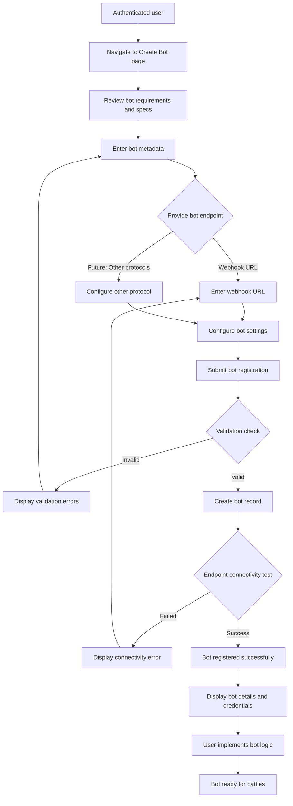

## Overview

This user journey describes how bot developers create and register autonomous bots on the Battle Bots platform. The journey covers the entire process from initial bot conception through registration and readiness for competition. This is a core user experience that enables the platform's primary value proposition: enabling developers to compete with autonomous battlebots.

## User Personas

**Primary Persona**: Bot Developer
- **Description**: A software developer (individual or team member) who wants to build and deploy an autonomous bot to compete in battles. They have programming experience and understand API integration concepts.
- **Goals**:
  - Create a functional bot that can receive state updates and respond with actions
  - Configure bot metadata and settings appropriately
  - Successfully register the bot in the platform
  - Have the bot ready to participate in battles
- **Pain Points**:
  - Uncertainty about bot implementation requirements and specifications
  - Difficulty understanding the bot communication protocol
  - Lack of clear validation feedback during registration
  - Unclear bot configuration options and their implications

**Secondary Persona**: Team Leader
- **Description**: A developer leading a team building bots, responsible for managing multiple bots and team access
- **Goals**:
  - Streamline bot creation process for team members
  - Understand bot ownership and access control
  - Track which team members have created which bots
- **Pain Points**:
  - Managing bot access and permissions across team members
  - Tracking team's bot portfolio

## Journey Flow Diagram

**Flow Narrative**:

1. **Starting Point**: User is already authenticated (see User Journey 0001) and navigates to the bot creation interface

2. **Review Requirements**: User reviews documentation about bot implementation requirements, including:
   - Communication protocol specifications
   - Required API endpoints the bot must implement
   - State update and action response format
   - Rate limits and timeout requirements

3. **Enter Bot Metadata**: User provides basic bot information:
   - Bot name (display name for the bot)
   - Description (optional, helps other users understand the bot's strategy)
   - Bot version or identifier (for tracking iterations)

4. **Provide Bot Endpoint**: User specifies how the platform will communicate with their bot:
   - **Current MVP**: Webhook URL where the bot receives state updates
   - **Future**: Support for gRPC, WebSocket, or other protocols

5. **Configure Bot Settings**: User sets operational parameters:
   - Timeout settings (how long to wait for bot responses)
   - Opt-in/opt-out for specific battle types
   - Public visibility settings (whether bot appears in public leaderboards)

6. **Submit Registration**: Platform validates the submission:
   - Checks required fields are present
   - Validates URL format and accessibility
   - Ensures bot name is unique for this user/team
   - Verifies user hasn't exceeded bot quota limits

7. **Validation Errors**: If validation fails, user sees specific error messages and can correct issues

8. **Endpoint Connectivity Test**: Platform performs a health check against the bot endpoint:
   - Sends a test request to verify the endpoint is reachable
   - Validates the bot responds in the expected format
   - Confirms response time is within acceptable limits

9. **Registration Success**: Bot is created and user receives:
   - Bot unique identifier
   - API credentials or tokens for authentication (if needed)
   - Next steps guidance for implementation
   - Link to bot management dashboard

10. **Implementation**: User implements bot logic based on specifications and tests locally

11. **Ready for Battle**: Once implementation is complete, bot is ready to participate in battles

**Persona-Specific Variations**:
- **Team Leader**: May see additional options for assigning bot ownership or sharing access with team members
- **Individual Developer**: Streamlined flow without team management options

## Requirements

### Access Control

#### REQ-AC-001
- **Priority**: P0
- **Description**: Only authenticated users can create bots
- **Rationale**: Bots must be associated with a user account for ownership, accountability, and access control. Prevents anonymous bot creation and abuse.

#### REQ-AC-002
- **Priority**: P0
- **Description**: Users can only manage (view, edit, delete) their own bots
- **Rationale**: Ensures bot creators maintain exclusive control over their creations and prevents unauthorized modifications.

#### REQ-AC-003
- **Priority**: P1
- **Description**: Bot creators can share bot management access with specific users or team members
- **Rationale**: Enables collaborative bot development within teams while maintaining security.

#### REQ-AC-004
- **Priority**: P2
- **Description**: Bot creators can define read-only viewers for their bot's configuration and performance
- **Rationale**: Allows sharing bot insights without granting modification privileges.

### Analytics

#### REQ-AN-001
- **Priority**: P0
- **Description**: Track bot creation events including user ID, timestamp, and bot configuration
- **Rationale**: Essential for understanding platform adoption, identifying popular configuration patterns, and troubleshooting user issues.

#### REQ-AN-002
- **Priority**: P1
- **Description**: Track bot registration validation failures and error types
- **Rationale**: Helps identify common user pain points in the registration process and areas where documentation or UX can be improved.

#### REQ-AN-003
- **Priority**: P1
- **Description**: Track endpoint connectivity test results (success/failure rate)
- **Rationale**: Indicates user success in properly implementing bot endpoints and can highlight infrastructure or documentation issues.

#### REQ-AN-004
- **Priority**: P2
- **Description**: Track time from bot registration to first battle participation
- **Rationale**: Measures the effectiveness of onboarding documentation and identifies friction in the journey from creation to active participation.

### Functionality

#### REQ-FN-001
- **Priority**: P0
- **Description**: Platform must validate bot endpoint is reachable during registration
- **Rationale**: Prevents registration of non-functional bots and provides immediate feedback to users about configuration issues.

#### REQ-FN-002
- **Priority**: P0
- **Description**: Platform must enforce unique bot names per user/team
- **Rationale**: Prevents confusion when managing multiple bots and ensures clear identification in battle contexts.

#### REQ-FN-003
- **Priority**: P1
- **Description**: Platform must provide clear, actionable error messages for all validation failures
- **Rationale**: Reduces user frustration and support burden by enabling self-service problem resolution.

#### REQ-FN-004
- **Priority**: P1
- **Description**: Platform must support bot metadata updates after creation
- **Rationale**: Allows users to iterate on bot configuration without recreating the entire bot, improving user experience.

#### REQ-FN-005
- **Priority**: P2
- **Description**: Platform should provide a test/sandbox mode for validating bot implementation
- **Rationale**: Enables users to verify their bot works correctly before entering real battles, reducing failed battle experiences.

### Performance

#### REQ-PF-001
- **Priority**: P0
- **Description**: Bot registration endpoint connectivity test must complete within 10 seconds
- **Rationale**: Provides timely feedback without causing user frustration during registration flow.

#### REQ-PF-002
- **Priority**: P1
- **Description**: Bot creation API must respond within 2 seconds (excluding endpoint connectivity test)
- **Rationale**: Ensures responsive user experience during bot registration.

### Security

#### REQ-SC-001
- **Priority**: P0
- **Description**: Platform must validate bot endpoint URLs to prevent SSRF attacks
- **Rationale**: Prevents malicious users from using bot registration to probe internal infrastructure.

#### REQ-SC-002
- **Priority**: P0
- **Description**: Platform must enforce rate limits on bot creation per user
- **Rationale**: Prevents abuse and resource exhaustion from automated bot creation.

#### REQ-SC-003
- **Priority**: P1
- **Description**: Platform should support HTTPS endpoints only for production bots
- **Rationale**: Ensures secure communication between platform and user bots, protecting sensitive battle state information.

## Success Metrics

**Quantitative Metrics:**
- **Bot Creation Success Rate**: Target 80%+ successful registrations on first attempt
  - Measures how many users successfully register a bot without validation errors
  - Lower rates indicate UX or documentation issues

- **Endpoint Validation Success Rate**: Target 70%+ endpoints pass connectivity test on first try
  - Indicates how well users understand bot implementation requirements
  - Helps identify if specifications are clear enough

- **Time to First Bot Creation**: Target <10 minutes from account creation
  - Measures onboarding effectiveness
  - Indicates if the creation flow is intuitive

- **Bot Creation to First Battle Time**: Target <24 hours median
  - Measures overall friction in getting started with the platform
  - Includes both platform UX and user implementation time

**Qualitative Metrics:**
- **User Satisfaction with Bot Creation Process**: Target 4/5 rating
  - Gathered through post-creation survey
  - Identifies pain points in the journey

- **Documentation Clarity**: Target 4/5 rating
  - Measured through survey question about bot specification documentation
  - Indicates if users understand how to implement bots

## Related Documentation

**Existing ADRs:**
- [ADR-0001: User Registration and Authentication Strategy](../adrs/0001-user-registration-and-authentication-strategy.md) - Defines authentication requirements that gate bot creation

**Required ADRs (Not Yet Created):**
- **Bot Communication Protocol** - Define how the platform communicates with user bots (webhook format, gRPC, WebSocket), request/response schemas, timeout handling, and retry logic. Critical for users to understand implementation requirements.

- **Bot Endpoint Validation Strategy** - Define how the platform validates bot endpoints during registration, including security measures to prevent SSRF, acceptable response times, and validation criteria.

- **Bot Quota and Rate Limiting** - Define limits on number of bots per user/team, bot creation rate limits, and how quotas scale with different user tiers or plans.

- **Bot Metadata and Configuration Schema** - Define required and optional bot metadata fields, configuration options, validation rules, and data storage approach.

- **Bot Ownership and Access Control** - Define ownership model for bots, team access patterns, permission levels, and how access is granted/revoked.

**Related User Journeys:**
- [0001: User Registration](0001-user-registration.md) - Users must complete registration before creating bots

**API Documentation:**
- **Bot Registration API** - Needs to be created to document POST /bots endpoint, request/response schemas, validation rules, and error responses
- **Bot Management API** - Needs to be created to document GET/PUT/DELETE /bots/{id} endpoints for managing registered bots

## Notes

**Future Enhancements:**
- **Bot Templates**: Provide starter templates in popular languages (Go, Python, JavaScript) to reduce implementation time
- **Local Testing Tools**: CLI tool or SDK that simulates battle state updates for local bot testing
- **Bot Versioning**: Support multiple versions of the same bot for A/B testing strategies
- **Bot Cloning**: Allow users to duplicate existing bots as starting points for variations
- **Batch Bot Creation**: API support for programmatically creating multiple bots
- **Bot Import/Export**: Allow users to export bot configuration and import it elsewhere

**Technical Considerations:**
- Bot endpoint validation must be performed asynchronously to avoid blocking the registration request if the user's endpoint is slow
- Need to consider retry logic if bot endpoint is temporarily unavailable during registration
- Bot credentials (if generated) must be stored securely and transmitted only once
- Consider webhook signature verification to ensure battle state updates come from legitimate platform sources
- Database schema must support efficient querying of bots by owner, status, and creation date
- Consider implementing soft delete for bots to preserve historical battle data

**Business Considerations:**
- Bot creation is a key conversion metric - optimizing this flow impacts platform growth
- Free tier users may have limited bot quotas, paid tiers could offer more bots
- Bot creation is a gateway to monetization opportunities (premium features, higher quotas, advanced analytics)
- Public bot visibility could drive community engagement and platform discovery
- Bot creation friction directly impacts time-to-value for new users
