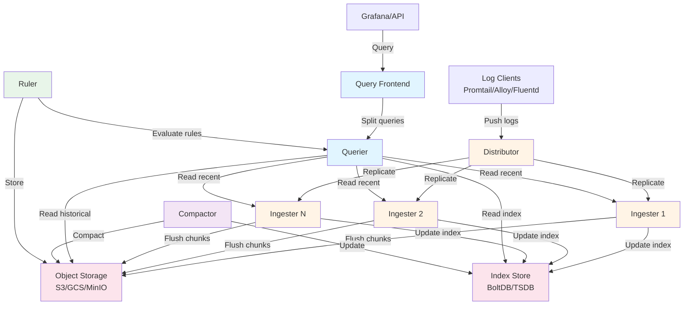
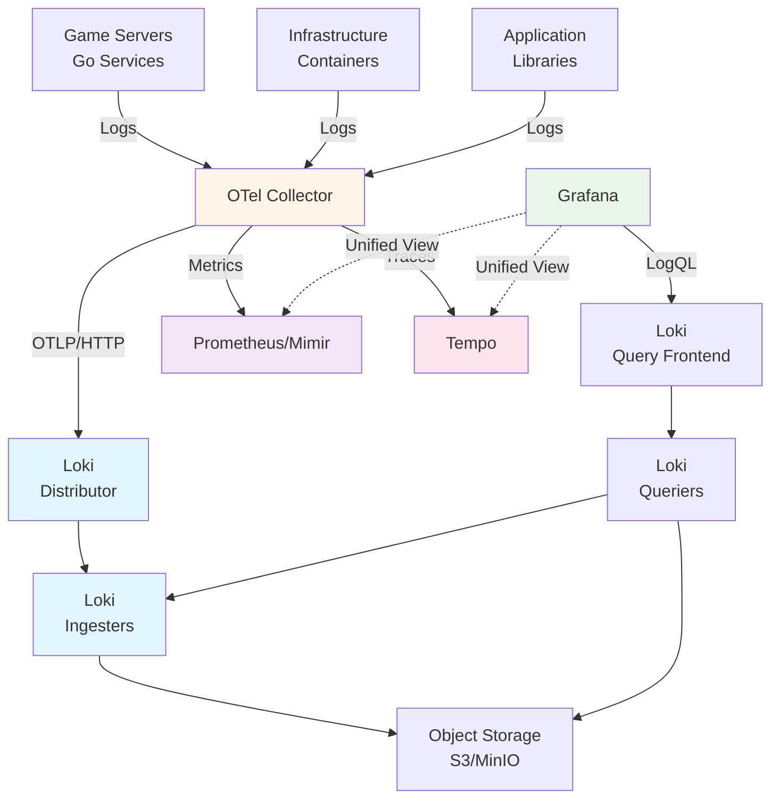

## Overview

Grafana Loki is a horizontally-scalable, highly-available, multi-tenant log aggregation system designed to be cost-effective and easy to operate. Inspired by Prometheus, Loki takes a fundamentally different approach to log storage compared to traditional systems like Elasticsearch.

The core innovation of Loki is its index-free architecture: instead of indexing the full contents of log lines, Loki only indexes metadata labels for each log stream. This design dramatically reduces storage costs, memory requirements, and operational complexity while still enabling fast queries through label-based filtering and grep-style text search.

Loki integrates seamlessly with Grafana for visualization, supports native OTLP ingestion (v3+), and works alongside Prometheus and Tempo to provide a complete observability stack. The system is built for cloud-native environments with first-class support for Kubernetes, containerized workloads, and distributed architectures.

## Key Concepts

Understanding Loki's data model is essential for effective deployment and usage.

### Streams

A **stream** is the fundamental data structure in Loki, representing a sequence of log entries that share the same set of labels. Each unique combination of labels creates a new stream. For example:

```
{app="battleserver", env="prod", region="us-east"}
{app="battleserver", env="prod", region="us-west"}
{app="matchmaker", env="prod", region="us-east"}
```

These three label sets create three distinct streams. All log entries with identical labels are appended to the same stream in chronological order.

### Labels

**Labels** are key-value pairs that categorize and identify log streams. Labels are the only metadata indexed by Loki, making label design the most critical aspect of Loki deployment.

Labels should be:
- **Low cardinality**: Use labels that have bounded, predictable values (e.g., `environment`, `service`, `host`)
- **Descriptive**: Represent the source or context of logs (e.g., `namespace`, `pod`, `container`)
- **Static**: Avoid labels that change frequently or have unique values per log entry

**Anti-pattern**: Using high-cardinality values like user IDs, trace IDs, or timestamps as labels will severely degrade performance.

```yaml
# Good label design (low cardinality)
{service="game-server", environment="production", region="us-east-1"}

# Bad label design (high cardinality)
{trace_id="abc123", user_id="user456", timestamp="2025-12-03T10:00:00Z"}
```

Loki recommends keeping total stream count below 10,000 for small deployments and under 100,000 active streams for larger deployments.

### Chunks

**Chunks** are compressed blocks of log data from a single stream. As logs arrive for a stream, the ingester accumulates them in memory, then periodically flushes completed chunks to object storage.

Key chunk characteristics:
- Contain only data from a single stream
- Compressed using LZ4 or Snappy
- Stored in object storage (S3, GCS, MinIO, filesystem)
- Typically span minutes to hours of log data
- Subject to configurable size and time limits

The chunk format optimizes for sequential reads, making time-range queries efficient.

### Index

The **index** stores the mapping between label sets and their corresponding chunks. Unlike full-text indexes, Loki's index only contains:
- Label names and values
- Chunk references (location, time range)
- Stream metadata

This minimal indexing approach is what makes Loki cost-effective. The index is stored separately from chunks, typically in a different backend (BoltDB, TSDB).

### LogQL

**LogQL** is Loki's query language, inspired by Prometheus's PromQL. LogQL queries have two stages:

1. **Log stream selection**: Filter streams using label matchers
2. **Log pipeline**: Parse, filter, and transform selected log lines

```logql
# Select streams, then filter log content
{service="game-server"} |= "error" | json | level="ERROR"

# Aggregate metrics from logs
rate({service="game-server"} |= "battle completed" [5m])

# Multi-stage pipeline with parsing and filtering
{namespace="battlebots"}
  | json
  | line_format "{{.message}}"
  | pattern `<_> level=<level> <_>`
  | level = "error"
```

LogQL supports metric queries, allowing you to generate time-series data from logs (e.g., error rates, request counts).

## Architecture Components

Loki uses a microservices architecture where each component can be scaled independently or combined into larger deployment targets.



### Distributor

The **distributor** is the entry point for log ingestion. It receives log streams from clients (Promtail, Alloy, OTLP endpoints) and routes them to ingesters.

Responsibilities:
- Validate incoming log streams for correctness and tenant limits
- Apply rate limiting per tenant
- Hash log streams by labels to determine target ingesters
- Replicate each stream to multiple ingesters (default: 3 replicas)
- Load balance across available ingesters

Distributors are stateless and can be horizontally scaled to handle high ingestion rates.

### Ingester

The **ingester** receives log streams from distributors and is responsible for:
- Buffering logs in memory for each stream
- Building compressed chunks
- Flushing chunks to object storage periodically
- Writing index entries
- Serving queries for recent (unflushed) data

Ingesters maintain an in-memory index of recent logs and use a write-ahead log (WAL) for crash recovery. Upon graceful shutdown, ingesters flush all buffered data to storage.

Ingesters are stateful and require careful scaling considerations. They use consistent hashing to distribute streams evenly across instances.

### Querier

The **querier** executes LogQL queries by:
- Fetching index data to identify relevant chunks
- Retrieving chunks from object storage
- Querying ingesters for recent unflushed data
- Merging results from multiple sources
- Applying log pipeline operations (parsing, filtering)
- Returning results to the query frontend

Queriers are stateless and can be scaled horizontally. They cache chunk data and index lookups to improve performance.

### Query Frontend

The **query frontend** sits in front of queriers and provides:
- Query splitting: Breaks large time-range queries into smaller sub-queries
- Query queuing: Prevents overwhelming queriers during traffic spikes
- Caching: Stores query results to avoid redundant computation
- Fair scheduling: Ensures multiple tenants share query resources equitably

The frontend is optional but highly recommended for production deployments. It significantly improves query performance and protects backend components from overload.

### Compactor

The **compactor** is a background service that:
- Merges small chunks into larger ones to improve query performance
- Removes duplicate data from replicated writes
- Applies retention policies by deleting old data
- Updates index to reflect compacted chunks

Only one compactor should run per tenant to avoid conflicts. The compactor is critical for long-term storage efficiency.

### Ruler

The **ruler** evaluates recording rules and alerting rules against stored logs:
- Runs LogQL queries on a schedule
- Generates derived metrics from log data
- Triggers alerts based on log patterns
- Stores rule evaluation results

The ruler is optional and typically used for log-based alerting scenarios.

### Index Gateway

The **index gateway** (available in recent versions) centralizes index access:
- Provides a single point for index queries
- Reduces load on the index store
- Enables better caching of index data
- Simplifies index backend scaling

This component is particularly useful with BoltDB index backends to avoid direct file access from multiple queriers.

## Deployment Modes

Loki supports three deployment modes, each balancing simplicity against scalability and operational flexibility.

### Monolithic Mode

In **monolithic mode**, all Loki components run in a single process. This is the simplest deployment option.

**Configuration:**
```bash
loki -target=all -config.file=loki-config.yaml
```

**Characteristics:**
- Single binary or container
- All components share memory and resources
- Minimal operational complexity
- Limited horizontal scalability
- Suitable for development and small deployments

**When to use:**
- Development and testing environments
- Proof-of-concept deployments
- Small-scale production (<100GB/day log ingestion)
- Single-server deployments

**Limitations:**
- Cannot scale components independently
- Single point of failure
- Resource contention between components
- Limited to vertical scaling (bigger instances)

### Simple Scalable Deployment (SSD)

**Simple scalable deployment** groups components into three logical targets: read, write, and backend.

**Targets:**
- **Read** (`-target=read`): Query Frontend, Querier
- **Write** (`-target=write`): Distributor, Ingester
- **Backend** (`-target=backend`): Compactor, Ruler, Index Gateway

**Configuration example:**
```yaml
# Write path (3 replicas for high availability)
loki -target=write -config.file=loki-config.yaml

# Read path (scale based on query load)
loki -target=read -config.file=loki-config.yaml

# Backend (single instance)
loki -target=backend -config.file=loki-config.yaml
```

**Characteristics:**
- Separates read and write paths
- Independent scaling of ingestion vs queries
- Easier to operate than full microservices
- Supports ~1TB/day log ingestion

**When to use:**
- Medium-scale production deployments
- When you need to scale reads and writes independently
- Kubernetes environments using Helm charts
- Teams wanting operational simplicity with scalability

This is the **recommended starting point** for most production deployments.

### Microservices Mode

**Microservices mode** runs each Loki component as a separate deployment, providing maximum flexibility.

**Components:**
- Distributor (multiple instances)
- Ingester (multiple instances, stateful)
- Querier (multiple instances)
- Query Frontend (multiple instances)
- Compactor (single instance per tenant)
- Ruler (multiple instances)
- Index Gateway (multiple instances)

**Characteristics:**
- Each component scaled independently
- Fine-grained resource allocation
- Most complex to deploy and maintain
- Supports enterprise-scale deployments (multi-TB/day)

**When to use:**
- Very large Loki clusters (>1TB/day)
- Organizations requiring precise control over scaling
- Multi-tenant SaaS deployments
- Teams with dedicated Loki operations expertise

**Considerations:**
- Significantly higher operational complexity
- More components to monitor and maintain
- Requires sophisticated orchestration (Kubernetes)
- Network communication overhead between components

## How to Run Loki

This section provides practical guidance for running Loki, focusing on Docker/Podman Compose for POC and development.

### Quick Start with Docker Compose

The simplest way to evaluate Loki is using the official Docker Compose example.

**Step 1: Create directory and download configurations**

```bash
mkdir loki-poc && cd loki-poc

# Download Loki configuration
wget https://raw.githubusercontent.com/grafana/loki/main/examples/getting-started/loki-config.yaml

# Download Alloy (log shipper) configuration
wget https://raw.githubusercontent.com/grafana/loki/main/examples/getting-started/alloy-local-config.yaml

# Download Docker Compose file
wget https://raw.githubusercontent.com/grafana/loki/main/examples/getting-started/docker-compose.yaml
```

**Step 2: Review the Docker Compose file**

The compose file includes:
- Loki (monolithic mode)
- Grafana (for visualization)
- Grafana Alloy (log collection agent)
- flog (log generator for testing)

**Step 3: Start the stack**

```bash
docker compose up -d
```

**Step 4: Verify deployment**

```bash
# Check Loki readiness
curl http://localhost:3100/ready

# Check Loki metrics
curl http://localhost:3100/metrics

# Access Grafana
# URL: http://localhost:3000
# Default credentials: admin / admin
```

**Step 5: Query logs**

In Grafana, navigate to Explore and select the Loki datasource to query logs using LogQL.

### Basic Configuration File Structure

A minimal Loki configuration for local development:

```yaml
auth_enabled: false

server:
  http_listen_port: 3100
  grpc_listen_port: 9096

common:
  instance_addr: 127.0.0.1
  path_prefix: /tmp/loki
  storage:
    filesystem:
      chunks_directory: /tmp/loki/chunks
      rules_directory: /tmp/loki/rules
  replication_factor: 1
  ring:
    kvstore:
      store: inmemory

schema_config:
  configs:
    - from: 2020-10-24
      store: tsdb
      object_store: filesystem
      schema: v13
      index:
        prefix: index_
        period: 24h

limits_config:
  reject_old_samples: true
  reject_old_samples_max_age: 168h
  max_cache_freshness_per_query: 10m
  split_queries_by_interval: 15m

query_range:
  align_queries_with_step: true
  cache_results: true

ruler:
  alertmanager_url: http://localhost:9093
```

This configuration uses local filesystem storage and is suitable for development only.

### Production Configuration with MinIO

For a more production-like setup using MinIO as object storage:

**Docker Compose with MinIO:**

```yaml
version: "3.8"

services:
  minio:
    image: minio/minio:latest
    entrypoint:
      - sh
      - -euc
      - |
        mkdir -p /data/loki-data
        minio server /data --console-address :9001
    environment:
      - MINIO_ROOT_USER=loki
      - MINIO_ROOT_PASSWORD=supersecret
      - MINIO_PROMETHEUS_AUTH_TYPE=public
    ports:
      - "9000:9000"
      - "9001:9001"
    volumes:
      - minio-data:/data

  loki:
    image: grafana/loki:3.0.0
    ports:
      - "3100:3100"
    volumes:
      - ./loki-config.yaml:/etc/loki/config.yaml
    command: -config.file=/etc/loki/config.yaml
    depends_on:
      - minio

  grafana:
    image: grafana/grafana:latest
    ports:
      - "3000:3000"
    environment:
      - GF_AUTH_ANONYMOUS_ENABLED=true
      - GF_AUTH_ANONYMOUS_ORG_ROLE=Admin
    volumes:
      - grafana-data:/var/lib/grafana

volumes:
  minio-data:
  grafana-data:
```

**Loki configuration with MinIO:**

```yaml
auth_enabled: false

server:
  http_listen_port: 3100
  grpc_listen_port: 9096

common:
  instance_addr: 127.0.0.1
  path_prefix: /loki
  storage:
    s3:
      endpoint: minio:9000
      bucketnames: loki-data
      access_key_id: loki
      secret_access_key: supersecret
      s3forcepathstyle: true
      insecure: true
  replication_factor: 1
  ring:
    kvstore:
      store: inmemory

schema_config:
  configs:
    - from: 2024-01-01
      store: tsdb
      object_store: s3
      schema: v13
      index:
        prefix: index_
        period: 24h

limits_config:
  ingestion_rate_mb: 10
  ingestion_burst_size_mb: 20
  max_global_streams_per_user: 10000
  max_query_length: 721h
  max_query_parallelism: 16
  max_streams_per_user: 0
  max_cache_freshness_per_query: 10m

query_range:
  align_queries_with_step: true
  cache_results: true
  results_cache:
    cache:
      embedded_cache:
        enabled: true
        max_size_mb: 100

frontend:
  encoding: protobuf
  compress_responses: true
  max_outstanding_per_tenant: 2048

chunk_store_config:
  max_look_back_period: 0s

table_manager:
  retention_deletes_enabled: true
  retention_period: 336h
```

### Resource Requirements

**Minimum requirements for development/POC:**
- CPU: 2 cores
- Memory: 4 GB RAM
- Storage: 20 GB (filesystem) or object storage bucket

**Recommended production requirements (simple scalable mode):**

**Write path (per instance):**
- CPU: 4-8 cores
- Memory: 8-16 GB RAM (for buffering chunks)
- Network: High bandwidth for ingestion

**Read path (per instance):**
- CPU: 4-8 cores
- Memory: 16-32 GB RAM (for query caching)
- Network: High bandwidth for chunk retrieval

**Backend:**
- CPU: 2-4 cores
- Memory: 4-8 GB RAM
- Storage: Object storage (S3, GCS, MinIO) with sufficient capacity for retention period

**Storage sizing:**
- Estimate: ~5-10 GB/day per 1 million log lines (varies by compression ratio)
- Retention: storage_size = daily_volume * retention_days
- Index: ~1-2% of total chunk storage

### Getting Started Steps

1. **Choose deployment mode**: Start with monolithic for POC, plan for simple scalable in production
2. **Set up object storage**: MinIO for local dev, S3/GCS for production
3. **Configure Loki**: Use appropriate schema version (v13 recommended)
4. **Deploy Loki**: Docker Compose for POC, Helm for Kubernetes
5. **Configure log shippers**: Alloy, Promtail, or OTLP endpoints
6. **Verify ingestion**: Check `/ready` endpoint and metrics
7. **Set up Grafana**: Add Loki datasource and create dashboards
8. **Test queries**: Use LogQL to validate data retrieval
9. **Monitor Loki**: Set up self-monitoring (metrics, logs, traces)
10. **Optimize configuration**: Tune based on ingestion rate and query patterns

## Best Practices for Running Loki

Successful Loki deployments depend on following these operational best practices.

### Label Strategy

**1. Keep labels low cardinality**

Aim for 10-15 labels maximum across all streams. Each unique label combination creates a new stream.

```yaml
# Good: Low cardinality (bounded values)
{
  service="game-server",
  environment="production",
  region="us-east-1",
  cluster="battlebot-cluster-01"
}

# Bad: High cardinality (unbounded values)
{
  service="game-server",
  trace_id="7a3f8c2d-4e5f-11ec-81d3-0242ac130003",
  user_id="user_12345",
  session_id="sess_67890"
}
```

**2. Use static labels that describe log sources**

Labels should represent where logs come from, not what's in them:
- `namespace`, `pod`, `container` (Kubernetes)
- `host`, `instance` (infrastructure)
- `service`, `application`, `component` (application)
- `environment`, `region`, `cluster` (deployment context)

**3. Avoid pod names and instance IDs as labels**

Pod names and container IDs change frequently, creating stream churn:

```yaml
# Avoid
{pod="game-server-abc123-xyz456"}

# Instead use
{service="game-server", namespace="battlebots"}
```

**4. Use filter expressions for high-cardinality data**

Search for user IDs, trace IDs, or other high-cardinality values using LogQL filters:

```logql
# Query for specific trace ID
{service="game-server"} |= "trace_id=7a3f8c2d"

# Query for specific user
{service="game-server"} | json | user_id="12345"
```

**5. Use structured metadata for supplemental high-cardinality data**

Loki v2.9+ supports structured metadata, which stores high-cardinality data without indexing it:

```yaml
# Structured metadata (not indexed, not creating streams)
labels: {service="game-server"}
structured_metadata:
  trace_id: "7a3f8c2d-4e5f-11ec-81d3-0242ac130003"
  user_id: "user_12345"
```

**6. Monitor stream count**

Use Loki metrics to track stream cardinality:

```promql
# Total active streams
loki_ingester_memory_streams

# Streams per tenant
sum by (tenant) (loki_ingester_memory_streams)
```

Keep total streams under 10,000 for small deployments, under 100,000 for larger deployments.

### Configuration Tips

**1. Set appropriate limits**

```yaml
limits_config:
  # Rate limiting
  ingestion_rate_mb: 10               # MB/s per tenant
  ingestion_burst_size_mb: 20         # Burst allowance

  # Stream limits
  max_global_streams_per_user: 10000  # Total active streams
  max_line_size: 256000               # Bytes per log line
  max_entries_limit_per_query: 5000   # Max returned entries

  # Query limits
  max_query_length: 721h              # 30 days
  max_query_parallelism: 16           # Concurrent query threads

  # Retention
  reject_old_samples: true
  reject_old_samples_max_age: 168h    # 7 days
```

**2. Configure retention**

```yaml
limits_config:
  retention_period: 744h  # 31 days

table_manager:
  retention_deletes_enabled: true
  retention_period: 744h
```

Note: Retention requires compactor to be running.

**3. Enable caching**

```yaml
query_range:
  align_queries_with_step: true
  cache_results: true
  results_cache:
    cache:
      embedded_cache:
        enabled: true
        max_size_mb: 500

chunk_store_config:
  chunk_cache_config:
    embedded_cache:
      enabled: true
      max_size_mb: 1000
```

**4. Use TSDB index (v13 schema)**

The TSDB index (schema v13) offers better performance than BoltDB:

```yaml
schema_config:
  configs:
    - from: 2024-01-01
      store: tsdb        # Use TSDB
      object_store: s3
      schema: v13        # Latest schema
      index:
        prefix: index_
        period: 24h
```

**5. Configure appropriate chunk settings**

```yaml
ingester:
  chunk_idle_period: 30m      # Flush idle chunks after 30 min
  chunk_block_size: 262144    # 256 KB blocks
  chunk_encoding: snappy      # Compression algorithm
  chunk_retain_period: 15m    # Retain flushed chunks in memory
  max_chunk_age: 1h           # Max time before forced flush

  wal:
    enabled: true
    dir: /loki/wal
```

### Storage Considerations

**1. Choose appropriate object storage**

- **Development**: Filesystem or MinIO
- **Production AWS**: S3 with lifecycle policies
- **Production GCP**: GCS with object versioning
- **Production Azure**: Azure Blob Storage
- **On-premises**: MinIO cluster or compatible S3 service

**2. Configure object storage lifecycle**

Reduce storage costs by transitioning older data to cheaper tiers:

```yaml
# AWS S3 lifecycle example
- Id: TransitionOldChunks
  Status: Enabled
  Transitions:
    - Days: 30
      StorageClass: STANDARD_IA
    - Days: 90
      StorageClass: GLACIER
```

**3. Separate index and chunk storage**

For better performance, use different backends:

```yaml
schema_config:
  configs:
    - from: 2024-01-01
      store: tsdb
      object_store: s3         # Chunks in S3
      schema: v13
      index:
        prefix: index_
        period: 24h

storage_config:
  tsdb_shipper:
    active_index_directory: /loki/index
    cache_location: /loki/index_cache
    shared_store: s3           # Index in S3

  aws:
    s3: s3://us-east-1/loki-chunks
    bucketnames: loki-chunks
```

**4. Monitor storage usage**

Track storage metrics to plan capacity:

```promql
# Chunk storage rate
rate(loki_ingester_chunk_stored_bytes_total[5m])

# Index entries created
rate(loki_ingester_index_entries_total[5m])
```

### Performance Tuning

**1. Optimize ingestion**

- Use batching in log shippers (Promtail, Alloy)
- Enable compression for network transport
- Scale distributors horizontally for high write load
- Scale ingesters based on stream count and retention

**2. Optimize queries**

- Use specific label matchers to reduce streams searched
- Limit query time ranges
- Use query frontend for splitting and caching
- Add parallelism for large queries

```logql
# Good: Specific label selector, limited time range
{service="game-server", environment="prod"} |= "error" [5m]

# Suboptimal: Broad selector, large time range
{environment="prod"} [24h]
```

**3. Use bloom filters (experimental)**

Bloom filters can speed up log line filtering:

```yaml
bloom_compactor:
  enabled: true

bloom_gateway:
  enabled: true
```

**4. Tune querier parallelism**

```yaml
querier:
  max_concurrent: 10           # Concurrent queries per querier
  query_timeout: 1m            # Per-query timeout

limits_config:
  max_query_parallelism: 16    # Parallel workers per query
```

### Common Pitfalls to Avoid

**1. High-cardinality labels**

**Problem**: Using trace IDs, user IDs, or timestamps as labels creates millions of streams.

**Solution**: Use structured metadata or filter expressions instead.

**2. Not monitoring stream count**

**Problem**: Stream count grows unbounded, degrading performance.

**Solution**: Monitor `loki_ingester_memory_streams` and set alerts at thresholds.

**3. Insufficient ingester memory**

**Problem**: Ingesters crash or flush chunks too frequently.

**Solution**: Allocate 8-16 GB RAM per ingester, adjust `max_chunk_age` and `chunk_idle_period`.

**4. No retention policy**

**Problem**: Storage costs grow unbounded.

**Solution**: Configure `retention_period` and enable compactor.

**5. Querying too much data**

**Problem**: Queries time out or overload queriers.

**Solution**: Use query frontend, limit time ranges, add specific label selectors.

**6. Single ingester (no replication)**

**Problem**: Data loss during ingester failure.

**Solution**: Set `replication_factor: 3` in production.

**7. Using filesystem storage in production**

**Problem**: Data loss, no scalability, no durability.

**Solution**: Always use object storage (S3, GCS, MinIO) for production.

**8. Not using WAL**

**Problem**: In-memory data lost on ingester crash.

**Solution**: Enable write-ahead log:

```yaml
ingester:
  wal:
    enabled: true
    dir: /loki/wal
```

## When to Use Loki

### Ideal Use Cases

**1. Cloud-native and Kubernetes environments**

Loki excels in containerized environments with:
- Automatic label extraction from Kubernetes metadata
- Efficient handling of ephemeral infrastructure
- Native Prometheus integration for unified observability

**2. Cost-sensitive deployments**

Loki's index-free architecture dramatically reduces:
- Storage costs (5-10x cheaper than Elasticsearch)
- Memory requirements
- Operational overhead

**3. Integration with existing Prometheus/Grafana stacks**

If you already use Prometheus and Grafana:
- Unified visualization across logs, metrics, and traces
- Similar query language (LogQL ~ PromQL)
- Consistent operational model

**4. High-volume log aggregation with simple queries**

Loki handles massive log volumes efficiently when:
- Queries primarily filter by labels and time ranges
- Full-text search is limited to known patterns
- Aggregation and metrics-from-logs are common use cases

**5. Correlation between logs, metrics, and traces**

Loki enables:
- Log-trace correlation via TraceID/SpanID
- Metrics extraction from logs
- Unified observability workflows in Grafana

**6. Multi-tenant logging platforms**

Loki's built-in multi-tenancy supports:
- Isolated log streams per tenant
- Per-tenant rate limiting and retention
- Shared infrastructure with tenant isolation

### Anti-Patterns

**1. Complex full-text search requirements**

Loki is not a replacement for Elasticsearch when you need:
- Advanced full-text search across all log content
- Complex query DSL with scoring and relevance
- Frequent regex searches without label filtering
- Ad-hoc exploratory searches without known labels

**2. Frequent high-cardinality queries**

Avoid Loki if you regularly need to:
- Search by unique identifiers (user IDs, session IDs) as primary access pattern
- Query without label-based filtering
- Perform analytics on unbounded dimensions

**3. Long-term analytics and data warehouse use cases**

Loki is optimized for recent data access, not:
- Historical data mining over years of logs
- Complex joins between log datasets
- Business intelligence and reporting workflows

**4. Transactional workloads**

Loki does not provide:
- ACID guarantees
- Immediate consistency for queries
- Strong durability guarantees (eventual consistency model)

### Loki vs. Elasticsearch Comparison

| Aspect | Loki | Elasticsearch |
|--------|------|---------------|
| **Indexing** | Labels only (metadata) | Full-text indexing |
| **Storage cost** | Low (index-free) | High (full indexes) |
| **Memory usage** | Low | High |
| **Query performance** | Fast for label-based queries | Fast for full-text search |
| **Setup complexity** | Low | Medium-high |
| **Operational overhead** | Low | High |
| **Search capabilities** | Label filtering + grep-style | Advanced full-text, DSL |
| **Best for** | Cloud-native, Kubernetes, cost-sensitive | Enterprise search, analytics |
| **Scalability** | Horizontal (microservices) | Horizontal (cluster) |
| **Multi-tenancy** | Built-in | Via indexes/namespaces |
| **Integration** | Grafana, Prometheus, Tempo | Kibana, Elastic ecosystem |

### Decision Factors

Choose **Loki** when:
- Cost efficiency is a priority
- You have well-defined label taxonomy
- Logs are primarily time-series access patterns
- You use Kubernetes and Prometheus
- Queries filter by known dimensions (service, environment)
- Integration with Grafana is important

Choose **Elasticsearch** when:
- Complex full-text search is required
- Ad-hoc exploratory queries are common
- Advanced analytics and aggregations are needed
- You need enterprise search capabilities
- Budget allows for higher infrastructure costs
- Team has existing ELK expertise

## BattleBots Integration Points

For the BattleBots platform, Loki would serve as the centralized log storage backend in the observability stack.

### How Loki Fits in the Observability Stack



### Game Event Logging Use Cases

**1. Battle event timeline**

Log all significant battle events with consistent labels:

```logql
{service="battle-server", battle_id="battle_123"}
  | json
  | line_format "{{.timestamp}} [{{.event_type}}] {{.description}}"
```

Example logs:
```
2025-12-03T10:00:00Z [battle_start] Battle battle_123 initialized
2025-12-03T10:00:05Z [bot_action] Bot bot_456 executed attack on bot_789
2025-12-03T10:00:06Z [damage_calc] Bot bot_789 took 15 damage
2025-12-03T10:00:10Z [victory] Bot bot_456 won battle battle_123
```

**2. Game state transitions**

Track game state changes with structured logging:

```json
{
  "timestamp": "2025-12-03T10:00:00Z",
  "service": "game-server",
  "level": "info",
  "message": "Game state transition",
  "game_id": "game_123",
  "previous_state": "waiting_for_players",
  "new_state": "in_progress",
  "player_count": 4
}
```

Query pattern:
```logql
{service="game-server"}
  | json
  | message="Game state transition"
  | game_id="game_123"
```

**3. Error tracking and debugging**

Capture errors with correlation to traces:

```json
{
  "timestamp": "2025-12-03T10:00:15Z",
  "service": "matchmaker",
  "level": "error",
  "message": "Failed to assign player to match",
  "error": "queue timeout exceeded",
  "trace_id": "7a3f8c2d-4e5f-11ec-81d3-0242ac130003",
  "span_id": "8b4g9d3e-5f6g-22fd-92e4-1353bd241114",
  "player_id": "player_456",
  "queue_wait_time_ms": 30000
}
```

Query errors for a trace:
```logql
{service="matchmaker"}
  | json
  | trace_id="7a3f8c2d-4e5f-11ec-81d3-0242ac130003"
  | level="error"
```

### Server Log Aggregation Patterns

**1. Label strategy for BattleBots**

```yaml
# Standard labels for all services
{
  service="battle-server",        # Service name
  environment="production",       # Deployment environment
  namespace="battlebots",         # Kubernetes namespace
  region="us-east-1",            # Deployment region
  version="v1.2.3"               # Application version
}

# Container-level labels (auto-discovered)
{
  container="battle-server",
  pod="battle-server-abc123-xyz456",
  node="node-01"
}
```

**2. Aggregating logs from multiple sources**

```logql
# All battle-related services
{namespace="battlebots"} | json | level="error"

# Specific service across all environments
{service="matchmaker"} | json

# All production services in a region
{environment="production", region="us-east-1"} | json
```

**3. Metrics extraction from logs**

Generate metrics from log data:

```logql
# Battle completion rate
rate({service="battle-server"} |= "battle completed" [5m])

# Error rate by service
sum by (service) (rate({namespace="battlebots"} | json | level="error" [5m]))

# Average match duration
avg_over_time({service="matchmaker"}
  | json
  | unwrap duration_ms [5m])
```

### Integration with OTel Collector

Loki integrates with the OpenTelemetry Collector via native OTLP endpoints or exporters.

**OTel Collector configuration (brief example):**

```yaml
exporters:
  otlphttp/loki:
    endpoint: http://loki:3100/otlp

service:
  pipelines:
    logs:
      receivers: [otlp]
      processors: [batch, resourcedetection]
      exporters: [otlphttp/loki]
```

For comprehensive OTel Collector integration details, see the dedicated [Loki OTLP Integration](loki-otlp-integration.md) document.

## Further Reading

### Official Documentation

- [Grafana Loki Documentation](https://grafana.com/docs/loki/latest/) - Official documentation home
- [Loki Architecture](https://grafana.com/docs/loki/latest/get-started/architecture/) - Detailed architecture overview
- [Loki Components](https://grafana.com/docs/loki/latest/get-started/components/) - Component reference
- [Loki Deployment Modes](https://grafana.com/docs/loki/latest/get-started/deployment-modes/) - Deployment mode comparison
- [LogQL Language](https://grafana.com/docs/loki/latest/query/) - Query language reference
- [Label Best Practices](https://grafana.com/docs/loki/latest/get-started/labels/bp-labels/) - Label design guidelines
- [Cardinality Management](https://grafana.com/docs/loki/latest/get-started/labels/cardinality/) - Cardinality considerations
- [Configuration Reference](https://grafana.com/docs/loki/latest/configure/) - Full configuration documentation

### Installation and Setup

- [Install Loki with Docker](https://grafana.com/docs/loki/latest/setup/install/docker/) - Docker and Docker Compose setup
- [Quick Start Guide](https://grafana.com/docs/loki/latest/get-started/quick-start/) - Getting started tutorial
- [Helm Installation](https://grafana.com/docs/loki/latest/setup/install/helm/) - Kubernetes Helm charts
- [Configure Storage](https://grafana.com/docs/loki/latest/setup/install/helm/configure-storage/) - Storage backend configuration

### Best Practices and Guides

- [How Labels Work in Loki](https://grafana.com/blog/2020/04/21/how-labels-in-loki-can-make-log-queries-faster-and-easier/) - Label design deep dive
- [The Concise Guide to Grafana Loki Labels](https://grafana.com/blog/2023/12/20/the-concise-guide-to-grafana-loki-everything-you-need-to-know-about-labels/) - Comprehensive label guide
- [Loki 2.4 Simple Scalable Deployment](https://grafana.com/blog/2021/11/10/loki-2.4-is-easier-to-run-with-a-new-simplified-deployment-model/) - Simple scalable mode introduction
- [Grafana Loki Architecture Guide](https://devopscube.com/grafana-loki-architecture/) - Architecture deep dive

### Storage and Integration

- [Using MinIO with Loki](https://blog.min.io/how-to-grafana-loki-minio/) - MinIO integration guide
- [Loki and MinIO Configuration](https://alexandre-vazquez.com/how-to-configure-grafana-loki-to-use-minio/) - MinIO setup tutorial
- [Storage Configuration](https://grafana.com/docs/loki/latest/configure/storage/) - Storage backend options

### Comparisons and Decision Making

- [Loki vs Elasticsearch](https://signoz.io/blog/loki-vs-elasticsearch/) - Detailed comparison
- [Grafana Loki vs ELK Stack](https://www.wallarm.com/cloud-native-products-101/grafana-loki-vs-elk-logging-stacks) - Use case comparison
- [Loki vs ELK: A Light Alternative](https://alexandre-vazquez.com/loki-vs-elk/) - Lightweight alternative perspective

### Community and Source Code

- [Loki GitHub Repository](https://github.com/grafana/loki) - Source code and issues
- [Loki Examples](https://github.com/grafana/loki/tree/main/examples) - Configuration examples
- [Grafana Community Forums](https://community.grafana.com/c/grafana-loki/) - Community discussions

### Related BattleBots Documentation

- [OpenTelemetry Collector Overview](../../otel-collector/opentelemetry-collector-overview.md) - OTel Collector architecture
- [OTel Collector Logs](../../otel-collector/otel-collector-logs.md) - Log handling in OTel Collector
- [Loki OTLP Integration](loki-otlp-integration.md) - Detailed OTLP integration guide
- [User Journey 0001: POC](../../../user-journeys/0001-poc.md) - Observability requirements
