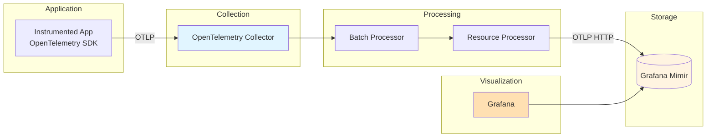
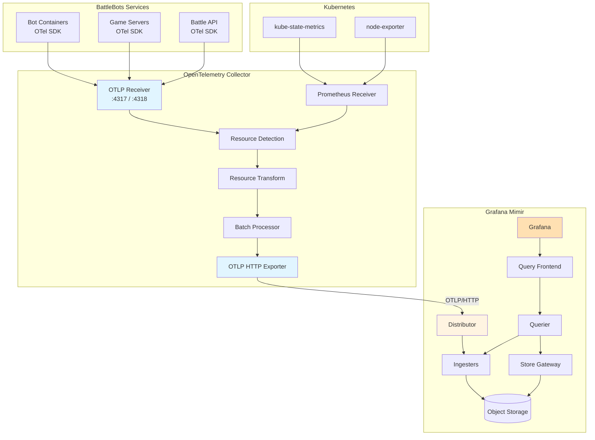

## Overview

This document provides comprehensive guidance on integrating Grafana Mimir with the OpenTelemetry Collector, addressing two critical questions:

1. **Does Mimir work with OTLP?** → **YES** - Native OTLP ingestion since version 2.3.0
2. **Can it be integrated with the OTel Collector?** → **YES** - Full integration via `otlphttp` or `prometheusremotewrite` exporters

The integration enables a vendor-neutral observability pipeline where the OpenTelemetry Collector collects metrics from instrumented applications and forwards them to Mimir for long-term storage, querying, and alerting.

### Why OTLP Matters for Metrics

OpenTelemetry Protocol (OTLP) is the native protocol of the OpenTelemetry project, designed as a vendor-neutral standard for telemetry data transmission. Using OTLP with Mimir provides:

- **Future-Proof**: OTLP is becoming the industry standard for telemetry data
- **Simplified Pipeline**: No protocol translation required (OTel → OTLP → Mimir)
- **Resource Attributes**: OTel resource attributes preserved in `target_info` metric
- **Unified Stack**: Same protocol for logs (Loki), metrics (Mimir), and traces (Tempo)
- **Vendor Independence**: Easy migration between OTLP-compatible backends

### Mimir's Position in the OTLP Ecosystem

Mimir acts as an **OTLP-compatible metrics backend**, receiving metrics via:

1. **Primary Path**: OpenTelemetry Collector → OTLP/HTTP → Mimir `/otlp/v1/metrics` endpoint
2. **Alternative Path**: OpenTelemetry Collector → Prometheus Remote Write → Mimir `/api/v1/push` endpoint

Both paths are fully supported, with OTLP recommended by Grafana for new deployments.

## OTLP Support in Mimir

### Native OTLP Support: YES

**Status**: Grafana Mimir has **native OTLP ingestion support**.

**Endpoint**: `/otlp/v1/metrics`

**Version History**:
- **v2.3.0 (September 2022)**: OTLP support introduced (experimental)
- **v2.15.0 (January 2025)**: OTLP support matured (no longer experimental)
  - Removed experimental `-distributor.direct-otlp-translation-enabled` flag
  - Added support for lz4 compression
  - Added support for integer exemplar values
- **v3.0.0 (October 2025)**: Additional OTLP enhancements
  - Experimental `-distributor.otel-translation-strategy` flag for metric name translation
  - Experimental `-distributor.otel-native-delta-ingestion` for native delta metric ingestion

**Protocol Support**:
- **OTLP over HTTP**: Primary protocol (recommended)
- **Encoding**: Protocol Buffers
- **Compression**: GZIP and lz4

### OTLP Endpoint Configuration

#### Endpoint URL

The OTLP endpoint in Mimir is:

```
http://<mimir-endpoint>/otlp/v1/metrics
```

**Important**: OpenTelemetry Collector clients automatically append `/v1/metrics` to the base path, so you only need to configure:

```
http://<mimir-endpoint>/otlp
```

#### Example Requests

**Using curl**:
```bash
# Send OTLP metrics to Mimir
curl -X POST http://mimir:8080/otlp/v1/metrics \
  -H "Content-Type: application/x-protobuf" \
  -H "X-Scope-OrgID: tenant-123" \
  --data-binary @metrics.pb
```

**Using OpenTelemetry Collector**:
```yaml
exporters:
  otlphttp:
    endpoint: http://mimir:8080/otlp
    headers:
      X-Scope-OrgID: tenant-123
```

### OTLP Features Supported

**Metric Types**:
- ✅ **Gauge**: Point-in-time values
- ✅ **Sum (Counter)**: Cumulative or delta monotonic sums
- ✅ **Histogram**: Distribution of values with buckets
- ⚠️ **Exponential Histogram**: Requires enabling Prometheus Native Histograms first
- ✅ **Summary**: Pre-computed quantiles (compatibility mode)

**Resource Attributes**:
- ✅ **Promoted Attributes**: Converted to Prometheus labels (e.g., `service.name` → `service_name`)
- ✅ **Target Info**: Non-promoted attributes stored in separate `target_info` metric
- ✅ **Queryable**: Use `info()` function or join queries to access resource attributes

**Exemplars**:
- ✅ **Metric Exemplars**: Link metrics to traces via trace_id and span_id
- ✅ **Integer Values**: Support for integer exemplar values (v2.15.0+)

**Compression**:
- ✅ **GZIP**: Standard compression
- ✅ **lz4**: Faster compression (v2.15.0+)

### OTLP vs. Prometheus Remote Write

Both protocols are supported by Mimir. Here's a detailed comparison:

| Feature | OTLP | Prometheus Remote Write |
|---------|------|------------------------|
| **Grafana Recommendation** | ✅ Recommended | Alternative |
| **Resource Attributes** | ✅ Stored in `target_info` | ❌ Lost during conversion |
| **Bandwidth Efficiency** | Moderate | ✅ Better (remote write 2.0: 40% reduction) |
| **Native Protocol** | ✅ OpenTelemetry native | Prometheus native |
| **Exponential Histograms** | Requires config | N/A (not applicable) |
| **Protocol Maturity** | Mature (since v2.15.0) | Very Mature |
| **Configuration Complexity** | Simple | Simple |
| **Future-Proof** | ✅ Industry standard | Prometheus ecosystem |

**Official Recommendation from Grafana**:

> "It's recommended that you use the OpenTelemetry protocol (OTLP)."
> - [Grafana Mimir Documentation](https://grafana.com/docs/mimir/latest/configure/configure-otel-collector/)

### Why Use OTLP Over Prometheus Remote Write?

**Advantages of OTLP**:

1. **Resource Attributes Preserved**: Mimir stores OTel resource attributes in `target_info` metric, enabling rich context
2. **Native OpenTelemetry**: Direct protocol compliance without translation
3. **Future Development**: Active OTLP feature development in each Mimir release
4. **Unified Observability**: Same protocol for logs (Loki), metrics (Mimir), traces (Tempo)
5. **Vendor Neutrality**: Easy migration between OTLP-compatible backends

**When to Use Prometheus Remote Write**:

1. **Bandwidth Critical**: Remote write 2.0 saves 40% bandwidth vs. remote write 1.0
2. **Existing Prometheus Infrastructure**: Already using Prometheus remote write
3. **Compatibility Issues**: If encountering specific OTLP compatibility issues (rare)

**For BattleBots**: **Use OTLP** as the primary integration path for future-proof observability.

### Known OTLP Limitations (Minor)

1. **Request Size Units**: OTel Collector uses samples-per-batch, Mimir uses bytes-per-batch (alignment difficult)
2. **Exponential Histograms**: Must enable Prometheus Native Histograms in Mimir first
3. **Out-of-Order Samples**: No ordering guarantees (can cause issues with Prometheus's ordered data expectations)
4. **Response Format**: Error responses don't fully comply with OTLP spec (returns plain string vs. Protobuf Status)

These are minor edge cases that don't affect typical deployments.

## OpenTelemetry Collector Configuration

This section provides complete configuration examples for integrating the OpenTelemetry Collector with Mimir.

### Architecture Overview



### Option 1: OTLP HTTP Exporter (Recommended)

The `otlphttp` exporter sends metrics using the native OTLP over HTTP protocol.

#### Basic Configuration

```yaml
receivers:
  otlp:
    protocols:
      grpc:
        endpoint: 0.0.0.0:4317
      http:
        endpoint: 0.0.0.0:4318

processors:
  batch:
    send_batch_size: 8192
    timeout: 10s

exporters:
  otlphttp:
    endpoint: http://mimir:8080/otlp
    compression: gzip

service:
  pipelines:
    metrics:
      receivers: [otlp]
      processors: [batch]
      exporters: [otlphttp]
```

#### Production Configuration with Authentication

```yaml
extensions:
  basicauth:
    client_auth:
      username: ${MIMIR_USERNAME}
      password: ${MIMIR_PASSWORD}

receivers:
  otlp:
    protocols:
      grpc:
        endpoint: 0.0.0.0:4317
      http:
        endpoint: 0.0.0.0:4318

processors:
  memory_limiter:
    check_interval: 1s
    limit_mib: 512
    spike_limit_mib: 128

  batch:
    send_batch_size: 8192
    timeout: 10s
    send_batch_max_size: 10000

  resourcedetection:
    detectors: [env, system, docker, gcp, ec2, k8s]
    timeout: 5s
    override: false

  resource:
    attributes:
      - key: environment
        value: ${ENVIRONMENT}
        action: upsert
      - key: cluster
        value: ${CLUSTER_NAME}
        action: upsert

exporters:
  otlphttp:
    auth:
      authenticator: basicauth
    endpoint: ${MIMIR_ENDPOINT}/otlp
    timeout: 30s
    compression: gzip
    retry_on_failure:
      enabled: true
      initial_interval: 5s
      max_interval: 30s
      max_elapsed_time: 300s
    sending_queue:
      enabled: true
      num_consumers: 10
      queue_size: 5000
    headers:
      X-Scope-OrgID: ${MIMIR_TENANT_ID}

service:
  extensions: [basicauth]
  pipelines:
    metrics:
      receivers: [otlp]
      processors: [memory_limiter, resourcedetection, resource, batch]
      exporters: [otlphttp]
```

### Option 2: Prometheus Remote Write Exporter

The `prometheusremotewrite` exporter sends metrics using the Prometheus Remote Write protocol.

#### Basic Configuration

```yaml
receivers:
  otlp:
    protocols:
      http:
        endpoint: 0.0.0.0:4318

processors:
  batch:
    send_batch_size: 8192
    timeout: 10s

exporters:
  prometheusremotewrite:
    endpoint: http://mimir:8080/api/v1/push

service:
  pipelines:
    metrics:
      receivers: [otlp]
      processors: [batch]
      exporters: [prometheusremotewrite]
```

#### Production Configuration

```yaml
extensions:
  basicauth:
    client_auth:
      username: ${MIMIR_USERNAME}
      password: ${MIMIR_PASSWORD}

receivers:
  otlp:
    protocols:
      grpc:
        endpoint: 0.0.0.0:4317
      http:
        endpoint: 0.0.0.0:4318

processors:
  memory_limiter:
    check_interval: 1s
    limit_mib: 512
    spike_limit_mib: 128

  batch:
    send_batch_size: 8192
    timeout: 10s
    send_batch_max_size: 10000

  resourcedetection:
    detectors: [env, system, docker, gcp, ec2, k8s]

  resource:
    attributes:
      - key: environment
        value: ${ENVIRONMENT}
        action: upsert

exporters:
  prometheusremotewrite:
    auth:
      authenticator: basicauth
    endpoint: ${MIMIR_ENDPOINT}/api/v1/push

    # External labels added to all metrics
    external_labels:
      cluster: ${CLUSTER_NAME}
      environment: ${ENVIRONMENT}

    # Resource to telemetry conversion
    resource_to_telemetry_conversion:
      enabled: true

    # Target info generation
    target_info:
      enabled: true

    # Retry configuration
    retry_on_failure:
      enabled: true
      initial_interval: 1s
      max_interval: 30s
      max_elapsed_time: 1800s

    # Queue configuration
    remote_write_queue:
      enabled: true
      queue_size: 10000
      num_consumers: 5

    # WAL (Write-Ahead Log) for durability
    wal:
      directory: /var/lib/otelcol/wal
      buffer_size: 300
      truncate_frequency: 1m

service:
  extensions: [basicauth]
  pipelines:
    metrics:
      receivers: [otlp]
      processors: [memory_limiter, resourcedetection, resource, batch]
      exporters: [prometheusremotewrite]
```

### Batch Processor Configuration

The batch processor is **CRITICAL** for production deployments. It improves efficiency by batching metrics before export.

#### Recommended Settings

```yaml
processors:
  batch:
    # Number of items to batch before sending
    send_batch_size: 8192  # Default, works for most cases

    # Maximum time to wait before sending (even if batch not full)
    timeout: 10s

    # Maximum batch size (safety valve)
    send_batch_max_size: 10000

    # Maximum metadata keys per batch
    metadata_keys: 1000

    # Maximum cardinality per metadata key
    metadata_cardinality_limit: 1000
```

#### Tuning Guidelines

**High-Throughput Deployments**:
```yaml
processors:
  batch:
    send_batch_size: 16384  # 2x default
    timeout: 5s  # Shorter timeout for lower latency
    send_batch_max_size: 20000
```

**Low-Latency Requirements**:
```yaml
processors:
  batch:
    send_batch_size: 1000  # Smaller batches
    timeout: 1s  # Quick flush
    send_batch_max_size: 2000
```

**Key Principles**:
- **Always use batch processor** before network-based exporters
- **Place after memory_limiter** in pipeline
- **Balance latency vs. efficiency**: Larger batches = better compression but higher latency

### Retry and Timeout Configuration

Configure retry logic to handle transient failures:

```yaml
exporters:
  otlphttp:
    # Request timeout
    timeout: 30s

    # Retry configuration
    retry_on_failure:
      enabled: true
      initial_interval: 5s  # Wait 5s before first retry
      max_interval: 30s  # Cap exponential backoff at 30s
      max_elapsed_time: 300s  # Give up after 5 minutes

    # Sending queue (buffer during retries)
    sending_queue:
      enabled: true
      num_consumers: 10  # Parallel export workers
      queue_size: 5000  # Buffer size
```

**Guidelines**:
- **initial_interval**: Start with 1-5 seconds (avoid retry storms)
- **max_interval**: Cap at 30-60 seconds (prevent infinite backoff)
- **max_elapsed_time**:
  - 300s (5 min): Low-latency, loss-tolerant
  - 1800s (30 min): Standard production
  - 3600s+ (1+ hour): Critical data that cannot be lost
- **num_consumers**: More consumers = more parallel requests (ensure backend can handle load)
- **queue_size**: Balance memory vs. buffering capacity

## Resource Attribute Mapping

OpenTelemetry resource attributes provide context about the source of metrics. Mimir handles these attributes through two mechanisms:

### Promoted Attributes

Certain resource attributes are automatically converted to Prometheus labels:

**Default Promoted Attributes**:
- `service.namespace` + `service.name` → `job` label
- `service.instance.id` → `instance` label

**Example**:
```yaml
# OpenTelemetry resource attributes
resource:
  service.namespace: "battlebots"
  service.name: "battle-api"
  service.instance.id: "pod-abc123"

# Resulting Prometheus labels
{
  job="battlebots/battle-api",
  instance="pod-abc123"
}
```

### Target Info Metric

Non-promoted resource attributes are stored in a separate `target_info` metric:

**Example**:
```yaml
# OpenTelemetry resource attributes
resource:
  service.name: "battle-api"
  service.version: "v1.2.3"
  k8s.namespace.name: "battlebots"
  k8s.pod.name: "battle-api-abc123"
  k8s.deployment.name: "battle-api"
  cloud.provider: "aws"
  cloud.region: "us-east-1"

# target_info metric created
target_info{
  job="battle-api",
  instance="pod-abc123",
  service_version="v1.2.3",
  k8s_namespace_name="battlebots",
  k8s_pod_name="battle-api-abc123",
  k8s_deployment_name="battle-api",
  cloud_provider="aws",
  cloud_region="us-east-1"
} 1
```

### Querying with Resource Attributes

**Direct Query** (promoted attributes):
```promql
http_requests_total{job="battlebots/battle-api"}
```

**Join Query** (non-promoted attributes):
```promql
# Join metric with target_info to access resource attributes
http_requests_total
* on(job, instance) group_left(k8s_namespace_name, k8s_pod_name)
target_info
```

**Using info() Function** (Prometheus 3.0+):
```promql
# Simpler syntax for joining with target_info
http_requests_total * info(target_info)
```

### Label Name Conversion

Prometheus labels don't support `.` or `-` characters. OpenTelemetry attributes are converted:

- `service.name` → `service_name`
- `k8s-cluster` → `k8s_cluster`
- `http.method` → `http_method`

### Resource Processor for Attribute Transformation

Use the resource processor to add, modify, or remove resource attributes:

```yaml
processors:
  resource:
    attributes:
      # Add new attribute
      - key: environment
        value: production
        action: insert

      # Update existing attribute
      - key: service.version
        value: v2.0.0
        action: update

      # Insert or update (upsert)
      - key: cluster
        value: us-east-1-prod
        action: upsert

      # Rename attribute
      - key: cluster_name
        from_attribute: k8s.cluster.name
        action: insert

      # Delete attribute
      - key: sensitive.data
        action: delete

      # Extract with regex
      - key: environment
        pattern: ^(dev|staging|prod)-.*$
        action: extract
```

### Resource Detection Processor

Automatically detect resource attributes from the environment:

```yaml
processors:
  resourcedetection:
    # Ordered list of detectors (first match wins)
    detectors: [env, system, docker, gcp, ec2, azure, k8s]
    timeout: 5s
    override: false  # Don't overwrite existing attributes

    # System detector configuration
    system:
      hostname_sources: ["os", "dns", "cname", "lookup"]

    # Docker detector
    docker:
      resource_attributes:
        host.name:
          enabled: true
        os.type:
          enabled: true

    # GCP detector
    gcp:
      resource_attributes:
        gcp.project.id:
          enabled: true
        cloud.platform:
          enabled: true
        cloud.region:
          enabled: true

    # Kubernetes detector
    k8s:
      resource_attributes:
        k8s.namespace.name:
          enabled: true
        k8s.pod.name:
          enabled: true
        k8s.deployment.name:
          enabled: true
        k8s.node.name:
          enabled: true
```

**Detected Attributes by Detector**:

| Detector | Attributes |
|----------|-----------|
| **env** | Reads from `OTEL_RESOURCE_ATTRIBUTES` environment variable |
| **system** | `host.name`, `host.id`, `host.arch`, `os.type` |
| **docker** | `host.name`, `os.type` from Docker environment |
| **gcp** | `cloud.provider`, `cloud.platform`, `cloud.region`, `gcp.project.id`, `gcp.gce.instance.id` |
| **ec2** | `cloud.provider`, `cloud.platform`, `cloud.region`, `cloud.account.id`, `host.id`, `host.type` |
| **azure** | `cloud.provider`, `cloud.platform`, `cloud.region`, `azure.vm.name`, `azure.resourcegroup.name` |
| **k8s** | `k8s.namespace.name`, `k8s.pod.name`, `k8s.deployment.name`, `k8s.node.name`, `k8s.cluster.name` |

## Label Strategy and Cardinality Control

Managing cardinality is critical when using OpenTelemetry with Mimir. High cardinality can cause performance issues and increased costs.

### Understanding Cardinality in OTel Context

Every unique combination of metric name + label key-value pairs = one time series.

**Low Cardinality** (Good):
```yaml
# Resource attributes
service.name: "battle-api"  # Limited number of services
environment: "production"  # 3 values: dev, staging, prod
region: "us-east-1"  # Limited AWS regions

# Metric-level attributes
http.method: "GET"  # ~7 HTTP methods
http.status_code: "200"  # ~50 HTTP status codes

# Total series per metric
= 10 services × 3 environments × 5 regions × 7 methods × 50 status codes
= 52,500 series (ACCEPTABLE)
```

**High Cardinality** (Bad):
```yaml
# Adding unbounded attributes
user.id: "user-12345"  # Millions of users

# New total series
= 52,500 × 1,000,000 users
= 52.5 billion series (UNSUSTAINABLE!)
```

### Cardinality Best Practices

**1. Avoid Unbounded Resource Attributes**:

**Bad**:
```yaml
resource:
  user.id: "12345"  # Unbounded
  session.id: "abc-def-ghi"  # Unbounded
  request.id: "uuid-..."  # Unbounded
  timestamp: "1634567890"  # Unbounded
```

**Good**:
```yaml
resource:
  service.name: "battle-api"  # Bounded
  environment: "production"  # Bounded (3 values)
  region: "us-east-1"  # Bounded (AWS regions)
  version: "v1.2.3"  # Bounded (release versions)
```

**2. Use Metric Attributes Sparingly**:

OpenTelemetry SDK allows setting attributes on individual metric data points. Use bounded sets only:

```go
// Good: Bounded attribute
meter.NewInt64Counter("http.requests",
    metric.WithDescription("HTTP requests"),
).Add(ctx, 1,
    attribute.String("method", "GET"),  // ~7 values
    attribute.Int("status_code", 200),  // ~50 values
)

// Bad: Unbounded attribute
meter.NewInt64Counter("http.requests").Add(ctx, 1,
    attribute.String("user_id", userID),  // Unbounded!
)
```

**3. Drop High-Cardinality Attributes**:

Use the resource processor to remove problematic attributes:

```yaml
processors:
  resource:
    attributes:
      # Drop user-specific attributes
      - key: user.id
        action: delete

      - key: session.id
        action: delete

      - key: request.id
        action: delete
```

**4. Aggregate Before Storing**:

For user-specific metrics, aggregate at collection time:

```go
// Instead of per-user metrics:
// user_requests{user_id="123"} → High cardinality

// Use aggregated metrics:
// requests_by_service{service="api"} → Low cardinality
// Then query logs for user-specific debugging
```

### Attribute Transformation Strategies

**Strategy 1: Bounded Enumeration**

Convert unbounded values to bounded categories:

```yaml
processors:
  attributes:
    actions:
      # Convert specific status codes to categories
      - key: http.status_code
        action: update
        pattern: ^2\d\d$
        value: "2xx"

      - key: http.status_code
        action: update
        pattern: ^4\d\d$
        value: "4xx"

      - key: http.status_code
        action: update
        pattern: ^5\d\d$
        value: "5xx"
```

**Strategy 2: Drop After Threshold**

Only keep top N values, drop the rest:

This requires custom collector processing or accept all values with limits configured in Mimir:

```yaml
# Mimir limits
limits:
  max_global_series_per_metric: 50000  # Cap per metric
```

### Recommended Labels for BattleBots

**Infrastructure Labels**:
```yaml
resource:
  service.name: "battle-api"  # Service name
  service.namespace: "battlebots"  # Application namespace
  service.instance.id: "pod-abc123"  # Pod/container ID
  service.version: "v1.2.3"  # Release version
  deployment.environment: "production"  # dev/staging/prod
  cloud.region: "us-east-1"  # Geographic region
  k8s.cluster.name: "us-east-1-prod"  # Cluster identifier
  k8s.namespace.name: "battlebots"  # Kubernetes namespace
```

**Game-Specific Labels** (metric-level attributes):
```yaml
# Battle events
battle.type: "team-deathmatch"  # Limited game modes
bot.type: "tank"  # Enumerable bot types
game.region: "us-east"  # Geographic game region

# DO NOT USE AS LABELS:
# battle.id: "12345"  # If battles are long-lived and accumulate
# player.id: "user-abc"  # High cardinality
# bot.id: "bot-xyz"  # High cardinality if bots are per-player
```

**Estimated Cardinality**:
```
http_requests_total{
  service_name: 10 services
  environment: 3 environments
  region: 5 regions
  method: 7 methods
  status_code: 50 codes
  endpoint: 50 endpoints
  battle_type: 5 game modes
}
= 1 × 10 × 3 × 5 × 7 × 50 × 50 × 5
= 13,125,000 series

# Acceptable for Mimir
```

## Authentication and Multi-Tenancy

### Basic Authentication

Use the `basicauth` extension for username/password authentication:

```yaml
extensions:
  basicauth:
    client_auth:
      username: ${MIMIR_USERNAME}
      password: ${MIMIR_PASSWORD}

exporters:
  otlphttp:
    auth:
      authenticator: basicauth
    endpoint: http://mimir:8080/otlp

service:
  extensions: [basicauth]
  pipelines:
    metrics:
      exporters: [otlphttp]
```

### Bearer Token Authentication

Use the `bearertoken` extension for token-based auth:

**Static Token**:
```yaml
extensions:
  bearertoken:
    token: ${MIMIR_API_TOKEN}

exporters:
  otlphttp:
    auth:
      authenticator: bearertoken
    endpoint: http://mimir:8080/otlp

service:
  extensions: [bearertoken]
  pipelines:
    metrics:
      exporters: [otlphttp]
```

**Token from File** (rotating tokens):
```yaml
extensions:
  bearertoken:
    filename: /var/run/secrets/mimir-token

exporters:
  otlphttp:
    auth:
      authenticator: bearertoken
    endpoint: http://mimir:8080/otlp

service:
  extensions: [bearertoken]
  pipelines:
    metrics:
      exporters: [otlphttp]
```

### Multi-Tenancy with X-Scope-OrgID

Mimir uses the `X-Scope-OrgID` header for tenant identification:

**Single Tenant**:
```yaml
exporters:
  otlphttp:
    endpoint: http://mimir:8080/otlp
    headers:
      X-Scope-OrgID: "tenant-production"
```

**Multiple Tenants** (separate pipelines):
```yaml
exporters:
  otlphttp/tenant1:
    endpoint: http://mimir:8080/otlp
    headers:
      X-Scope-OrgID: "tenant-1"

  otlphttp/tenant2:
    endpoint: http://mimir:8080/otlp
    headers:
      X-Scope-OrgID: "tenant-2"

service:
  pipelines:
    metrics/tenant1:
      receivers: [otlp]
      processors: [batch]
      exporters: [otlphttp/tenant1]

    metrics/tenant2:
      receivers: [otlp]
      processors: [batch]
      exporters: [otlphttp/tenant2]
```

**Dynamic Tenant Routing**:

For dynamic tenant routing based on resource attributes, use the routing processor:

```yaml
processors:
  routing:
    from_attribute: tenant.id
    default_exporters: [otlphttp/default]
    table:
      - value: "tenant-1"
        exporters: [otlphttp/tenant1]
      - value: "tenant-2"
        exporters: [otlphttp/tenant2]

exporters:
  otlphttp/tenant1:
    endpoint: http://mimir:8080/otlp
    headers:
      X-Scope-OrgID: "tenant-1"

  otlphttp/tenant2:
    endpoint: http://mimir:8080/otlp
    headers:
      X-Scope-OrgID: "tenant-2"

  otlphttp/default:
    endpoint: http://mimir:8080/otlp
    headers:
      X-Scope-OrgID: "default"

service:
  pipelines:
    metrics:
      receivers: [otlp]
      processors: [routing, batch]
      exporters: [otlphttp/tenant1, otlphttp/tenant2, otlphttp/default]
```

### TLS Configuration

Enable TLS for secure communication:

```yaml
exporters:
  otlphttp:
    endpoint: https://mimir.example.com/otlp
    tls:
      insecure: false  # Verify server certificate
      cert_file: /path/to/client-cert.pem  # Client certificate
      key_file: /path/to/client-key.pem  # Client private key
      ca_file: /path/to/ca-cert.pem  # CA certificate for server verification
```

**Mutual TLS (mTLS)**:
```yaml
exporters:
  otlphttp:
    endpoint: https://mimir.example.com/otlp
    tls:
      insecure: false
      cert_file: /path/to/client-cert.pem
      key_file: /path/to/client-key.pem
      ca_file: /path/to/ca-cert.pem
      min_version: "1.2"  # Minimum TLS version
      max_version: "1.3"  # Maximum TLS version
```

## Complete Configuration Example

This example demonstrates a complete, production-ready OpenTelemetry Collector configuration for BattleBots integrating with Mimir.

```yaml
# OpenTelemetry Collector Configuration for BattleBots + Mimir
# Production-ready configuration with OTLP HTTP exporter

extensions:
  # Health check endpoint
  health_check:
    endpoint: 0.0.0.0:13133

  # Memory ballast to reduce GC pressure
  memory_ballast:
    size_mib: 165  # 1/3 of memory_limiter limit_mib

  # Authentication for Mimir
  basicauth:
    client_auth:
      username: ${MIMIR_USERNAME}
      password: ${MIMIR_PASSWORD}

receivers:
  # OTLP receiver for metrics from instrumented apps
  otlp:
    protocols:
      grpc:
        endpoint: 0.0.0.0:4317
      http:
        endpoint: 0.0.0.0:4318

  # Prometheus receiver for scraping Prometheus exporters
  prometheus:
    config:
      scrape_configs:
        # Scrape OpenTelemetry Collector's own metrics
        - job_name: 'otel-collector'
          scrape_interval: 30s
          static_configs:
            - targets: ['localhost:8888']

        # Scrape BattleBots services
        - job_name: 'battlebots'
          kubernetes_sd_configs:
            - role: pod
              namespaces:
                names: ['battlebots']
          relabel_configs:
            - source_labels: [__meta_kubernetes_pod_annotation_prometheus_io_scrape]
              action: keep
              regex: true
            - source_labels: [__meta_kubernetes_pod_annotation_prometheus_io_path]
              action: replace
              target_label: __metrics_path__
              regex: (.+)
            - source_labels: [__address__, __meta_kubernetes_pod_annotation_prometheus_io_port]
              action: replace
              regex: ([^:]+)(?::\d+)?;(\d+)
              replacement: $1:$2
              target_label: __address__

processors:
  # Memory limiter (MUST be first in pipeline)
  memory_limiter:
    check_interval: 1s
    limit_mib: 512
    spike_limit_mib: 128  # 25% of limit_mib

  # Resource detection
  resourcedetection:
    detectors: [env, system, docker, gcp, ec2, k8s]
    timeout: 5s
    override: false

  # Resource attribute transformation
  resource:
    attributes:
      # Add deployment environment
      - key: deployment.environment
        value: ${ENVIRONMENT}
        action: upsert

      # Add cluster name
      - key: cluster.name
        value: ${CLUSTER_NAME}
        action: upsert

      # Add BattleBots platform identifier
      - key: platform
        value: battlebots
        action: upsert

      # Add version
      - key: version
        value: ${APP_VERSION}
        action: upsert

      # Remove sensitive attributes
      - key: host.id
        action: delete

  # Filter processor (optional - drop unwanted metrics)
  filter:
    metrics:
      exclude:
        match_type: strict
        metric_names:
          - unwanted_metric_1
          - unwanted_metric_2

  # Batch processor (CRITICAL for production)
  batch:
    send_batch_size: 8192
    timeout: 10s
    send_batch_max_size: 10000

exporters:
  # Primary: OTLP HTTP to Mimir
  otlphttp:
    auth:
      authenticator: basicauth
    endpoint: ${MIMIR_ENDPOINT}/otlp
    timeout: 30s
    compression: gzip
    retry_on_failure:
      enabled: true
      initial_interval: 5s
      max_interval: 30s
      max_elapsed_time: 300s
    sending_queue:
      enabled: true
      num_consumers: 10
      queue_size: 5000
    headers:
      X-Scope-OrgID: ${MIMIR_TENANT_ID}

  # Debug: Logging exporter (disable in production)
  logging:
    loglevel: info
    sampling_initial: 5
    sampling_thereafter: 200

service:
  extensions: [health_check, memory_ballast, basicauth]

  # Collector's own telemetry
  telemetry:
    logs:
      level: info
    metrics:
      address: 0.0.0.0:8888
      level: detailed

  pipelines:
    # Metrics pipeline
    metrics:
      receivers: [otlp, prometheus]
      processors: [memory_limiter, resourcedetection, resource, filter, batch]
      exporters: [otlphttp]

    # Optional: Separate pipeline for debugging
    # metrics/debug:
    #   receivers: [otlp]
    #   processors: [batch]
    #   exporters: [logging]
```

### Environment Variables

```bash
# Mimir connection
export MIMIR_ENDPOINT="http://mimir-gateway:8080"
export MIMIR_USERNAME="battlebots-collector"
export MIMIR_PASSWORD="supersecret"
export MIMIR_TENANT_ID="battlebots-production"

# Application metadata
export ENVIRONMENT="production"
export CLUSTER_NAME="us-east-1-prod"
export APP_VERSION="v1.2.3"

# Memory configuration
export GOMEMLIMIT="410MiB"  # 80% of memory_limiter limit_mib
```

### Kubernetes Deployment

```yaml
apiVersion: v1
kind: ConfigMap
metadata:
  name: otel-collector-config
  namespace: battlebots
data:
  config.yaml: |
    # Paste complete configuration from above

---
apiVersion: v1
kind: Secret
metadata:
  name: mimir-credentials
  namespace: battlebots
type: Opaque
stringData:
  username: battlebots-collector
  password: supersecret

---
apiVersion: apps/v1
kind: Deployment
metadata:
  name: otel-collector
  namespace: battlebots
spec:
  replicas: 3
  selector:
    matchLabels:
      app: otel-collector
  template:
    metadata:
      labels:
        app: otel-collector
    spec:
      containers:
      - name: otel-collector
        image: otel/opentelemetry-collector-contrib:0.115.0
        args:
          - --config=/conf/config.yaml
        env:
        - name: GOMEMLIMIT
          value: "410MiB"
        - name: MIMIR_ENDPOINT
          value: "http://mimir-gateway.mimir.svc.cluster.local:8080"
        - name: MIMIR_USERNAME
          valueFrom:
            secretKeyRef:
              name: mimir-credentials
              key: username
        - name: MIMIR_PASSWORD
          valueFrom:
            secretKeyRef:
              name: mimir-credentials
              key: password
        - name: MIMIR_TENANT_ID
          value: "battlebots-production"
        - name: ENVIRONMENT
          value: "production"
        - name: CLUSTER_NAME
          value: "us-east-1-prod"
        - name: APP_VERSION
          value: "v1.2.3"
        resources:
          limits:
            memory: 512Mi
            cpu: 500m
          requests:
            memory: 256Mi
            cpu: 200m
        ports:
        - containerPort: 4317  # OTLP gRPC
          name: otlp-grpc
        - containerPort: 4318  # OTLP HTTP
          name: otlp-http
        - containerPort: 8888  # Metrics
          name: metrics
        - containerPort: 13133  # Health check
          name: health
        livenessProbe:
          httpGet:
            path: /
            port: health
        readinessProbe:
          httpGet:
            path: /
            port: health
        volumeMounts:
        - name: config
          mountPath: /conf
      volumes:
      - name: config
        configMap:
          name: otel-collector-config

---
apiVersion: v1
kind: Service
metadata:
  name: otel-collector
  namespace: battlebots
spec:
  selector:
    app: otel-collector
  ports:
  - name: otlp-grpc
    port: 4317
    targetPort: 4317
  - name: otlp-http
    port: 4318
    targetPort: 4318
  - name: metrics
    port: 8888
    targetPort: 8888
```

### Docker Compose Example

```yaml
version: '3.8'

services:
  otel-collector:
    image: otel/opentelemetry-collector-contrib:0.115.0
    command: ["--config=/etc/otelcol/config.yaml"]
    environment:
      - GOMEMLIMIT=410MiB
      - MIMIR_ENDPOINT=http://mimir:8080
      - MIMIR_USERNAME=battlebots
      - MIMIR_PASSWORD=supersecret
      - MIMIR_TENANT_ID=battlebots
      - ENVIRONMENT=development
      - CLUSTER_NAME=local
      - APP_VERSION=v1.0.0
    ports:
      - "4317:4317"  # OTLP gRPC
      - "4318:4318"  # OTLP HTTP
      - "8888:8888"  # Metrics
      - "13133:13133"  # Health check
    volumes:
      - ./otel-config.yaml:/etc/otelcol/config.yaml
    networks:
      - battlebots

  mimir:
    image: grafana/mimir:latest
    command: ["-config.file=/etc/mimir.yaml"]
    ports:
      - "8080:8080"
    volumes:
      - ./mimir-config.yaml:/etc/mimir.yaml
      - mimir-data:/data
    networks:
      - battlebots

  grafana:
    image: grafana/grafana:latest
    ports:
      - "3000:3000"
    environment:
      - GF_AUTH_ANONYMOUS_ENABLED=true
      - GF_AUTH_ANONYMOUS_ORG_ROLE=Admin
    networks:
      - battlebots

networks:
  battlebots:

volumes:
  mimir-data:
```

## Troubleshooting

### Common Issues and Solutions

#### 1. Connection Refused / Network Errors

**Symptoms**:
```
failed to export metrics: connection refused
```

**Diagnosis**:
1. Verify Mimir is running and reachable:
   ```bash
   curl http://mimir:8080/ready
   ```

2. Check network connectivity:
   ```bash
   # From collector pod/container
   nc -zv mimir 8080
   ```

3. Verify endpoint configuration:
   ```yaml
   # Ensure correct endpoint format
   endpoint: http://mimir:8080/otlp  # Correct
   # NOT: http://mimir:8080/otlp/v1/metrics (client auto-appends)
   ```

**Solutions**:
- Fix network policies/firewall rules
- Verify Kubernetes service DNS resolution
- Check load balancer configuration
- Ensure Mimir port 8080 is exposed

#### 2. Authentication Failures

**Symptoms**:
```
failed to export metrics: 401 Unauthorized
failed to export metrics: 403 Forbidden
```

**Diagnosis**:
1. Check credentials in environment variables
2. Verify basicauth extension configuration
3. Test authentication manually:
   ```bash
   curl -u username:password http://mimir:8080/ready
   ```

**Solutions**:
```yaml
# Verify basicauth configuration
extensions:
  basicauth:
    client_auth:
      username: ${MIMIR_USERNAME}  # Check env var set
      password: ${MIMIR_PASSWORD}  # Check env var set

exporters:
  otlphttp:
    auth:
      authenticator: basicauth  # Must reference extension

service:
  extensions: [basicauth]  # Must be listed here
```

#### 3. Multi-Tenancy Header Issues

**Symptoms**:
```
failed to export metrics: no org id
```

**Solution**:
```yaml
exporters:
  otlphttp:
    headers:
      X-Scope-OrgID: "your-tenant-id"  # Must include header
```

Or disable multi-tenancy in Mimir:
```yaml
# mimir-config.yaml
multitenancy_enabled: false
```

#### 4. Invalid Metric Names or Labels

**Symptoms**:
```
err-mimir-metric-name-invalid
err-mimir-label-invalid
```

**Cause**: Metric names must match `[a-zA-Z_:][a-zA-Z0-9_:]*`

**Solution**: Use the `metricstransform` processor to rename metrics:

```yaml
processors:
  metricstransform:
    transforms:
      - include: .*
        match_type: regexp
        action: update
        operations:
          # Replace invalid characters with underscores
          - action: update_label
            label: "invalid-label"
            new_label: "invalid_label"
```

#### 5. High Memory Usage / OOM Kills

**Symptoms**:
- Collector pod/container killed with OOM
- High memory usage in metrics

**Diagnosis**:
```promql
# Monitor collector memory
process_runtime_go_mem_heap_alloc_bytes{job="otel-collector"}
```

**Solutions**:

1. **Tune memory_limiter**:
   ```yaml
   processors:
     memory_limiter:
       check_interval: 1s
       limit_mib: 512  # Adjust based on container limit
       spike_limit_mib: 128  # 25% of limit
   ```

2. **Set GOMEMLIMIT** (80% of container memory):
   ```yaml
   env:
     - name: GOMEMLIMIT
       value: "410MiB"  # For 512Mi container limit
   ```

3. **Reduce batch sizes**:
   ```yaml
   processors:
     batch:
       send_batch_size: 4096  # Reduce from 8192
       send_batch_max_size: 5000  # Reduce from 10000
   ```

4. **Increase num_consumers**:
   ```yaml
   exporters:
     otlphttp:
       sending_queue:
         num_consumers: 20  # More parallel exports
   ```

#### 6. Metrics Not Appearing in Mimir

**Diagnosis Checklist**:

1. **Check collector logs for export errors**:
   ```bash
   kubectl logs -f deployment/otel-collector
   ```

2. **Verify metrics received by collector**:
   ```promql
   # Check collector's own metrics
   otelcol_receiver_accepted_metric_points{receiver="otlp"}
   otelcol_exporter_sent_metric_points{exporter="otlphttp"}
   ```

3. **Check Mimir ingester logs**:
   ```bash
   kubectl logs -f deployment/mimir-ingester
   ```

4. **Query Mimir directly**:
   ```bash
   curl -H "X-Scope-OrgID: your-tenant" \
     http://mimir:8080/prometheus/api/v1/query?query=up
   ```

**Common Causes**:
- Metrics filtered out by filter processor
- Batch processor holding data (check timeout)
- Invalid metric names (check for errors in logs)
- Wrong tenant ID in query vs. export

#### 7. Cardinality Limit Errors

**Symptoms**:
```
err-mimir-max-series-per-metric
err-mimir-max-series-per-user
```

**Diagnosis**:
```promql
# Check active series
cortex_ingester_active_series

# Check per-metric cardinality
topk(10, count by (__name__) ({__name__=~".+"}))
```

**Solutions**:

1. **Identify high-cardinality metrics**:
   ```bash
   # Use Mimir's cardinality analysis API
   curl -H "X-Scope-OrgID: tenant" \
     http://mimir:8080/prometheus/api/v1/cardinality/label_names
   ```

2. **Drop high-cardinality labels**:
   ```yaml
   processors:
     resource:
       attributes:
         - key: user_id
           action: delete
         - key: request_id
           action: delete
   ```

3. **Increase Mimir limits** (temporary):
   ```yaml
   # Mimir config
   limits:
     max_global_series_per_user: 10000000  # Increase limit
     max_global_series_per_metric: 100000  # Increase limit
   ```

#### 8. Slow Query Performance

**Symptoms**:
- Queries timeout
- High query latency

**Solutions**:

1. **Enable caching in Mimir**:
   ```yaml
   # Mimir config
   query_frontend:
     results_cache:
       backend: memcached
   ```

2. **Reduce query time range**:
   ```promql
   # Instead of querying 30 days:
   rate(http_requests_total[30d])

   # Query smaller range:
   rate(http_requests_total[1h])
   ```

3. **Optimize PromQL queries**:
   ```promql
   # Inefficient
   sum(rate(metric[5m]))

   # Efficient (specify labels)
   sum(rate(metric{job="api"}[5m])) by (status)
   ```

### Monitoring Collector Health

**Key Metrics to Monitor**:

```promql
# Successful exports
rate(otelcol_exporter_sent_metric_points{exporter="otlphttp"}[5m])

# Failed exports
rate(otelcol_exporter_send_failed_metric_points{exporter="otlphttp"}[5m])

# Batch processor metrics
otelcol_processor_batch_batch_send_size
otelcol_processor_batch_timeout_trigger_send

# Memory limiter backpressure
rate(otelcol_processor_refused_metric_points{processor="memory_limiter"}[5m])

# Queue depth
otelcol_exporter_queue_size{exporter="otlphttp"}
```

**Recommended Alerts**:

```yaml
groups:
  - name: otel-collector-alerts
    rules:
      # Export failures
      - alert: OTelCollectorExportFailures
        expr: |
          rate(otelcol_exporter_send_failed_metric_points[5m]) > 0
        for: 5m
        annotations:
          summary: "OpenTelemetry Collector failing to export metrics"

      # Memory pressure
      - alert: OTelCollectorMemoryPressure
        expr: |
          rate(otelcol_processor_refused_metric_points[5m]) > 0
        for: 5m
        annotations:
          summary: "OpenTelemetry Collector under memory pressure"

      # Queue filling up
      - alert: OTelCollectorQueueFull
        expr: |
          otelcol_exporter_queue_size / otelcol_exporter_queue_capacity > 0.8
        for: 10m
        annotations:
          summary: "OpenTelemetry Collector export queue filling up"
```

## BattleBots Integration Points

### Complete Observability Pipeline



### Example Metrics for BattleBots

**Bot Action Latency** (from OpenTelemetry SDK):
```go
// In bot implementation
histogram, _ := meter.Int64Histogram(
    "bot.action.duration",
    metric.WithDescription("Bot action execution time"),
    metric.WithUnit("ms"),
)

histogram.Record(ctx, durationMs,
    attribute.String("action", "attack"),
    attribute.String("bot.type", "tank"),
)
```

**Query in Mimir** (after OTLP export):
```promql
# 95th percentile attack latency by bot type
histogram_quantile(0.95,
  sum(rate(bot_action_duration_bucket{action="attack"}[5m]))
  by (bot_type, le)
)
```

**API Request Metrics**:
```go
// In Battle API
counter, _ := meter.Int64Counter(
    "http.server.requests",
    metric.WithDescription("HTTP requests"),
)

counter.Add(ctx, 1,
    attribute.String("http.method", "POST"),
    attribute.String("http.route", "/api/v1/battles"),
    attribute.Int("http.status_code", 201),
)
```

**Query in Mimir**:
```promql
# Request rate by endpoint and status
sum(rate(http_server_requests[5m]))
by (http_route, http_status_code)

# Error rate
sum(rate(http_server_requests{http_status_code=~"5.."}[5m]))
/
sum(rate(http_server_requests[5m]))
```

### Resource Attribute Examples for BattleBots

```yaml
# Detected by resourcedetection processor
resource:
  # Kubernetes attributes
  k8s.namespace.name: "battlebots"
  k8s.pod.name: "battle-api-abc123"
  k8s.deployment.name: "battle-api"
  k8s.node.name: "node-us-east-1a"

  # Cloud attributes
  cloud.provider: "aws"
  cloud.platform: "aws_ec2"
  cloud.region: "us-east-1"
  cloud.availability_zone: "us-east-1a"

  # Service attributes (from OTel SDK)
  service.name: "battle-api"
  service.namespace: "battlebots"
  service.version: "v1.2.3"
  service.instance.id: "pod-abc123"

  # Added by resource processor
  deployment.environment: "production"
  cluster.name: "us-east-1-prod"
  platform: "battlebots"
```

### Example PromQL Queries with Resource Attributes

**Query with promoted attributes**:
```promql
# All metrics from battle-api service
{job="battlebots/battle-api"}
```

**Query with target_info join**:
```promql
# Metrics filtered by Kubernetes deployment
http_server_requests
* on(job, instance) group_left(k8s_deployment_name)
target_info{k8s_deployment_name="battle-api"}
```

**Using info() function** (Prometheus 3.0+):
```promql
# Simpler syntax
http_server_requests{job="battlebots/battle-api"}
* info(target_info)
```

### BattleBots Dashboards

**Request Rate Dashboard**:
```json
{
  "title": "BattleBots API Request Rate",
  "targets": [
    {
      "expr": "sum(rate(http_server_requests{job=~\"battlebots/.*\"}[5m])) by (http_route)"
    }
  ]
}
```

**Bot Performance Dashboard**:
```json
{
  "title": "Bot Action Latency (p95)",
  "targets": [
    {
      "expr": "histogram_quantile(0.95, sum(rate(bot_action_duration_bucket[5m])) by (bot_type, action, le))"
    }
  ]
}
```

**Linked Dashboard** (Metrics → Traces):
- Click on metric spike in Grafana
- Grafana shows exemplars (trace IDs embedded in metrics)
- Click exemplar → Opens trace in Tempo
- Trace shows detailed spans with logs

## Further Reading

### Official Documentation

- [Configure OpenTelemetry Collector for Mimir](https://grafana.com/docs/mimir/latest/configure/configure-otel-collector/) - Official integration guide
- [OTLP Format Considerations](https://grafana.com/docs/grafana-cloud/send-data/otlp/otlp-format-considerations/) - OTLP best practices
- [Mimir OTLP Endpoint](https://grafana.com/docs/mimir/latest/references/http-api/#otlp) - API reference
- [Prometheus Resource Attribute Promotion](https://grafana.com/blog/2025/05/20/opentelemetry-with-prometheus-better-integration-through-resource-attribute-promotion/) - How resource attributes become labels

### OpenTelemetry Collector Documentation

- [OTLP HTTP Exporter](https://github.com/open-telemetry/opentelemetry-collector/tree/main/exporter/otlphttpexporter) - Official exporter docs
- [Prometheus Remote Write Exporter](https://github.com/open-telemetry/opentelemetry-collector-contrib/blob/main/exporter/prometheusremotewriteexporter/README.md) - Alternative exporter
- [Batch Processor](https://github.com/open-telemetry/opentelemetry-collector/blob/main/processor/batchprocessor/README.md) - Batching guide
- [Resource Detection Processor](https://github.com/open-telemetry/opentelemetry-collector-contrib/blob/main/processor/resourcedetectionprocessor/README.md) - Attribute detection
- [Resource Processor](https://github.com/open-telemetry/opentelemetry-collector-contrib/blob/main/processor/resourceprocessor/README.md) - Attribute transformation

### Guides and Tutorials

- [OpenTelemetry at Grafana Labs 2025](https://grafana.com/blog/2025/01/07/opentelemetry-and-grafana-labs-whats-new-and-whats-next-in-2025/) - Latest updates
- [Using Prometheus as OpenTelemetry Backend](https://prometheus.io/docs/guides/opentelemetry/) - Prometheus perspective
- [Mastering the Batch Processor](https://www.dash0.com/guides/opentelemetry-batch-processor) - Deep dive
- [Mastering the Memory Limiter](https://www.dash0.com/guides/opentelemetry-memory-limiter-processor) - Prevent OOM
- [OpenTelemetry Processors Best Practices](https://last9.io/blog/opentelemetry-processors/) - Configuration tips

### Troubleshooting

- [OpenTelemetry Collector Troubleshooting](https://opentelemetry.io/docs/collector/troubleshooting/) - Official guide
- [Mimir Runbooks](https://grafana.com/docs/mimir/latest/manage/mimir-runbooks/) - Operational guides
- [Using Authenticator Extension](https://www.controltheory.com/resources/using-the-opentelemetry-authenticator-extension/) - Auth setup

### Performance and Optimization

- [Prometheus Remote Write Tuning](https://prometheus.io/docs/practices/remote_write/) - Optimize ingestion
- [High Cardinality Management](https://grafana.com/blog/2022/10/20/how-to-manage-high-cardinality-metrics-in-prometheus-and-kubernetes/) - Cardinality strategies
- [Metric Cardinality Explained](https://www.sawmills.ai/blog/metric-cardinality-explained-sre-fixes) - Understanding cardinality

### Community Resources

- [OpenTelemetry Community](https://opentelemetry.io/community/) - Get help, contribute
- [Grafana Community Forum](https://community.grafana.com/) - Ask questions
- [CNCF OpenTelemetry Project](https://www.cncf.io/projects/opentelemetry/) - Project homepage
