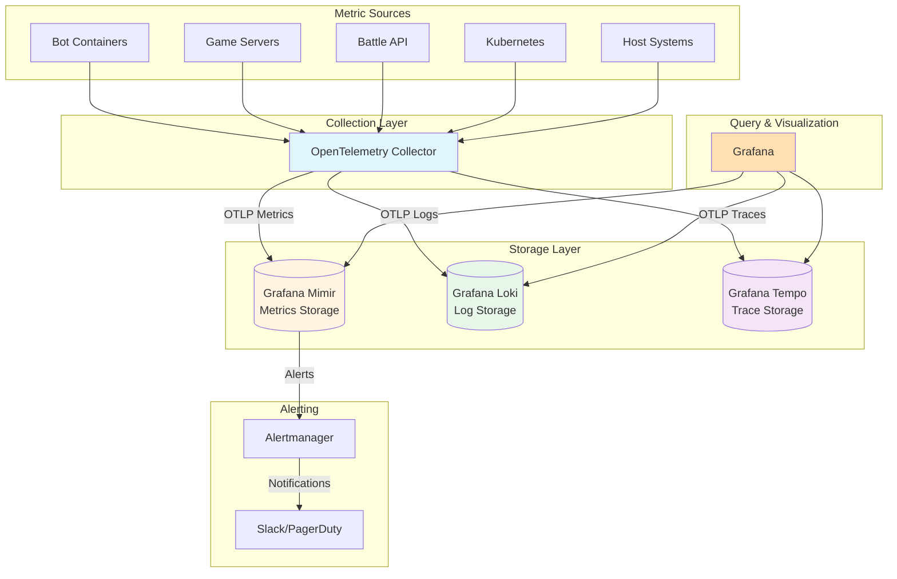

## Overview

Grafana Mimir is a horizontally scalable, highly available, multi-tenant, long-term storage solution for Prometheus metrics. It transforms Prometheus's single-server architecture into a distributed microservices platform capable of handling over 1 billion active time series with unlimited retention backed by object storage.

### What is Mimir?

Mimir takes the Prometheus Time Series Database (TSDB) and **splits it into microservices**, creating a distributed system where each component can scale independently. While Prometheus excels at real-time monitoring on a single machine, Mimir extends this capability to enterprise scale with:

- **Horizontal Scalability**: Scale from thousands to billions of active time series
- **Long-Term Storage**: Store metrics for months or years using cost-effective object storage
- **High Availability**: Built-in replication and distributed architecture eliminate single points of failure
- **Multi-Tenancy**: Isolated metrics per tenant with per-tenant resource limits
- **Prometheus Compatibility**: 100% PromQL compatibility ensures existing queries and dashboards work unchanged

### Core Innovation

Mimir's key innovation is **separating Prometheus into write path, read path, and backend components**, each independently scalable:

- **Write Path** (Distributor → Ingester): Handles metric ingestion with validation and replication
- **Read Path** (Query-Frontend → Querier → Store-Gateway): Executes queries across recent and historical data
- **Backend** (Compactor, Ruler): Background processing for storage optimization and alerting

This separation enables scaling write throughput independently from query performance, and both independently from long-term storage management.

### Relationship to Prometheus and Cortex

**Prometheus Foundation**: Mimir uses the Prometheus TSDB format and PromQL query language, providing seamless migration paths and familiar operations.

**Cortex Successor**: Mimir began as a fork of Cortex in March 2022 when Grafana Labs stopped contributing to Cortex. Mimir inherits Cortex's distributed architecture while adding:
- Reduced operational complexity through monolithic deployment mode
- Split-and-merge compactor that overcomes TSDB's 64GB index limit
- Performance optimizations and simplified configuration
- Active development and feature additions

**Recommendation**: Always choose Mimir over Cortex for new deployments. Cortex is in maintenance mode with minimal active development.

## Key Concepts

### Blocks Storage Architecture

Mimir uses a **blocks-based storage system** derived from Prometheus TSDB:

#### TSDB Blocks

Time series data is broken into **fixed-time blocks** (default: 2 hours) containing:
- **Chunks**: Highly compressed time series sample data (~1.5 bytes per sample)
- **Index**: Inverted index mapping metric names and labels to time series
- **Meta.json**: Block metadata including time range, statistics, and compaction level

#### Block Lifecycle

1. **Creation**: Ingesters create 2-hour blocks from in-memory data and upload to object storage
2. **Compaction**: Compactor merges small blocks into larger, optimized blocks (2h → 12h → 24h)
3. **Querying**: Queriers fetch recent data from ingesters, historical data from store-gateways
4. **Retention**: Compactor deletes blocks older than configured retention period
5. **Cleanup**: Soft-deleted blocks removed after deletion delay (default: 12 hours)

#### Storage Backends

Mimir requires **object storage** for long-term block storage:
- **Amazon S3** or S3-compatible services (MinIO, Ceph, etc.)
- **Google Cloud Storage (GCS)**
- **Microsoft Azure Blob Storage**
- **OpenStack Swift**

Object storage provides:
- **Durability**: Built-in replication and fault tolerance
- **Cost-Effectiveness**: ~$0.02-0.03/GB/month vs. ~$0.10-0.20/GB/month for SSD
- **Unlimited Capacity**: No practical storage limits
- **Geographic Distribution**: Multi-region replication for disaster recovery

### Time Series and Cardinality

#### Time Series Definition

A **time series** is uniquely identified by a metric name and a set of label key-value pairs:

```
http_requests_total{method="GET", endpoint="/api/battles", status="200"}
```

This creates **one time series**. Each unique combination of labels creates a separate time series.

#### Cardinality

**Cardinality** is the number of unique time series (distinct label combinations). High cardinality occurs when labels have many possible values:

**Low Cardinality** (Good):
```promql
http_requests{method="GET"}    # method has ~10 values (GET, POST, PUT, DELETE, etc.)
http_requests{status="200"}    # status has ~50 values (HTTP status codes)
```

**High Cardinality** (Problematic):
```promql
http_requests{user_id="12345"}      # user_id could have millions of values
http_requests{request_id="abc123"}  # request_id has infinite possible values
```

**Best Practice**: Avoid labels with unbounded values (UUIDs, timestamps, user IDs, email addresses). Use labels with bounded, enumerable values (service names, environments, HTTP methods, status codes).

**Mimir's Scale**: Tested at 1 billion active series, real-world deployments at 500 million series.

### Tenants and Tenant Isolation

#### Multi-Tenancy by Default

Mimir is **multi-tenant by default**. Each request must include a tenant ID via the `X-Scope-OrgID` HTTP header:

```bash
curl -H "X-Scope-OrgID: tenant-123" \
  http://mimir:8080/prometheus/api/v1/query?query=up
```

#### Tenant Isolation Mechanisms

- **Automatic Creation**: Tenants created on first write (no pre-registration needed)
- **Data Segregation**: Complete separation of data between tenants in object storage
- **Resource Limits**: Per-tenant limits for ingestion rate, active series, query concurrency
- **Query Isolation**: Tenants can only query their own data
- **No Authentication**: Mimir trusts the `X-Scope-OrgID` header; add authentication layer (reverse proxy/API gateway) for production

#### Tenant Federation

Query across multiple tenants using pipe-separated tenant IDs:

```
X-Scope-OrgID: tenant-1|tenant-2|tenant-3
```

This enables cross-tenant analytics and aggregation while maintaining isolation for writes.

#### Disabling Multi-Tenancy

For single-tenant deployments, disable multi-tenancy:

```yaml
multitenancy_enabled: false
```

All requests use a default tenant ID without requiring the `X-Scope-OrgID` header.

### PromQL Compatibility

Mimir provides **100% PromQL (Prometheus Query Language) compatibility**:

- All Prometheus query functions supported
- Recording rules and alerting rules work unchanged
- Grafana dashboards require no modifications
- Existing Prometheus alerts can be migrated directly

**Example Queries**:
```promql
# Instant query: Current values
up{job="battlebots-api"}

# Range query: Historical data
rate(http_requests_total[5m])

# Aggregation: Summary across labels
sum(rate(http_requests_total[5m])) by (status_code)

# Histogram quantiles: Latency percentiles
histogram_quantile(0.95,
  sum(rate(http_request_duration_seconds_bucket[5m])) by (le, service)
)
```

## Architecture Components

Mimir's microservices architecture comprises multiple horizontally scalable components that operate independently and in parallel.

### Component Overview


### Write Path Components

#### Distributor

**Role**: Entry point for the write path; receives and validates incoming metrics.

**Key Functions**:
- Receives write requests from Prometheus remote write or OTLP endpoints
- Validates metric format and labels (must match `[a-zA-Z_:][a-zA-Z0-9_:]*`)
- Enforces per-tenant rate limits and metadata limits
- Shards incoming time series across ingesters based on consistent hashing
- Replicates data to multiple ingesters (default: 3 replicas)

**Characteristics**:
- **Stateless**: Can be scaled horizontally without coordination
- **CPU-Bound**: Scales with sample ingestion rate
- **Resource Estimate**: 1 core per 25,000 samples/second

**Configuration Example**:
```yaml
distributor:
  ring:
    kvstore:
      store: memberlist  # Service discovery
  pool:
    health_check_ingesters: true
```

#### Ingester

**Role**: Writes incoming time series to long-term storage; serves recent data for queries.

**Key Functions**:
- Receives samples from distributors and appends to per-tenant TSDB on local disk
- Writes samples to Write-Ahead Log (WAL) for crash recovery
- Compacts in-memory samples into TSDB blocks (default: every 2 hours)
- Uploads newly created blocks to object storage
- Serves queries for recent data (within ingester retention window)
- Participates in hash ring for data sharding and replication

**Characteristics**:
- **Stateful**: Stores active series in memory and on local disk
- **Memory-Bound**: Scales with number of active series
- **Resource Estimates**:
  - CPU: 1 core per 300,000 in-memory series
  - Memory: 2.5 GB per 300,000 in-memory series
  - Disk: 5 GB per 300,000 in-memory series (for WAL and blocks)

**Recommended Limits**:
- **Conservative**: Up to 1.5 million series per ingester
- **Maximum**: Up to 5 million series per ingester (with sufficient memory)

**Configuration Example**:
```yaml
ingester:
  ring:
    replication_factor: 3  # Number of ingester replicas
    kvstore:
      store: memberlist

blocks_storage:
  tsdb:
    dir: /data/tsdb  # Local TSDB directory
    block_ranges_period: [2h]  # Block creation interval
    retention_period: 6h  # Keep blocks locally for 6 hours
```

### Read Path Components

#### Query-Frontend

**Role**: Receives and optimizes PromQL queries before dispatching to queriers.

**Key Functions**:
- Provides the same HTTP API as Prometheus (`/prometheus/api/v1/query`, etc.)
- Splits large time-range queries into smaller sub-queries (query splitting)
- Caches query results to avoid re-computation (query result caching)
- Shards queries across time series to enable parallel execution (query sharding)
- Dispatches queries to queriers via query scheduler for better load distribution
- Retries failed queries automatically

**Characteristics**:
- **Stateless**: Can be scaled horizontally
- **CPU-Bound**: Scales with query rate
- **Resource Estimate**: 1 core per 250 queries/second

**Configuration Example**:
```yaml
query_frontend:
  results_cache:
    backend: memcached
    memcached:
      addresses: memcached:11211
  split_queries_by_interval: 24h  # Split queries into 24h chunks
```

#### Query-Scheduler (Optional)

**Role**: Intermediary between query-frontend and queriers for better queue management.

**Key Functions**:
- Receives queries from query-frontends and maintains a queue
- Dispatches queries to available queriers
- Provides fair scheduling across tenants (prevents single tenant monopolizing queriers)
- Enables scaling query-frontends independently from queriers

**Characteristics**:
- **Stateless**: Lightweight component
- **Resource Estimate**: 1 core per 500 queries/second

**Configuration Example**:
```yaml
query_scheduler:
  max_outstanding_requests_per_tenant: 100
```

#### Querier

**Role**: Executes PromQL queries by fetching data from ingesters and store-gateways.

**Key Functions**:
- Receives query requests from query-frontend or query-scheduler
- Fetches recent data (within retention window) from ingesters
- Fetches historical data (older than retention window) from store-gateways
- Merges data from multiple sources and evaluates PromQL expression
- Returns results to query-frontend

**Characteristics**:
- **Stateless**: Can be scaled horizontally
- **CPU + Memory Bound**: Scales with query complexity and time range
- **Resource Estimate**: 1 core per 10 queries/second (assumes ~100ms average latency)

**Configuration Example**:
```yaml
querier:
  max_concurrent: 20  # Maximum concurrent queries per querier
  timeout: 2m  # Query timeout
  query_ingesters_within: 13h  # Query ingesters for data within 13h
  query_store_after: 12h  # Query store-gateway for data older than 12h
```

### Backend Components

#### Store-Gateway

**Role**: Provides access to historical blocks stored in object storage.

**Key Functions**:
- Synchronizes the list of blocks from object storage (bucket index)
- Downloads and memory-maps index-header files for fast block querying
- Serves queries from queriers and rulers for historical data
- Implements block-level sharding (each store-gateway responsible for subset of blocks)
- Downloads only necessary portions of blocks (chunks and index sections), not entire blocks

**Characteristics**:
- **Stateful**: Memory-maps index-headers, participates in hash ring
- **Disk I/O Bound**: Benefits from SSD for index-header operations
- **Resource Estimates**:
  - CPU: 1 core per 10 queries/second
  - Memory: 1 GB per 10 queries/second
  - Disk: 13 GB per 1 million active series (for index-header files)

**Configuration Example**:
```yaml
store_gateway:
  sharding_ring:
    replication_factor: 3
    kvstore:
      store: memberlist

blocks_storage:
  bucket_store:
    sync_dir: /data/tsdb-sync
    index_cache:
      backend: memcached
      memcached:
        addresses: memcached:11211
```

#### Compactor

**Role**: Compacts and optimizes TSDB blocks; manages retention and cleanup.

**Key Functions**:
- **Vertical Compaction**: Merges blocks from same tenant covering same time range
  - Deduplicates replicated samples (from replication factor > 1)
  - Reduces index size and chunk overhead
- **Horizontal Compaction**: Combines blocks across adjacent time periods (2h → 12h → 24h)
- **Split-and-Merge Compaction**: For large tenants (>20M series), splits compaction into shards to overcome TSDB 64GB index limit
- Maintains per-tenant **bucket index** (metadata about all blocks)
- Deletes blocks older than configured retention period
- Implements two-stage deletion: soft delete (mark) → hard delete (remove after delay)

**Characteristics**:
- **Stateful**: Participates in hash ring for per-tenant compaction ownership
- **I/O Bound**: Downloads source blocks, writes compacted blocks
- **Resource Estimates**:
  - CPU: 1 core per compactor instance
  - Memory: 4 GB per instance
  - Disk: 300 GB per instance (for downloading/uploading blocks)

**Scaling Guideline**: 1 compactor instance per 20 million active series

**Configuration Example**:
```yaml
compactor:
  data_dir: /data/compactor
  compaction_interval: 30m
  block_ranges: [2h, 12h, 24h]  # Compaction levels
  sharding_ring:
    kvstore:
      store: memberlist

  # For large tenants (>20M series)
  split_and_merge_shards: 4  # Number of shards
  split_groups: 4  # Number of groups (match shards or use next power of 2)
```

#### Ruler

**Role**: Evaluates Prometheus recording and alerting rules.

**Key Functions**:
- Executes Prometheus recording rules (pre-compute expensive queries)
- Evaluates alerting rules and sends alerts to Alertmanager
- Supports multi-tenant rules (per-tenant rule groups)
- Stores recording rule results back to Mimir via remote write
- Uses store-gateway for querying when evaluating rules

**Characteristics**:
- **Stateful**: Participates in hash ring for rule group sharding
- **CPU Bound**: Scales with number and complexity of rules

**Configuration Example**:
```yaml
ruler:
  enable_api: true  # Enable ruler API for rule management
  rule_path: /data/rules
  ring:
    kvstore:
      store: memberlist

ruler_storage:
  backend: s3
  s3:
    bucket_name: mimir-ruler
    endpoint: s3.amazonaws.com
```

## Deployment Modes

Mimir supports three deployment modes with different trade-offs between simplicity and scalability.

### Comparison Table

| Feature | Monolithic | Read-Write | Microservices |
|---------|-----------|------------|---------------|
| **Complexity** | Low | Medium | High |
| **Scalability** | Limited (all together) | Medium (3 groups) | Maximum (per-component) |
| **Resource Efficiency** | Lower (over-provisioning) | Medium | Highest (fine-grained) |
| **Failure Isolation** | Single process failure | Tier-level failure | Component-level isolation |
| **Ideal Scale** | <1M series | 1-10M series | 10M+ series |
| **Operational Overhead** | Minimal | Medium | High |
| **Deployment Tool** | Docker/VM | Kubernetes | Kubernetes + Helm |

### Monolithic Mode

**Architecture**: All Mimir components run in a single process.

**Configuration**:
```yaml
target: all  # Run all components in one process

# Or via environment variable:
# MIMIR_MODE=all
```

**Characteristics**:
- Simplest deployment model with lowest operational overhead
- All components scale together (cannot scale independently)
- Single binary to deploy and monitor
- Suitable for development, testing, and small production deployments

**High Availability**: Deploy multiple `-target=all` instances with shared object storage:
- Each instance runs full component stack
- Ingesters replicate data across instances (default: 3x replication)
- Queriers query all ingesters and merge results
- Provides HA without microservices complexity

**Resource Requirements**:
- Memory: Sized for peak ingester + querier memory needs
- CPU: Sum of all component CPU needs
- Disk: Sized for WAL and local TSDB blocks

**When to Use**:
- Development and testing environments
- POC deployments
- Production deployments with <1M active series
- Teams preferring operational simplicity over granular scalability
- When total resource requirements fit on a single machine (vertically scaled)

**Limitations**:
- Cannot scale write path independently from read path
- Resource-intensive queries impact ingestion performance
- Maximum scale limited by largest available machine
- Not supported in Jsonnet deployment tooling

**Example Docker Compose Configuration**:
```yaml
version: '3.8'

services:
  mimir:
    image: grafana/mimir:latest
    command: ["-config.file=/etc/mimir.yaml"]
    ports:
      - "9009:9009"
    volumes:
      - ./mimir.yaml:/etc/mimir.yaml
      - mimir-data:/data

volumes:
  mimir-data:
```

### Read-Write Mode (Experimental)

**Architecture**: Three-tier deployment separating read, write, and backend responsibilities.

**Tiers**:
1. **Write Tier**: Distributors + Ingesters (handles data ingestion)
2. **Read Tier**: Query-Frontends + Queriers (handles queries)
3. **Backend Tier**: Store-Gateways + Compactors + Rulers (background processing)

**Configuration**:
```yaml
# Write tier
target: write

# Read tier
target: read

# Backend tier
target: backend
```

**Characteristics**:
- Simpler than full microservices (3 tiers vs. 7+ components)
- Independent scaling of read vs. write workloads
- Logical grouping of related components
- Requires multi-zone ingesters and store-gateways

**When to Use**:
- Medium-scale deployments (1-10M active series)
- Organizations wanting simpler architecture than microservices
- Workloads with varying read vs. write loads
- Teams with some distributed systems experience

**Limitations**:
- Less granular scaling than microservices mode
- Currently experimental (use with caution in production)
- Cannot scale individual components within a tier

**Scaling Example**:
- Write-heavy workload: Scale write tier (more distributors + ingesters)
- Query-heavy workload: Scale read tier (more query-frontends + queriers)
- Storage optimization: Scale backend tier (more compactors)

### Microservices Mode

**Architecture**: Each component runs as a separate process/deployment.

**Configuration**: Each process invoked with specific `-target` parameter:
```bash
# Distributor
mimir -target=distributor -config.file=mimir.yaml

# Ingester
mimir -target=ingester -config.file=mimir.yaml

# Query-frontend
mimir -target=query-frontend -config.file=mimir.yaml

# Querier
mimir -target=querier -config.file=mimir.yaml

# Store-gateway
mimir -target=store-gateway -config.file=mimir.yaml

# Compactor
mimir -target=compactor -config.file=mimir.yaml

# Ruler
mimir -target=ruler -config.file=mimir.yaml

# Optional: Query-scheduler
mimir -target=query-scheduler -config.file=mimir.yaml

# Optional: Alertmanager
mimir -target=alertmanager -config.file=mimir.yaml
```

**Characteristics**:
- Maximum scalability and flexibility
- Each component scales independently based on workload
- Granular failure domains (component failures don't affect entire system)
- Component-specific resource allocation and optimization
- Recommended for production environments

**When to Use**:
- Production deployments with >10M active series
- Large-scale systems requiring fine-grained control
- Deployments with highly variable component loads
- Organizations with distributed systems expertise
- Kubernetes environments with operator/Helm support

**Scaling Strategies**:

**Write-Heavy Workload**:
- Scale distributors (1 core per 25K samples/sec)
- Scale ingesters (1 core per 300K series)

**Query-Heavy Workload**:
- Scale query-frontends (1 core per 250 queries/sec)
- Scale queriers (1 core per 10 queries/sec)
- Scale store-gateways (1 core per 10 queries/sec)

**Large Data Volume**:
- Scale compactors (1 per 20M series)
- Increase store-gateway replicas

**Example Kubernetes Deployment** (using Helm):
```bash
helm repo add grafana https://grafana.github.io/helm-charts
helm install mimir grafana/mimir-distributed \
  --namespace mimir \
  --values production-values.yaml
```

**Benefits**:
- Independent failure domains (ingester crash doesn't affect queriers)
- Fine-tuned resource allocation (queriers get more CPU, ingesters get more memory)
- Targeted scaling based on bottlenecks
- Easier capacity planning and cost optimization

**Trade-offs**:
- Higher operational complexity
- More components to monitor and maintain
- Network communication overhead between components
- Requires service discovery and coordination (Kubernetes, Consul, etcd)

## How to Run Mimir

### Quick Start with Docker Compose

For POC environments and local development, Docker Compose provides the fastest path to running Mimir.

#### Prerequisites

- Docker and Docker Compose installed
- At least 4 GB RAM available
- 10 GB free disk space

#### Complete Docker Compose Stack

This example deploys:
- **MinIO**: S3-compatible object storage
- **Mimir** (3 instances): High-availability monolithic deployment
- **NGINX**: Load balancer distributing traffic across Mimir instances
- **Grafana**: Visualization and dashboarding

**Directory Structure**:
```
mimir-poc/
├── docker-compose.yml
├── config/
│   ├── mimir.yaml
│   ├── nginx.conf
│   └── alertmanager-fallback-config.yaml
└── data/  (created automatically)
```

**docker-compose.yml**:
```yaml
version: '3.8'

services:
  # MinIO object storage
  minio:
    image: minio/minio
    entrypoint: [""]
    command: ["sh", "-c", "mkdir -p /data/mimir-blocks /data/mimir-ruler /data/mimir-alertmanager && minio server --quiet /data --console-address :9001"]
    environment:
      - MINIO_ROOT_USER=mimir
      - MINIO_ROOT_PASSWORD=supersecret
    ports:
      - "9000:9000"   # S3 API
      - "9001:9001"   # Web console
    volumes:
      - minio-data:/data
    healthcheck:
      test: ["CMD", "curl", "-f", "http://localhost:9000/minio/health/live"]
      interval: 30s
      timeout: 10s
      retries: 3

  # Mimir instance 1
  mimir-1:
    image: grafana/mimir:latest
    command: ["-config.file=/etc/mimir.yaml"]
    hostname: mimir-1
    depends_on:
      - minio
    ports:
      - "8001:8080"
    volumes:
      - ./config/mimir.yaml:/etc/mimir.yaml
      - ./config/alertmanager-fallback-config.yaml:/etc/alertmanager-fallback-config.yaml
      - mimir-1-data:/data

  # Mimir instance 2
  mimir-2:
    image: grafana/mimir:latest
    command: ["-config.file=/etc/mimir.yaml"]
    hostname: mimir-2
    depends_on:
      - minio
    ports:
      - "8002:8080"
    volumes:
      - ./config/mimir.yaml:/etc/mimir.yaml
      - ./config/alertmanager-fallback-config.yaml:/etc/alertmanager-fallback-config.yaml
      - mimir-2-data:/data

  # Mimir instance 3
  mimir-3:
    image: grafana/mimir:latest
    command: ["-config.file=/etc/mimir.yaml"]
    hostname: mimir-3
    depends_on:
      - minio
    ports:
      - "8003:8080"
    volumes:
      - ./config/mimir.yaml:/etc/mimir.yaml
      - ./config/alertmanager-fallback-config.yaml:/etc/alertmanager-fallback-config.yaml
      - mimir-3-data:/data

  # NGINX load balancer
  nginx:
    image: nginx:alpine
    ports:
      - "9009:9009"
    volumes:
      - ./config/nginx.conf:/etc/nginx/nginx.conf:ro
    depends_on:
      - mimir-1
      - mimir-2
      - mimir-3

  # Grafana for visualization
  grafana:
    image: grafana/grafana:latest
    environment:
      - GF_AUTH_ANONYMOUS_ENABLED=true
      - GF_AUTH_ANONYMOUS_ORG_ROLE=Admin
    ports:
      - "3000:3000"
    volumes:
      - grafana-data:/var/lib/grafana

volumes:
  minio-data:
  mimir-1-data:
  mimir-2-data:
  mimir-3-data:
  grafana-data:
```

**config/mimir.yaml**:
```yaml
# Monolithic mode configuration
target: all,alertmanager

# Multi-tenancy (disable for single-tenant POC)
multitenancy_enabled: false

# Server configuration
server:
  http_listen_port: 8080
  log_level: info

# Common configuration (shared by all components)
common:
  storage:
    backend: s3
    s3:
      endpoint: minio:9000
      access_key_id: mimir
      secret_access_key: supersecret
      insecure: true  # Use HTTP (not HTTPS) for local MinIO

# Blocks storage configuration
blocks_storage:
  backend: s3
  s3:
    bucket_name: mimir-blocks
  tsdb:
    dir: /data/tsdb
  bucket_store:
    sync_dir: /data/tsdb-sync

# Compactor configuration
compactor:
  data_dir: /data/compactor
  sharding_ring:
    kvstore:
      store: memberlist

# Distributor configuration
distributor:
  ring:
    instance_addr: 127.0.0.1
    kvstore:
      store: memberlist

# Ingester configuration
ingester:
  ring:
    instance_addr: 127.0.0.1
    kvstore:
      store: memberlist
    replication_factor: 3  # 3 replicas across 3 Mimir instances

# Ruler storage configuration
ruler_storage:
  backend: s3
  s3:
    bucket_name: mimir-ruler

# Alertmanager configuration
alertmanager_storage:
  backend: s3
  s3:
    bucket_name: mimir-alertmanager

alertmanager:
  fallback_config_file: /etc/alertmanager-fallback-config.yaml
  data_dir: /data/alertmanager

# Store-gateway configuration
store_gateway:
  sharding_ring:
    replication_factor: 3

# Limits configuration
limits:
  # Ingestion limits
  ingestion_rate: 10000  # Samples per second per tenant
  ingestion_burst_size: 20000

  # Series limits
  max_global_series_per_user: 1000000  # 1M series max
  max_global_series_per_metric: 50000

  # Query limits
  max_query_lookback: 0  # No limit on query time range

  # Retention
  compactor_blocks_retention_period: 0  # Indefinite retention (0 = disabled)
```

**config/nginx.conf**:
```nginx
events {
    worker_connections 1024;
}

http {
    upstream mimir {
        server mimir-1:8080;
        server mimir-2:8080;
        server mimir-3:8080;
    }

    server {
        listen 9009;

        location / {
            proxy_pass http://mimir;
            proxy_set_header Host $host;
            proxy_set_header X-Real-IP $remote_addr;
            proxy_set_header X-Forwarded-For $proxy_add_x_forwarded_for;
        }
    }
}
```

**config/alertmanager-fallback-config.yaml**:
```yaml
route:
  receiver: 'default-receiver'
  group_wait: 10s
  group_interval: 10s
  repeat_interval: 1h

receivers:
  - name: 'default-receiver'
```

#### Launch the Stack

```bash
# Start all services
docker-compose up -d

# Verify services are running
docker-compose ps

# Check Mimir logs
docker-compose logs -f mimir-1

# Access MinIO console
open http://localhost:9001  # Username: mimir, Password: supersecret

# Access Grafana
open http://localhost:3000
```

#### Configure Prometheus Remote Write

**prometheus.yml**:
```yaml
global:
  scrape_interval: 15s

scrape_configs:
  - job_name: 'prometheus'
    static_configs:
      - targets: ['localhost:9090']

remote_write:
  - url: http://localhost:9009/api/v1/push
    queue_config:
      capacity: 10000
      max_shards: 10
      min_shards: 1
```

#### Configure Grafana Data Source

1. Navigate to **Connections** → **Data sources**
2. Click **Add data source**
3. Select **Prometheus**
4. Configure:
   - **Name**: Mimir
   - **URL**: `http://nginx:9009/prometheus`
   - **Prometheus type**: Mimir
5. Click **Save & test**

### Production Configuration with MinIO

For on-premises production deployments or when AWS S3 is not available, MinIO provides enterprise-grade S3-compatible object storage.

**Differences from POC Setup**:
- **Distributed MinIO**: Deploy 4+ MinIO servers for high availability (erasure coding)
- **Persistent Volumes**: Use network-attached storage or cloud block storage
- **TLS Encryption**: Enable HTTPS for MinIO and Mimir
- **Authentication**: Implement proper access control and API key rotation
- **Resource Limits**: Set CPU/memory limits based on capacity planning
- **Monitoring**: Deploy Prometheus + Grafana to monitor Mimir and MinIO

**Example Production Values**:
```yaml
# Mimir production configuration with MinIO
common:
  storage:
    backend: s3
    s3:
      endpoint: minio.storage.svc.cluster.local:9000
      access_key_id: ${MINIO_ACCESS_KEY}  # From secret
      secret_access_key: ${MINIO_SECRET_KEY}  # From secret
      insecure: false  # Use HTTPS
      bucket_name: mimir-blocks

ingester:
  ring:
    replication_factor: 3
    instance_addr: ${POD_IP}
    kvstore:
      store: memberlist

limits:
  ingestion_rate: 50000  # Higher for production
  max_global_series_per_user: 10000000  # 10M series

blocks_storage:
  tsdb:
    retention_period: 24h  # Ingesters retain blocks for 24h before relying on object storage
    block_ranges_period: [2h]

compactor:
  compaction_interval: 30m
  cleanup_interval: 15m
  block_ranges: [2h, 12h, 24h]
```

### Resource Requirements

Based on the capacity planning guide:

**Small Deployment** (~1M active series):
- **Distributors**: 2 instances × (1 core, 1 GB RAM)
- **Ingesters**: 3 instances × (2 cores, 8 GB RAM, 20 GB disk)
- **Queriers**: 2 instances × (1 core, 2 GB RAM)
- **Query-Frontends**: 2 instances × (1 core, 1 GB RAM)
- **Store-Gateways**: 2 instances × (1 core, 2 GB RAM, 15 GB disk)
- **Compactor**: 1 instance × (1 core, 4 GB RAM, 300 GB disk)
- **Object Storage**: ~50 GB (1 year retention)

**Large Deployment** (~10M active series):
- **Total Resources**: ~140 CPUs, 800 GB memory
- Use the [Mimir capacity calculator](https://o11y.tools/mimircalc/) for detailed estimates

### Grafana Data Source Setup

After deploying Mimir, configure Grafana to query metrics:

**Via UI**:
1. **Connections** → **Data sources** → **Add data source** → **Prometheus**
2. **URL**: `http://mimir-gateway:8080/prometheus` (adjust for your deployment)
3. **Prometheus type**: Select "Mimir" from dropdown
4. **Save & test**

**Via Provisioning** (GitOps):
```yaml
# grafana/provisioning/datasources/mimir.yaml
apiVersion: 1

datasources:
  - name: Mimir
    type: prometheus
    access: proxy
    url: http://mimir-gateway.mimir.svc.cluster.local:8080/prometheus
    jsonData:
      prometheusType: Mimir
      timeInterval: 15s
      httpMethod: POST
```

## Best Practices

### Label Strategy and Cardinality Management

**Golden Rule**: Avoid unbounded labels (infinite possible values).

**Good Labels** (bounded cardinality):
```promql
{service="battle-api"}           # Limited number of services
{environment="production"}       # dev, staging, production (3 values)
{region="us-east-1"}            # Limited AWS regions
{status_code="200"}             # ~50 HTTP status codes
{method="GET"}                  # GET, POST, PUT, DELETE, PATCH (~7 values)
```

**Bad Labels** (unbounded cardinality):
```promql
{user_id="12345"}               # Millions of users = millions of series
{request_id="abc-123-def"}      # Every request unique = infinite series
{email="user@example.com"}      # Unbounded user emails
{timestamp="1634567890"}        # Infinite timestamp values
{session_id="xyz789"}           # Every session unique
```

**Cardinality Calculation**:
```
Total Series = Metric × (Label1_Values × Label2_Values × ... × LabelN_Values)
```

**Example**:
```promql
http_requests_total{service, environment, region, method, status_code}
= 1 metric × (10 services × 3 environments × 5 regions × 7 methods × 50 status codes)
= 1 × 52,500
= 52,500 time series
```

Adding `user_id` (1M users):
```
= 52,500 × 1,000,000 = 52.5 billion time series (UNSUSTAINABLE!)
```

**Best Practices**:
1. **Use Bounded Sets**: Labels should have enumerable values
2. **Aggregate Before Storing**: Use recording rules to pre-aggregate high-cardinality metrics
3. **Drop Unused Labels**: Use `metric_relabel_configs` in Prometheus to drop unnecessary labels
4. **Monitor Cardinality**: Enable cardinality analysis in Mimir
5. **Set Limits**: Configure per-tenant series limits to prevent runaway cardinality

### Configuration Best Practices

#### Ingester Tuning

**File Descriptors**:
```bash
# Set system limits for ingester pods/containers
ulimit -n 65536  # Minimum
ulimit -n 1048576  # For 1000+ tenants
```

**Memory and Disk**:
```yaml
ingester:
  # Target 1.5M series per ingester (conservative)
  # Max 5M series per ingester (with sufficient memory)

blocks_storage:
  tsdb:
    # Reduce block creation interval for lower memory usage
    block_ranges_period: [1h]  # vs. default 2h

    # Tune for high tenant count
    head_chunks_write_buffer_size_bytes: 2097152  # 2MB (default 4MB)
    stripe_size: 8192  # Default 16384
```

**Zone-Aware Replication**:
```yaml
ingester:
  ring:
    zone_awareness_enabled: true
    instance_availability_zone: ${AZ}  # us-east-1a, us-east-1b, etc.
```

#### Querier and Store-Gateway Optimization

**Enable Caching** (CRITICAL for production):
```yaml
blocks_storage:
  bucket_store:
    # Metadata cache
    metadata_cache:
      backend: memcached
      memcached:
        addresses: memcached-metadata:11211

    # Index cache (high CPU usage)
    index_cache:
      backend: memcached
      memcached:
        addresses: memcached-index:11211

    # Chunks cache (high bandwidth usage)
    chunks_cache:
      backend: memcached
      memcached:
        addresses: memcached-chunks:11211
        max_item_size: 5242880  # 5MB max chunk size

query_frontend:
  # Query results cache
  results_cache:
    backend: memcached
    memcached:
      addresses: memcached-results:11211
      timeout: 500ms
```

**File Descriptors**:
```bash
# Store-gateway needs many open files for index-headers
ulimit -n 65536  # Minimum
```

**SSD Recommendations**:
- **Ingesters**: SSD for WAL performance
- **Store-Gateways**: SSD for index-header operations
- **Compactor**: SSD for faster compaction

#### Compactor Configuration

**For Standard Tenants**:
```yaml
compactor:
  compaction_interval: 30m
  cleanup_interval: 15m
  data_dir: /data/compactor
  block_ranges: [2h, 12h, 24h]
```

**For Large Tenants** (>20M series):
```yaml
compactor:
  # Enable split-and-merge compaction
  split_and_merge_shards: 4  # 1 shard per 8M series
  split_groups: 4  # Match shard count or next power of 2
```

**Retention Configuration**:
```yaml
limits:
  # Global default: 1 year retention
  compactor_blocks_retention_period: 1y

# Per-tenant overrides via runtime config
overrides:
  tenant-production:
    compactor_blocks_retention_period: 2y  # 2 years for production

  tenant-development:
    compactor_blocks_retention_period: 4w  # 4 weeks for dev
```

### Storage Backend Selection

**Cloud Deployments**:
- **AWS**: Use Amazon S3 (native integration, lowest latency in AWS)
- **GCP**: Use Google Cloud Storage (native integration, lowest latency in GCP)
- **Azure**: Use Azure Blob Storage (disable hierarchical namespace!)

**On-Premises Deployments**:
- **MinIO**: Deploy distributed MinIO (4+ nodes with erasure coding)
- **Ceph**: Use Ceph RADOS Gateway (S3-compatible)
- **OpenStack Swift**: For OpenStack environments

**Bucket Configuration**:
```yaml
# CRITICAL: Use separate buckets for each storage type
blocks_storage:
  s3:
    bucket_name: mimir-blocks  # TSDB blocks

ruler_storage:
  s3:
    bucket_name: mimir-ruler  # Recording/alerting rules

alertmanager_storage:
  s3:
    bucket_name: mimir-alertmanager  # Alertmanager state
```

**Bucket Lifecycle Policies** (cost optimization):
```xml
<!-- AWS S3 Lifecycle Policy Example -->
<LifecycleConfiguration>
  <Rule>
    <ID>TransitionOldMetrics</ID>
    <Status>Enabled</Status>
    <Transition>
      <Days>90</Days>
      <StorageClass>STANDARD_IA</StorageClass>
    </Transition>
    <Transition>
      <Days>180</Days>
      <StorageClass>GLACIER_IR</StorageClass>
    </Transition>
  </Rule>
</LifecycleConfiguration>
```

### Performance Tuning

#### gRPC Compression

Enable compression between components to reduce network bandwidth:

```yaml
# Ingester → Object Storage compression
blocks_storage:
  s3:
    # Enable gzip compression for block uploads
    send_content_encoding: gzip

# Query-Frontend → Querier compression
querier:
  frontend_client:
    grpc_client_config:
      # Enable gzip compression
      grpc_compression: gzip
```

**Compression Trade-offs**:
- **Snappy**: ~5x compression, 400 MiB/s throughput (low CPU)
- **Gzip**: 6-8x compression, 50-135 MiB/s throughput (higher CPU)

#### Query Optimization

**Query Splitting**:
```yaml
query_frontend:
  # Split large time-range queries into smaller chunks
  split_queries_by_interval: 24h  # Split into 24-hour chunks
  align_queries_with_step: true
```

**Query Sharding**:
```yaml
query_frontend:
  # Shard queries across time series for parallel execution
  parallelize_shardable_queries: true
```

**Query Caching**:
```yaml
query_frontend:
  cache_results: true
  results_cache:
    backend: memcached
    memcached:
      addresses: memcached:11211

  # Cache queries for 10 minutes
  cache_unaligned_requests: true
```

#### Avoid Querying Non-Compacted Blocks

Use default values for these settings to avoid querying uncompacted blocks:

```yaml
querier:
  # Query store-gateway for data older than 12h
  query_store_after: 12h

  # Query ingesters for data within 13h
  query_ingesters_within: 13h

blocks_storage:
  bucket_store:
    # Store-gateway ignores blocks uploaded within 10h
    ignore_blocks_within: 10h
```

This ensures queriers only fetch compacted, optimized blocks from store-gateways.

### Multi-Tenancy Best Practices

**Always Use Reverse Proxy**:
```
Client → Auth Proxy (validates user, injects X-Scope-OrgID) → Mimir
```

Never expose Mimir directly to untrusted clients.

**Per-Tenant Limits**:
```yaml
# Global defaults (conservative)
limits:
  ingestion_rate: 10000
  max_global_series_per_user: 1000000

# Runtime config for per-tenant overrides
overrides:
  premium-tenant:
    ingestion_rate: 100000
    max_global_series_per_user: 10000000

  standard-tenant:
    ingestion_rate: 25000
    max_global_series_per_user: 2500000
```

**Enable Shuffle Sharding**:
```yaml
ingester:
  ring:
    # Reduce blast radius: each tenant uses subset of ingesters
    instance_enable_ipv6: false
    unregister_on_shutdown: true
```

### Common Pitfalls to Avoid

1. **Not Enabling Caching**: Queries will hammer object storage (high cost, poor performance)
2. **Unbounded Label Cardinality**: User IDs, request IDs, timestamps in labels
3. **Insufficient File Descriptors**: Ingesters and store-gateways need high limits
4. **Same Bucket for Different Stores**: Always use separate buckets
5. **Azure Hierarchical Namespace**: Must be disabled (causes orphaned directories)
6. **No Monitoring**: Deploy mimir-mixin dashboards and alerts from day one
7. **Under-provisioning Compactor Disk**: Needs space for source + destination blocks
8. **Ignoring Latency Spikes**: Upgrade to v2.15+ for improved block-cutting

## When to Use Mimir

### Ideal Use Cases

**1. Enterprise Scale** (>10M active series)

Prometheus hits memory and disk limits around 10-50M series depending on hardware. Mimir scales horizontally to billions of series.

**Example**: Multi-region infrastructure with 100+ Kubernetes clusters, each running hundreds of services.

**2. Long-Term Retention** (months to years)

Prometheus retention limited by local disk capacity (typically days to weeks). Mimir uses object storage for years of retention.

**Example**: Compliance requirements for 2-year metrics retention, capacity planning based on historical trends.

**3. Multi-Cluster Aggregation**

Multiple Prometheus instances across regions/environments need unified querying.

**Example**: Global view of service health across US, EU, and APAC deployments.

**4. Multi-Tenancy**

Per-customer, per-team, or per-environment isolation with resource limits.

**Example**: SaaS platform providing per-customer metrics dashboards, or large organization isolating team metrics.

**5. High Availability Requirements**

No tolerance for data loss or query unavailability.

**Example**: Financial services, healthcare, or e-commerce platforms requiring 99.9%+ uptime.

### Anti-Patterns (When NOT to Use Mimir)

**1. Small-Scale Deployments** (<1M active series, <30 days retention)

**Problem**: Mimir's complexity unjustified for workloads Prometheus handles easily.

**Solution**: Use standalone Prometheus until scale demands distributed storage.

**2. Operational Complexity Constraints**

**Problem**: Team lacks distributed systems expertise or Kubernetes experience.

**Solution**: Start with Prometheus, build expertise, migrate to Mimir when needed.

**3. Cost-Constrained Environments**

**Problem**: Mimir has higher baseline infrastructure costs (multiple components + object storage).

**Solution**: Prometheus is more cost-effective at small scale.

**4. Real-Time Only (No Historical Analysis)**

**Problem**: If only real-time alerting needed (no dashboards, no historical queries).

**Solution**: Prometheus sufficient; Mimir's long-term storage unused.

### Mimir vs. Prometheus Comparison

| Factor | Prometheus | Grafana Mimir |
|--------|-----------|---------------|
| **Active Series Limit** | 10-50M (single machine) | 1B+ (distributed) |
| **Retention** | Days to weeks (disk-limited) | Months to years (object storage) |
| **Scalability** | Vertical only | Horizontal (all components) |
| **High Availability** | Manual (federation/replica pairs) | Built-in (replication + distribution) |
| **Multi-Tenancy** | Not built-in | Native support |
| **Operational Complexity** | Low (single binary) | High (microservices) |
| **Setup Time** | Minutes | Hours to days |
| **Cost (Small Scale)** | Lower | Higher |
| **Cost (Large Scale)** | Not feasible | Medium (object storage efficient) |
| **Query Performance** | Excellent (local disk) | Good (distributed, cached) |
| **Use Case** | Small-medium, real-time | Enterprise, long-term, multi-cluster |

### Mimir vs. Thanos Comparison

Both Mimir and Thanos solve similar problems but with different approaches.

| Factor | Thanos | Grafana Mimir |
|--------|--------|---------------|
| **Architecture** | Sidecar or Receiver mode | Receiver mode only (push-based) |
| **Design Focus** | Operational simplicity, cost | Performance, scalability |
| **Compaction** | Standard TSDB compaction | Split-and-merge (overcomes 64GB index limit) |
| **Max Index Size** | 64GB (TSDB limit) | No practical limit |
| **Query Caching** | Metadata caching only | Full query result caching |
| **Maturity** | Mature, CNCF project | Newer, actively developed |
| **Deployment Model** | Pull (sidecar) or push (receiver) | Push only (remote write) |
| **Grafana Integration** | Good | Excellent (same vendor) |
| **Community** | Large CNCF community | Grafana Labs + community |

**When to Choose Mimir**:
- Need maximum performance and scalability
- Prefer Grafana ecosystem integration
- Large tenants (>20M series per tenant)
- Active development and new features valued

**When to Choose Thanos**:
- Prefer sidecar deployment model (pull-based)
- CNCF governance important
- Operational simplicity over raw performance
- Existing Thanos deployments

### Mimir vs. Cortex

**Relationship**: Mimir is the successor to Cortex (forked March 2022).

**Key Differences**:
- **Development**: Mimir actively developed by Grafana Labs; Cortex in maintenance mode
- **Features**: Mimir has newer features (monolithic mode, improved compactor, OTLP support matured first)
- **Complexity**: Mimir simplified some operational aspects of Cortex
- **Migration**: Cortex → Mimir migration supported and documented

**Recommendation**: **Always use Mimir** for new deployments. Only run Cortex if already deployed and not ready to migrate.

### Decision Criteria Matrix

Use this matrix to determine if Mimir is right for your use case:

| Criterion | Prometheus | Mimir | Thanos |
|-----------|-----------|-------|--------|
| **Active Series** | <10M | >10M | >10M |
| **Retention Requirement** | <30 days | >30 days | >30 days |
| **Multi-Cluster** | Single cluster | Multiple clusters | Multiple clusters |
| **Multi-Tenancy** | Not needed | Required | Via labels |
| **Team Expertise** | Limited | Distributed systems | Distributed systems |
| **Budget** | Constrained | Medium-High | Medium |
| **Deployment Model** | Any | Kubernetes preferred | Kubernetes or VMs |
| **Vendor Preference** | Neutral | Grafana ecosystem | CNCF ecosystem |

**Decision Guide**:

**Choose Prometheus** if:
- Active series < 10M
- Retention < 30 days
- Single Kubernetes cluster
- Team prefers simplicity

**Choose Mimir** if:
- Active series > 10M (or expect to reach soon)
- Retention > 30 days
- Multiple Prometheus instances to aggregate
- Multi-tenancy required
- Grafana ecosystem preferred

**Choose Thanos** if:
- Want to keep Prometheus sidecar model
- CNCF governance important
- Operational simplicity over maximum performance
- Existing Thanos deployment

## BattleBots Integration Points

For the BattleBots platform, Mimir would serve as the centralized metrics storage backend within the broader observability stack.

### Observability Stack Architecture



### Game Metrics Use Cases

#### Bot Performance Metrics

**Action Latency**:
```promql
# 95th percentile attack action latency by bot type
histogram_quantile(0.95,
  sum(rate(bot_action_duration_seconds_bucket{action="attack"}[5m]))
  by (bot_type, le)
)

# Slow bots (p95 > 100ms)
histogram_quantile(0.95,
  sum(rate(bot_action_duration_seconds_bucket[5m])) by (bot_id, le)
) > 0.1
```

**Bot Health Tracking**:
```promql
# Average bot health per battle
avg(bot_health_points) by (battle_id, bot_id)

# Bots eliminated in last hour
count(bot_health_points == 0) by (battle_id)
```

**Resource Usage**:
```promql
# CPU usage per bot container
rate(container_cpu_usage_seconds_total{
  namespace="battlebots",
  pod=~"bot-.*"
}[5m])

# Memory usage per bot
container_memory_working_set_bytes{
  namespace="battlebots",
  pod=~"bot-.*"
} / 1024 / 1024  # Convert to MB
```

#### Battle Event Metrics

**Battle State**:
```promql
# Active battles
sum(battle_state{state="active"})

# Average battle duration
rate(battle_duration_seconds_sum[5m])
/
rate(battle_duration_seconds_count[5m])

# Battles per minute
rate(battles_total[1m]) * 60
```

**Matchmaking Metrics**:
```promql
# Players in queue
player_queue_length

# Average queue wait time
rate(queue_wait_seconds_sum[5m])
/
rate(queue_wait_seconds_count[5m])

# Matchmaking success rate
rate(matchmaking_success_total[5m])
/
rate(matchmaking_attempts_total[5m])
```

### Infrastructure Metrics Use Cases

**API Performance**:
```promql
# Request rate by endpoint and status
sum(rate(http_requests_total{service="battle-api"}[5m]))
by (endpoint, status_code)

# Error rate
sum(rate(http_requests_total{status_code=~"5.."}[5m]))
/
sum(rate(http_requests_total[5m]))

# p99 latency
histogram_quantile(0.99,
  sum(rate(http_request_duration_seconds_bucket[5m]))
  by (endpoint, le)
)
```

**Kubernetes Metrics**:
```promql
# Pod restart rate
rate(kube_pod_container_status_restarts_total{
  namespace="battlebots"
}[1h])

# Pods not ready
count(kube_pod_status_phase{
  namespace="battlebots",
  phase!="Running"
})

# Node resource utilization
sum(node_memory_MemAvailable_bytes)
/
sum(node_memory_MemTotal_bytes)
```

### Label Strategy for BattleBots

**Recommended Labels**:
```promql
{
  # Infrastructure labels
  cluster="us-east-1-prod",
  namespace="battlebots",
  service="battle-api",
  environment="production",

  # Game labels
  battle_id="12345",           # OK if battles are finite and expire
  bot_type="tank",             # Enumerable bot types
  game_mode="team-deathmatch", # Bounded game modes
  region="us-east",            # Geographic regions

  # Avoid these!
  # player_id="...",           # High cardinality
  # session_id="...",          # Unbounded
  # request_id="...",          # Infinite values
}
```

**Cardinality Estimate**:
```
http_requests_total {
  service: 10 values (battle-api, game-server, matchmaking, etc.)
  environment: 3 values (dev, staging, prod)
  region: 5 values (us-east, us-west, eu-west, ap-south, ap-east)
  method: 7 values (GET, POST, PUT, DELETE, PATCH, OPTIONS, HEAD)
  endpoint: 50 values (API endpoints)
  status_code: 50 values (HTTP status codes)
}
= 1 × 10 × 3 × 5 × 7 × 50 × 50
= 2,625,000 time series

# Acceptable cardinality for 1 metric
```

### Example PromQL Queries for BattleBots

**Battle Analytics**:
```promql
# Total battles completed today
increase(battles_completed_total[24h])

# Win rate by bot type
sum(rate(battle_outcomes_total{outcome="victory"}[1h])) by (bot_type)
/
sum(rate(battle_outcomes_total[1h])) by (bot_type)

# Average players online by hour
avg_over_time(players_online_total[1h])
```

**Capacity Planning**:
```promql
# CPU headroom
(sum(node_cpu_capacity_cores) - sum(rate(node_cpu_usage_seconds_total[5m])))
/
sum(node_cpu_capacity_cores)

# Memory headroom
(sum(node_memory_MemTotal_bytes) - sum(node_memory_MemUsed_bytes))
/
sum(node_memory_MemTotal_bytes)

# Projected series growth
predict_linear(mimir_ingester_active_series[24h], 7*24*3600)
```

**Cost Optimization**:
```promql
# Underutilized bot containers (CPU < 10%)
avg(rate(container_cpu_usage_seconds_total{pod=~"bot-.*"}[5m])) by (pod) < 0.1

# Idle game servers
count(game_server_active_battles == 0) by (instance)
```

### Alerting Examples

**Critical Alerts**:
```yaml
groups:
  - name: battlebots-critical
    interval: 30s
    rules:
      # Battle API down
      - alert: BattleAPIDown
        expr: up{job="battle-api"} == 0
        for: 1m
        labels:
          severity: critical
        annotations:
          summary: "Battle API is down"
          description: "Battle API {{ $labels.instance }} has been down for more than 1 minute"

      # High error rate
      - alert: HighErrorRate
        expr: |
          sum(rate(http_requests_total{status_code=~"5.."}[5m]))
          /
          sum(rate(http_requests_total[5m])) > 0.05
        for: 5m
        labels:
          severity: critical
        annotations:
          summary: "High error rate detected"
          description: "Error rate is {{ $value | humanizePercentage }}"

      # Ingester approaching series limit
      - alert: MimirIngesterSeriesLimit
        expr: |
          mimir_ingester_active_series
          /
          mimir_limits_overrides{limit_name="max_global_series_per_user"} > 0.8
        for: 15m
        labels:
          severity: warning
        annotations:
          summary: "Mimir ingester approaching series limit"
```

### Integration with Loki and Tempo

**Metric-to-Log Correlation**:
```promql
# In Grafana, link from metric spike to logs
{namespace="battlebots", service="battle-api"}
|= "error"
| logfmt
| battle_id="12345"
```

**Metric-to-Trace Correlation**:
- Use exemplars in Prometheus metrics to link to traces
- Query by `trace_id` in Tempo from metric anomalies
- Grafana's Explore view shows metrics → traces → logs correlation

**Unified Dashboard Example**:
```
┌─────────────────────────────────────┐
│  Battle API Request Rate (Mimir)   │
│  [Graph showing spike at 14:30]     │
└─────────────────────────────────────┘
         ↓ Click spike
┌─────────────────────────────────────┐
│  Traces at 14:30 (Tempo)            │
│  [Slow traces listed]                │
└─────────────────────────────────────┘
         ↓ Click trace
┌─────────────────────────────────────┐
│  Logs for trace_id (Loki)           │
│  [Error logs with stack trace]      │
└─────────────────────────────────────┘
```

## Further Reading

### Official Documentation

- [Grafana Mimir Documentation](https://grafana.com/docs/mimir/latest/) - Comprehensive official docs
- [Mimir GitHub Repository](https://github.com/grafana/mimir) - Source code, issues, discussions
- [Mimir Architecture Overview](https://grafana.com/docs/mimir/latest/get-started/about-grafana-mimir-architecture/) - Detailed architecture guide
- [Mimir Configuration Parameters](https://grafana.com/docs/mimir/latest/configure/configuration-parameters/) - Complete config reference
- [Mimir Runbooks](https://grafana.com/docs/mimir/latest/manage/mimir-runbooks/) - Troubleshooting guides

### Deployment and Operations

- [Helm Chart Documentation](https://grafana.com/docs/helm-charts/mimir-distributed/latest/) - Kubernetes deployment guide
- [Production Tips](https://grafana.com/docs/mimir/latest/manage/run-production-environment/production-tips/) - Best practices
- [Capacity Planning](https://grafana.com/docs/mimir/latest/manage/run-production-environment/planning-capacity/) - Resource estimation
- [Mimir Capacity Calculator](https://o11y.tools/mimircalc/) - Interactive sizing tool
- [Monitor Mimir Health](https://grafana.com/docs/mimir/latest/manage/monitor-grafana-mimir/) - Self-monitoring setup

### Integration Guides

- [Configure OpenTelemetry Collector for Mimir](https://grafana.com/docs/mimir/latest/configure/configure-otel-collector/) - OTLP integration
- [Migrate from Prometheus to Mimir](https://grafana.com/docs/mimir/latest/set-up/migrate/migrate-from-thanos-or-prometheus/) - Migration guide
- [Remote Write Tuning](https://prometheus.io/docs/practices/remote_write/) - Optimize Prometheus → Mimir ingestion
- [Grafana Dashboards for Mimir](https://grafana.com/grafana/dashboards/?search=mimir) - Pre-built dashboards

### Performance and Scaling

- [How We Scaled Mimir to 1 Billion Active Series](https://grafana.com/blog/2022/04/08/how-we-scaled-our-new-prometheus-tsdb-grafana-mimir-to-1-billion-active-series/) - Grafana Labs blog
- [Scaling Mimir to 500M Series (Customer Story)](https://grafana.com/blog/2022/05/24/scaling-grafana-mimir-to-500-million-active-series-on-customer-infrastructure-with-grafana-enterprise-metrics/) - Pipedrive case study
- [Mimir vs Prometheus Scalability](https://grafana.com/blog/2022/07/28/how-grafana-mimir-helped-pipedrive-overcome-prometheus-scalability-limits/) - Real-world comparison
- [Query Performance Optimization](https://grafana.com/docs/mimir/latest/query/query-best-practices/) - PromQL tuning

### Comparisons and Decision Guides

- [Mimir vs Prometheus Comparison](https://gradus.dev/labs/prometheus-vs.-mimir:-choosing-the-right-tool-for-observability-dDFMHo) - Detailed comparison
- [Mimir vs Thanos Discussion](https://github.com/grafana/mimir/discussions/3380) - Community comparison
- [Prometheus and Centralized Storage](https://palark.com/blog/prometheus-centralized-storage-mimir/) - When to use centralized metrics

### Community and Support

- [Mimir Community Forum](https://community.grafana.com/c/grafana-mimir/) - Ask questions, share knowledge
- [Grafana Slack #mimir Channel](https://grafana.slack.com/) - Real-time community support
- [Mimir Release Notes](https://grafana.com/docs/mimir/latest/release-notes/) - Version history and breaking changes
- [CNCF OpenTelemetry Project](https://www.cncf.io/projects/opentelemetry/) - Related OTLP ecosystem

### Tutorials and Workshops

- [Play with Grafana Mimir](https://grafana.com/docs/mimir/latest/get-started/play-with-grafana-mimir/) - Hands-on tutorial
- [Mimir Workshop](https://github.com/grafana/mimir/tree/main/docs/sources/mimir/get-started/play-with-grafana-mimir) - Full Docker Compose examples
- [OTLP Integration Tutorial](https://grafana.com/blog/2025/01/07/opentelemetry-and-grafana-labs-whats-new-and-whats-next-in-2025/) - OpenTelemetry + Mimir guide

### Advanced Topics

- [Cardinality Management](https://grafana.com/docs/mimir/latest/manage/run-production-environment/production-tips/#cardinality-management) - Label strategy
- [Multi-Tenancy Setup](https://grafana.com/docs/mimir/latest/configure/about-tenant-ids/) - Tenant isolation guide
- [Ingest Storage Architecture](https://grafana.com/docs/mimir/latest/get-started/about-grafana-mimir-architecture/about-ingest-storage-architecture/) - Kafka-based ingestion (Mimir 3.0+)
- [Split-and-Merge Compactor](https://grafana.com/docs/mimir/latest/references/architecture/components/compactor/) - Large tenant optimization
