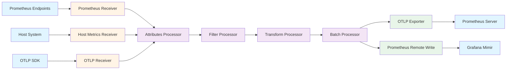

## Overview

The OpenTelemetry Collector provides comprehensive support for collecting, processing, and exporting metrics data from diverse sources to multiple backends. It serves as a bridge between different metrics ecosystems, enabling seamless integration of Prometheus metrics, host system metrics, and custom application metrics within a unified observability platform.

The Collector's metrics support emphasizes signal correlation—connecting metrics to traces through exemplars and enriching attributes via Baggage and Context. This enables powerful observability patterns such as jumping from a metric anomaly to related traces or finding metrics that explain slow trace spans.

Key capabilities include scraping Prometheus endpoints, collecting host system metrics, transforming metric formats, aggregating data points, and routing metrics to multiple backends simultaneously while handling different temporality preferences.

## Key Concepts

### OpenTelemetry Metrics Data Model

The [OpenTelemetry Metrics data model](https://opentelemetry.io/docs/specs/otel/metrics/data-model/) defines how metrics are represented and processed. The data model serves to:

- Capture raw measurements efficiently and simultaneously
- Decouple instrumentation from the SDK implementation
- Enable correlation with traces and logs
- Support migration from OpenCensus and Prometheus

**Architecture layers:**

1. **MeterProvider & Instruments**: Applications collect measurements through Meters and their associated Instruments
2. **In-Memory Aggregation**: Measurements aggregate into an intermediate representation
3. **MetricReader**: Processes aggregated metrics for export to backends

### Metric Types

OpenTelemetry supports four primary metric types, each suited for different measurement scenarios.

#### Counter (Sum)

Counters represent cumulative or delta measurements that can only increase over time (or be reset to zero). Common examples include:

- Request count
- Error count
- Bytes transmitted
- Items processed

**Characteristics:**
- Monotonically increasing
- Supports both delta and cumulative temporality
- Can be aggregated across instances
- Typically visualized as rate-of-change

For detailed specifications, see [OTLP Metrics Types](https://docs.datadoghq.com/metrics/open_telemetry/otlp_metric_types/).

#### Gauge

Gauges represent sampled values that can arbitrarily increase or decrease over time. Unlike counters, gauges are not cumulative—they reflect the current value at the time of measurement.

Common examples include:
- CPU usage percentage
- Memory utilization
- Queue depth
- Active connection count
- Temperature readings

**Characteristics:**
- Non-monotonic (can increase or decrease)
- No aggregation temporality (uses "last sample value")
- Represents point-in-time state
- Cannot be meaningfully aggregated across instances without additional context

#### Histogram

Histograms convey a population of recorded measurements in a compressed format by grouping measurements into configurable buckets. This enables statistical analysis without storing individual data points.

Common examples include:
- Request latency distribution
- Response size distribution
- Query execution time
- Message size distribution

**Characteristics:**
- Provides count, sum, and bucket distributions
- Supports both delta and cumulative temporality
- Enables percentile calculations (p50, p95, p99)
- More efficient than storing individual measurements

Histograms are particularly valuable for understanding the distribution of latency or size measurements, revealing whether most requests are fast with occasional slow outliers, or if performance degrades uniformly.

#### Summary

Summaries provide pre-calculated quantile values (percentiles) over a time window. Unlike histograms, which send bucket distributions for backend calculation, summaries compute quantiles client-side.

**Important**: Summary points cannot always be merged meaningfully. This point type is **not recommended for new applications** and exists primarily for compatibility with other formats like Prometheus summaries.

For comprehensive metric type details, see [OpenTelemetry Metrics](https://uptrace.dev/opentelemetry/metrics).

### Temporality

Temporality defines how metric values are accumulated and reported over time. OpenTelemetry supports two aggregation temporality modes:

#### Delta Temporality

Delta temporality reports the change since the last collection period. Each data point represents only new measurements since the previous export.

**Characteristics:**
- Non-overlapping time windows
- Measures rate of change
- Preferred by some backends (StatsD, Carbon)
- Requires stateless aggregation

**Example**: A request counter shows +100 requests in period 1, then +150 requests in period 2.

#### Cumulative Temporality

Cumulative temporality reports the total value since process start (or a fixed start point). Each data point includes all measurements from the beginning.

**Characteristics:**
- Overlapping time windows from fixed start
- Accumulates over application lifetime
- Preferred by Prometheus
- Resilient to collection gaps

**Example**: A request counter shows 100 total requests in period 1, then 250 total requests in period 2.

**Important note**: Set the temporality preference to DELTA when possible, as setting it to CUMULATIVE may discard some data points during application or collector startup. However, Prometheus backends require cumulative temporality.

For more details, see [OpenTelemetry Metrics Aggregation](https://last9.io/blog/opentelemetry-metrics-aggregation/).

## Metrics Receivers

Receivers collect metrics data from various sources and convert it into the OpenTelemetry metrics data model.

### Prometheus Receiver

The [Prometheus receiver](https://www.dash0.com/guides/opentelemetry-prometheus-receiver) enables the OpenTelemetry Collector to act as a Prometheus server by scraping Prometheus-compatible endpoints, then converting the metrics into OTLP format.

**Key capabilities:**

- Scrapes any Prometheus `/metrics` endpoint
- Supports service discovery mechanisms
- Converts Prometheus metrics to OpenTelemetry format
- Handles metric relabeling and filtering
- Scales with Target Allocator for large deployments

**Configuration example:**

```yaml
receivers:
  prometheus:
    config:
      scrape_configs:
        - job_name: 'otel-collector'
          scrape_interval: 15s
          static_configs:
            - targets: ['localhost:8888']
```

**Scaling with Target Allocator:**

The [Target Allocator](https://opentelemetry.io/docs/platforms/kubernetes/helm/collector/) decouples service discovery and metric collection, allowing independent scaling. Each Collector pod registers with the Target Allocator, which uses consistent hashing to distribute discovered targets evenly among active Collectors, ensuring each target is scraped exactly once without overlap.

For comprehensive guidance, see [Prometheus and OpenTelemetry Collector Integration](https://uptrace.dev/opentelemetry/collector/prometheus).

### Host Metrics Receiver

The [hostmetrics receiver](https://uptrace.dev/opentelemetry/collector/host-metrics) collects comprehensive system-level metrics from host machines, providing visibility into infrastructure health.

**Available scrapers:**

- **cpu**: CPU utilization, time, and frequency
- **disk**: Disk I/O operations and throughput
- **filesystem**: Filesystem usage and available space
- **memory**: Memory utilization and swap usage
- **network**: Network interface statistics and errors
- **load**: System load averages
- **paging**: Paging and swapping activity
- **processes**: Process count and resource usage

**Configuration example:**

```yaml
receivers:
  hostmetrics:
    collection_interval: 30s
    scrapers:
      cpu:
      disk:
      filesystem:
      memory:
      network:
```

The hostmetrics receiver is essential for infrastructure monitoring and provides context for application-level metrics. When deployed in Kubernetes, appropriate volumes and volumeMounts are automatically configured when the hostMetrics preset is enabled.

### OTLP Receiver

The OTLP receiver accepts metrics data transmitted using the OpenTelemetry Protocol from instrumented applications or upstream collectors.

**Supported transports:**
- gRPC (default port 4317)
- HTTP (default port 4318, endpoint `/v1/metrics`)

**Use cases:**
- Collecting metrics directly from OpenTelemetry SDKs
- Multi-tier collector deployments (agent → gateway)
- Receiving metrics from serverless functions

### Other Metrics Receivers

The ecosystem includes receivers for diverse metrics sources:

- **statsd**: Receives StatsD protocol metrics
- **kafka**: Consumes metrics from Kafka topics
- **influxdb**: Receives InfluxDB line protocol
- **carbon**: Receives Graphite carbon metrics
- **collectd**: Receives collectd metrics
- **postgresql**: Scrapes PostgreSQL metrics
- **redis**: Scrapes Redis metrics
- **mongodb**: Scrapes MongoDB metrics

For a complete list, see the [Receiver Components](https://opentelemetry.io/docs/collector/components/receiver/) documentation.

## Metrics Processors

Processors transform and enrich metrics data as it flows through pipelines.

### Metrics Transform Processor

The metrics transform processor modifies metric names, types, and attributes using transformation rules.

**Common operations:**
- Rename metrics for consistency
- Change metric types (e.g., gauge to counter)
- Add or modify resource attributes
- Aggregate metrics across dimensions

### Filter Processor

The filter processor drops metrics matching specified conditions, reducing data volume and costs.

**Use cases:**
- Dropping debug metrics in production
- Filtering metrics from test environments
- Excluding high-cardinality metrics
- Removing specific metric names or attribute values

### Cumulative to Delta Processor

This processor converts cumulative temporality metrics to delta temporality, useful when backends prefer delta metrics.

### Attributes Processor

Adds, updates, or deletes metric attributes and resource attributes, enabling:
- Environment labeling (`environment=production`)
- Team ownership tags (`team=platform`)
- Cost allocation labels
- Normalization across different metric sources

### Batch Processor

Groups metrics before export, improving throughput and reducing network overhead. Recommended for all production deployments.

**Configuration considerations:**
- Batch size: Number of metric data points per batch
- Timeout: Maximum wait before sending partial batch
- Memory limits: Prevents unbounded memory growth

## Metrics Exporters

Exporters send processed metrics to observability backends and time-series databases.

### OTLP Exporter

The OTLP exporter sends metrics using the OpenTelemetry Protocol to OTLP-compatible backends.

**Supported destinations:**
- OpenTelemetry-native backends
- Cloud vendor endpoints (AWS CloudWatch, Google Cloud Monitoring, Azure Monitor)
- Commercial observability platforms (Datadog, New Relic, Honeycomb)

**Important**: OTLP is now the **recommended protocol** for sending metrics to modern backends. For example, [Prometheus can now accept OTLP](https://prometheus.io/docs/guides/opentelemetry/) directly:

```bash
export OTEL_EXPORTER_OTLP_PROTOCOL=http/protobuf
export OTEL_EXPORTER_OTLP_METRICS_ENDPOINT=http://localhost:9090/api/v1/otlp/v1/metrics
```

### Prometheus Remote Write Exporter

The [Prometheus Remote Write exporter](https://github.com/open-telemetry/opentelemetry-collector-contrib/blob/main/exporter/prometheusremotewriteexporter/README.md) sends OpenTelemetry metrics to Prometheus remote write compatible backends such as:

- Cortex
- Grafana Mimir
- Thanos
- Amazon Managed Service for Prometheus
- Google Cloud Managed Prometheus

**Capabilities:**
- TLS support (required by default)
- Queued retry mechanisms
- Authentication options (basic auth, bearer token, OAuth2)

**Important limitation**: Non-cumulative monotonic, histogram summary, and exponential histogram OTLP metrics are dropped by this exporter.

For Grafana Mimir specifically, it's [recommended to use OTLP](https://grafana.com/docs/mimir/latest/configure/configure-otel-collector/) rather than Prometheus remote write.

### Prometheus Exporter

The Prometheus exporter exposes metrics in Prometheus format on an HTTP endpoint for Prometheus servers to scrape.

**Use cases:**
- Existing Prometheus deployments
- Push-based collection converted to pull-based
- Multi-backend export (push to one, expose for scraping by another)

### File Exporter

Writes metrics to local files for debugging, archival, or processing by batch systems.

For additional exporters, see the [Exporter Components](https://opentelemetry.io/docs/collector/components/exporter/) documentation.

## Metrics Pipeline Flow

A typical metrics pipeline demonstrates collection, processing, and export to multiple backends:



## Configuration Considerations

### Temporality Management

Different backends have different temporality preferences:

- **Prometheus**: Requires cumulative temporality
- **StatsD-like systems**: Prefer delta temporality
- **Cloud vendors**: Often accept both

Configure the Collector to convert between temporalities based on backend requirements using the cumulative-to-delta processor.

### Cardinality Control

High cardinality metrics (many unique label combinations) can overwhelm backends and increase costs. Strategies include:

- Filtering high-cardinality dimensions
- Aggregating metrics before export
- Dropping rarely-used labels
- Using metric relabeling to reduce dimensions

### Scrape Interval Tuning

Balance data freshness with resource consumption:

- Short intervals (5-15s): Real-time monitoring, higher costs
- Medium intervals (30-60s): Standard monitoring
- Long intervals (5m+): Capacity planning, cost optimization

### Exemplar Support

Exemplars link metrics to traces by attaching trace IDs to specific metric data points. This enables:

- Jumping from a high-latency histogram bucket to example slow traces
- Finding traces that contributed to an error rate spike
- Correlating metrics anomalies with detailed trace analysis

Enable exemplar support in the Prometheus receiver and ensure trace context propagation in applications.

## Integration Points

### BattleBots Metrics Collection

For the BattleBots platform, metrics collection would capture:

**Game Metrics:**
- Match duration and outcome distribution
- Bot action rates (attacks, defenses, moves)
- Game state transition frequency

**Performance Metrics:**
- Request latency percentiles
- WebSocket connection counts
- Message throughput rates
- Server CPU and memory usage

**Business Metrics:**
- Active user count
- Matches per hour
- Bot creation rate

The combination of Prometheus receiver (for Go runtime metrics), hostmetrics receiver (for infrastructure), and OTLP receiver (for custom metrics) provides comprehensive visibility.

### Metrics-Trace Correlation

Connecting metrics and traces enables powerful workflows:

1. **Alerting on metrics**: High error rate triggers investigation
2. **Drill-down to traces**: Click exemplar to see example failing requests
3. **Root cause analysis**: Examine detailed trace spans to identify cause
4. **Fix validation**: Monitor metrics to confirm fix effectiveness

This requires:
- Applications emit both metrics and traces
- Exemplars enabled in metric collection
- Unified storage backend (or cross-backend linking)

### Cross-Signal Analysis

Metrics complement logs and traces:

- **Metrics** identify anomalies at scale (response time spike)
- **Traces** show affected request flows (which service is slow)
- **Logs** provide detailed context (exception messages, stack traces)

The Collector's unified data model enables seamless correlation across all three signals.

## Further Reading

### Official Documentation

- [OpenTelemetry Metrics Specification](https://opentelemetry.io/docs/concepts/signals/metrics/)
- [Metrics Data Model](https://opentelemetry.io/docs/specs/otel/metrics/data-model/)
- [Receiver Components](https://opentelemetry.io/docs/collector/components/receiver/)
- [Processor Components](https://opentelemetry.io/docs/collector/components/processor/)
- [Exporter Components](https://opentelemetry.io/docs/collector/components/exporter/)

### Integration Guides

- [Collecting Prometheus Metrics with the OpenTelemetry Collector](https://www.dash0.com/guides/opentelemetry-prometheus-receiver)
- [Prometheus and OpenTelemetry Collector Integration](https://uptrace.dev/opentelemetry/collector/prometheus)
- [OpenTelemetry Host Metrics receiver](https://uptrace.dev/opentelemetry/collector/host-metrics)
- [Using Prometheus as your OpenTelemetry backend](https://prometheus.io/docs/guides/opentelemetry/)
- [Configure the OpenTelemetry Collector to write metrics into Mimir](https://grafana.com/docs/mimir/latest/configure/configure-otel-collector/)
- [How to collect Prometheus metrics with the OpenTelemetry Collector and Grafana](https://grafana.com/blog/2022/05/10/how-to-collect-prometheus-metrics-with-the-opentelemetry-collector-and-grafana/)

### Component-Specific Resources

- [Prometheus Remote Write Exporter](https://github.com/open-telemetry/opentelemetry-collector-contrib/blob/main/exporter/prometheusremotewriteexporter/README.md)
- [OpenTelemetry Collector Chart (Kubernetes)](https://opentelemetry.io/docs/platforms/kubernetes/helm/collector/)
- [Prometheus and OpenTelemetry - Better Together](https://opentelemetry.io/blog/2024/prom-and-otel/)

### Analysis and Best Practices

- [OTLP Metrics Types](https://docs.datadoghq.com/metrics/open_telemetry/otlp_metric_types/)
- [Understanding OpenTelemetry Metrics](https://uptrace.dev/opentelemetry/metrics)
- [OpenTelemetry Metrics Aggregation](https://last9.io/blog/opentelemetry-metrics-aggregation/)
- [How Prometheus Exporters Work With OpenTelemetry](https://last9.io/blog/how-prometheus-exporters-work-with-opentelemetry/)

### Related Analysis Documents

- [OpenTelemetry Collector Overview](opentelemetry-collector-overview.md) - Core architecture and concepts
- [Logs Support](otel-collector-logs.md) - How the Collector handles log data
- [Traces Support](otel-collector-traces.md) - How the Collector handles distributed traces
- [Self-Monitoring](otel-collector-self-monitoring.md) - Observing the Collector itself
