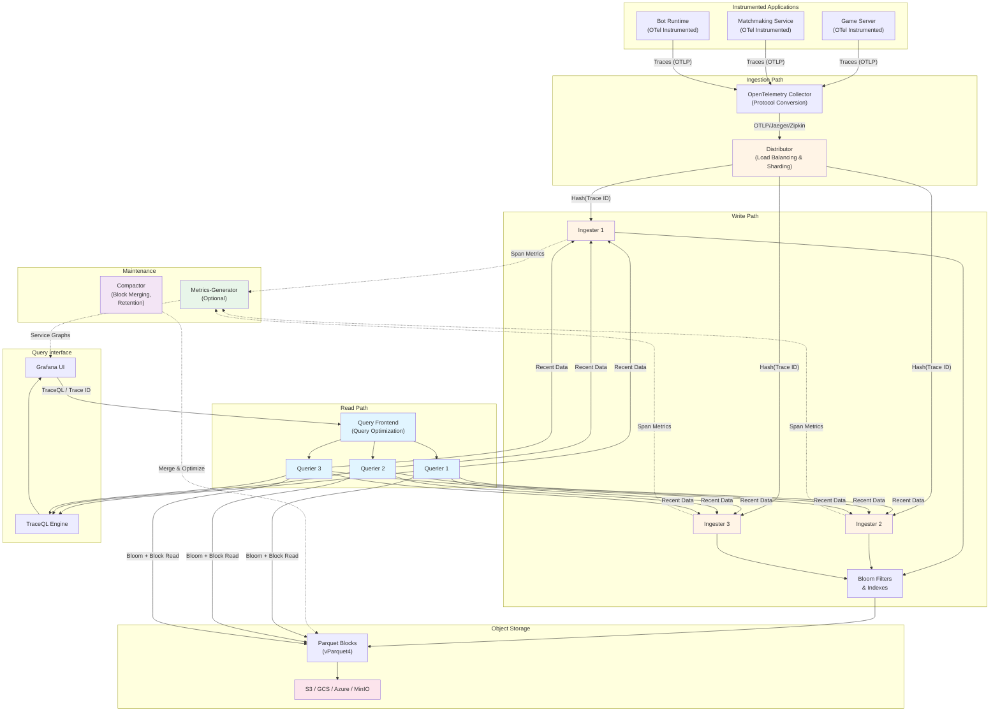

## Overview

Grafana Tempo is a high-volume, minimal dependency distributed tracing backend designed for cost-efficiency and operational simplicity. Unlike traditional distributed tracing systems that require complex database infrastructure like Cassandra or Elasticsearch, Tempo leverages object storage as its only dependency, dramatically reducing operational complexity while providing powerful trace querying capabilities through TraceQL.

The core innovation of Tempo is its index-free, object storage-first architecture: traces are stored as immutable blocks in cost-effective object storage (S3, GCS, Azure, MinIO) without requiring expensive indexing infrastructure. While this trades off some search flexibility compared to fully-indexed systems like Jaeger, it enables storing 100% of traces at a fraction of the cost. TraceQL, Tempo's SQL-like query language, provides sophisticated trace analysis capabilities including filtering by span attributes, duration thresholds, and span relationships.

Tempo integrates seamlessly with the Grafana observability stack, enabling powerful trace-to-metrics correlation through exemplars and trace-to-logs correlation through shared trace IDs. Combined with Loki (logs) and Mimir (metrics), Tempo completes the LGTM stack for unified observability.

## What is Grafana Tempo?

Grafana Tempo is an open-source distributed tracing backend that fundamentally changes the economics and operational model of trace storage at scale. Launched by Grafana Labs, Tempo addresses the primary pain points of traditional tracing systems: expensive storage infrastructure, complex database management, and prohibitive costs that force aggressive sampling.

**Design Philosophy:**

- **Cost-Efficient**: Object storage costs 90% less than Cassandra or Elasticsearch for trace storage
- **Minimal Dependencies**: Only requires object storage—no databases, no indexes, no complex infrastructure
- **Standards-Based**: Native OpenTelemetry Protocol (OTLP) support with full compatibility for Jaeger and Zipkin formats
- **High Scale with Simplicity**: Handle millions of spans per second while maintaining operational simplicity
- **Deep Integration**: Seamless correlation with Grafana, Loki, Mimir, and Prometheus

**Key Characteristics:**

1. **Index-Free Architecture**: Primary lookup method is by trace ID; advanced queries use TraceQL with on-demand scanning
2. **Blocks Storage Model**: Traces stored in columnar Apache Parquet format optimized for fast scanning (300 GB/s search speed)
3. **Query Language**: TraceQL provides SQL-like syntax for powerful trace analysis
4. **Multi-Protocol Ingestion**: Accepts OTLP, Jaeger, Zipkin, and OpenCensus protocols
5. **Multi-Tenancy**: Native support for isolated tenant data with per-tenant limits and retention

**Problem It Solves:**

Traditional tracing backends (Jaeger, Zipkin) require expensive, complex database infrastructure that:
- Incurs high storage costs (forcing aggressive sampling to 1-10% of traces)
- Requires skilled operators to manage Cassandra or Elasticsearch clusters
- Creates operational overhead for database tuning, backups, and scaling
- Limits retention to days or weeks due to cost constraints

Tempo eliminates these issues by leveraging cheap object storage and an index-free design, enabling teams to store 100% of traces for weeks or months at a fraction of the cost, with minimal operational burden.

## Why Research Tempo?

For the BattleBots platform's observability stack, Tempo offers several strategic advantages:

### Cost Efficiency at Scale

- **10x Storage Cost Reduction**: Object storage costs $0.023/GB/month (S3) vs. $0.10-0.30/GB/month for databases
- **Store 100% of Traces**: No sampling required—capture every battle, every bot action, every error
- **Long-Term Retention**: Affordable retention for 30+ days enables historical analysis and debugging

### Operational Simplicity

- **No Database Management**: No Cassandra tuning, no Elasticsearch cluster management
- **Minimal Infrastructure**: Deploy Tempo components + object storage (which you likely already have)
- **Simple Scaling**: Add more distributors/ingesters/queriers independently as needed

### Native OpenTelemetry Integration

- **OTLP First-Class Protocol**: Native OTLP/gRPC (port 4317) and OTLP/HTTP (port 4318) support since v1.3.0
- **Zero Translation Overhead**: Direct ingestion without protocol conversion
- **Future-Proof**: Built on CNCF standard used by entire industry

### Powerful Query Capabilities

- **TraceQL**: SQL-like query language for filtering by span attributes, duration, status, and relationships
- **Structural Queries**: Find traces with specific span patterns (e.g., "database call > 100ms following API call")
- **Aggregations**: Generate metrics from traces (span counts, duration distributions)

### Unified Observability

- **Trace-to-Metrics**: Exemplars link metric spikes to example slow traces
- **Trace-to-Logs**: Shared trace ID enables jumping from trace span to correlated log lines
- **Grafana Ecosystem**: Native integration with Loki, Mimir, Prometheus, and Grafana

### Battle-Specific Benefits

- **Debug Complete Battles**: Trace entire battle workflow from matchmaking → execution → results persistence
- **Bot Performance Analysis**: Analyze every bot action's latency and success/failure patterns
- **Error Investigation**: Capture 100% of failed actions without worrying about sampling missing critical traces
- **Historical Analysis**: Compare bot performance across battles over weeks or months

## Key Concepts

Understanding Tempo's data model and terminology is essential for effective deployment and usage.

### Traces and Spans

A **trace** represents the full journey of one request or transaction across distributed services, while a **span** is a timed unit of work within that journey.

**Trace structure:**
- Traces consist of one or more spans organized in a tree/hierarchy
- Each span represents an operation with a start time and duration
- Spans have parent-child relationships forming the call graph
- The root span represents the initial request entry point
- Spans can have events (annotations at specific timestamps) and links (references to spans in other traces)

**Example BattleBots trace:**
```
Trace: Battle Execution (trace_id: abc123)
├─ Root Span: ProcessBattleAction (100ms)
   ├─ Child Span: ValidateAction (10ms)
   ├─ Child Span: UpdateGameState (30ms)
   │  └─ Child Span: PersistState (database) (20ms)
   └─ Child Span: BroadcastUpdate (WebSocket) (15ms)
```

**Span characteristics:**
- **Name**: Describes the operation (e.g., "GET /api/battles", "ProcessBotAction", "database.query")
- **Start time and duration**: Nanosecond precision timing information
- **Status**: Success (ok), error, or unset
- **Span kind**: Client, server, internal, producer, or consumer
- **Attributes**: Key-value metadata (e.g., `http.method=GET`, `bot.id=bot123`, `action.type=attack`)
- **Events**: Timestamped annotations (e.g., exceptions, state changes, cache hits)
- **Links**: References to causally-related spans in different traces

### Trace ID and Span ID

**Trace ID**
- Unique identifier for the entire trace (128-bit or 64-bit hex string)
- Follows the trace through all services and operations
- Used as the primary key for trace retrieval in Tempo
- Example: `4bf92f3577b34da6a3ce929d0e0e4736`

**Span ID**
- Unique identifier for an individual span within a trace (64-bit hex string)
- Used to reconstruct parent-child relationships
- Combined with trace ID for precise span references
- Example: `00f067aa0ba902b7`

**Parent Span ID**
- References the span ID of the parent span
- Enables reconstruction of the trace tree structure
- Root spans have no parent span ID

### Blocks Storage

**Blocks** are immutable units of trace data stored in object storage, representing Tempo's fundamental persistence mechanism.

**Block characteristics:**
- **Format**: Apache Parquet columnar storage (vParquet4 as of Tempo 2.5+)
- **Immutability**: Once written, blocks are never modified (only compacted/deleted)
- **Time-based**: Blocks typically represent traces from a specific time window
- **Columnar**: Span attributes stored in columns for efficient filtering
- **Compressed**: Parquet provides excellent compression ratios

**Block lifecycle:**
1. **Creation**: Ingesters accumulate spans in memory over configured time period (default 30-60 minutes)
2. **Flushing**: Ingester writes complete block to object storage with bloom filters and indexes
3. **Querying**: Queriers read blocks, using bloom filters to skip irrelevant blocks
4. **Compaction**: Compactor merges small blocks into larger ones for query efficiency
5. **Expiration**: Compactor deletes blocks older than retention period

**Performance:**
- Previous block format: ~40-50 GB/s search speed
- Parquet format (vParquet4): ~300 GB/s search speed (6x improvement)
- Bloom filters enable skipping 99%+ of irrelevant blocks

### TraceQL Query Language

**TraceQL** is Tempo's powerful SQL-like query language for selecting, filtering, and analyzing distributed traces.

**Design characteristics:**
- **Structure-aware**: Understands trace architecture (root spans, parent-child relationships)
- **Attribute-focused**: Query by span attributes, resource attributes, and intrinsics
- **Familiar syntax**: Borrows concepts from PromQL and LogQL for consistency
- **Aggregation support**: Generate metrics from traces (counts, averages, histograms)

**Query structure:**
```traceql
{ <span-selector> } | <pipeline-operations>
```

**Attribute scopes:**
- `span.*`: Span-level attributes (e.g., `span.http.method`, `span.db.statement`)
- `resource.*`: Resource-level attributes (e.g., `resource.service.name`, `resource.host.name`)
- `event.*`: Event attributes
- `link.*`: Link attributes to related spans

**Intrinsics (built-in span properties):**
- `name`: Span name
- `duration`: Span duration in nanoseconds
- `status`: Span status (ok, error, unset)
- `kind`: Span kind (client, server, internal, producer, consumer)

**Example TraceQL queries:**

```traceql
# Find all traces with HTTP GET requests
{ span.http.method = "GET" }

# Find slow database queries (> 1 second)
{ span.db.statement =~ "SELECT.*" && duration > 1s }

# Find errors in specific service
{ resource.service.name = "game-server" && status = error }

# Complex: API calls that resulted in slow database queries
{ span.http.route = "/api/battles" } >> { span.db.statement != nil && duration > 100ms }

# Aggregate: Count traces by service
{ } | by(resource.service.name) | count() > 10

# BattleBots: Find all battles where bot actions took > 500ms
{ resource.service.name = "game-server" && span.action.type = "bot_move" && duration > 500ms }
```

**Query execution:**
Tempo evaluates TraceQL queries by:
1. Identifying relevant blocks using time range and bloom filters
2. Scanning blocks in parallel using columnar Parquet format
3. Applying span selectors and filters
4. Executing pipeline operations (aggregations, grouping)
5. Returning matching traces or aggregated results

### Sampling Strategies

**Sampling** controls which traces are retained for analysis, balancing observability value with storage costs and performance impact.

**Head-Based Sampling**
- **Decision point**: Made at trace creation time, before seeing complete trace
- **Characteristics**: Low latency, minimal overhead, consistent across services
- **Use cases**: Baseline traffic reduction, predictable sampling rates
- **Limitation**: Cannot make decisions based on trace outcome (errors, latency)

**Tail-Based Sampling**
- **Decision point**: Made after seeing all/most spans in a trace
- **Characteristics**: Intelligent decisions based on complete trace data, higher overhead
- **Policies**: Always sample errors, sample slow traces (latency threshold), probabilistic, rate limiting
- **Requirement**: Multi-tier collector deployment (agent → tail sampling gateway)
- **Use cases**: Capture 100% of errors while sampling successful traces

**Adaptive Sampling**
- **TraceQL support**: `with(sample=true)` automatically determines optimal strategy
- **Fixed span sampling**: `with(span_sample=0.10)` selects 10% of spans
- **Fixed trace sampling**: `with(trace_sample=0.10)` selects complete traces

**Recommendation for BattleBots:**
1. **Development**: 100% sampling (no sampling)
2. **Production**: Tail-based sampling with policies:
   - Always sample traces with `status = error`
   - Always sample traces with duration > 2 seconds
   - Sample 10-20% of successful, fast traces
   - Always sample traces with `span.action.type = "bot_death"` (critical game events)

## Architecture Components

Tempo uses a microservices architecture where each component can be scaled independently or combined into larger deployment targets. The architecture is inspired by Grafana Loki and optimized for object storage.



### Distributor

The **distributor** is the entry point for all incoming span data, receiving traces in multiple formats and routing them to ingesters.

**Responsibilities:**
- Accept spans in multiple protocols: OTLP (gRPC/HTTP), Jaeger (gRPC/Thrift), Zipkin, OpenCensus
- Validate incoming span data for correctness and completeness
- Apply rate limiting per tenant (if multi-tenancy enabled)
- Hash spans by trace ID to determine target ingesters
- Route spans to ingesters using consistent hashing on trace ID
- Load balance across available ingesters

**Key characteristics:**
- Stateless component (can be horizontally scaled easily)
- Uses OpenTelemetry Collector's receiver layer for protocol handling
- Leverages distributed consistent hash ring for sharding
- All spans for a given trace ID route to the same ingester set

**Configuration considerations:**
- Enable only the receivers you need (OTLP recommended, disable unused protocols)
- Configure appropriate rate limits per tenant
- Set batch sizes to balance latency vs. throughput
- Enable gRPC compression (snappy) for bandwidth efficiency

### Ingester

The **ingester** indexes and batches span data for efficient storage, creating the immutable blocks that form Tempo's storage layer.

**Responsibilities:**
- Receive spans from distributors (sharded by trace ID)
- Buffer spans in memory, organizing by trace ID
- Generate bloom filters and indexes for fast retrieval
- Batch spans into blocks based on time or size thresholds
- Write complete blocks to object storage (S3, GCS, Azure, MinIO)
- Serve recent, not-yet-persisted trace data to queriers (for real-time queries)
- Maintain Write-Ahead Log (WAL) for crash recovery

**Block creation process:**
1. Accumulate spans in memory for configured duration (default 30-60 min)
2. Partition span data into Apache Parquet columnar schema
3. Generate bloom filters for efficient trace ID lookups
4. Compress data using Parquet compression
5. Write immutable block to object storage
6. Update internal metadata for recent blocks

**Key characteristics:**
- Stateful component (requires careful scaling and shutdown)
- Uses consistent hashing with replication (default RF=3 for durability)
- Memory usage scales with trace volume and `max_block_duration`
- WAL ensures data durability during crashes

**Configuration considerations:**
- `max_block_duration`: 30-60 minutes optimal (balance memory vs. block count)
- `max_block_bytes`: Default 100GB (prevents excessive block sizes)
- `trace_idle_period`: How long to wait before flushing a trace (default 10s)
- Replication factor: RF=3 recommended for production

### Querier

The **querier** executes trace searches and retrievals, scanning object storage blocks and querying ingesters for recent data.

**Responsibilities:**
- Execute trace ID lookups (primary query method)
- Execute TraceQL queries across blocks
- Read bloom filters and indexes from object storage
- Skip irrelevant blocks using bloom filter checks
- Scan relevant blocks in parallel using Parquet columnar format
- Query ingesters for recent, not-yet-persisted traces
- Merge results from multiple sources (ingesters + blocks)
- Return matching spans to Query Frontend

**Query execution:**
1. Receive query from Query Frontend
2. Determine time range and relevant blocks
3. Check bloom filters to skip blocks without matching trace IDs
4. Read relevant blocks from object storage in parallel
5. Query ingesters for recent data
6. Apply TraceQL filters and aggregations
7. Return results

**Key characteristics:**
- Stateless component (horizontally scalable)
- Query performance depends on block count, trace size, and time range
- Uses caching to improve repeated query performance

**Configuration considerations:**
- Scale based on query concurrency and complexity
- Configure appropriate CPU/memory for parallel block scanning
- Enable query result caching

### Query Frontend

The **query Frontend** optimizes and coordinates incoming trace queries, sharding large queries across multiple queriers in parallel.

**Responsibilities:**
- Act as the interface between Grafana and the tracing backend
- Split large time-range queries into smaller sub-queries (query sharding)
- Distribute sub-queries across multiple queriers in parallel
- Aggregate and concatenate results from queriers
- Manage query queuing to prevent querier overload
- Cache query results to improve performance

**Key characteristics:**
- Stateless component (horizontally scalable)
- Significantly improves query performance for large time ranges
- Required for high availability (minimum 2 replicas recommended)

**Configuration considerations:**
- Deploy at least 2 replicas for HA
- Configure query sharding parameters based on trace volume
- Enable query result caching

### Compactor

The **compactor** maintains and optimizes stored blocks, running on scheduled intervals to compress and deduplicate data.

**Responsibilities:**
- Merge small blocks into larger blocks (reduces block count by ~90%)
- Deduplicate spans from replicated writes (RF=3 creates duplicates)
- Apply retention policies by deleting blocks older than configured retention
- Optimize bloom filters for merged blocks
- Update block metadata

**Compaction process:**
1. List all blocks in object storage for a given time window
2. Download blocks to be compacted
3. Merge and deduplicate spans
4. Generate new, larger block with optimized bloom filters
5. Upload merged block to object storage
6. Delete source blocks

**Key characteristics:**
- I/O-bound component (minimal CPU requirements)
- Only one compactor should run per tenant (to avoid conflicts)
- Critical for long-term storage efficiency and query performance

**Configuration considerations:**
- `block_retention`: 30 days default (configurable per tenant)
- `compacted_block_retention`: 0-1 hour (how long to keep source blocks after compaction)
- Schedule compaction during low-traffic periods if possible

### Metrics-Generator (Optional)

The **metrics-generator** derives metrics from ingested traces, enabling span metrics and service graphs.

**Responsibilities:**
- Analyze incoming span data
- Extract span metrics (request rates, error rates, latencies by service)
- Generate service graph metrics (call relationships between services)
- Write derived metrics to metrics storage (Prometheus, Mimir)
- Enable trace-to-metrics correlation through exemplars

**Generated metrics:**
- **Span metrics**: `traces_spanmetrics_calls_total`, `traces_spanmetrics_latency_bucket`
- **Service graph metrics**: Request rate, error rate, latency between service pairs

**Key characteristics:**
- Optional component (not required for core tracing functionality)
- Enables powerful trace-to-metrics workflows in Grafana
- Adds memory overhead to ingesters

**Configuration considerations:**
- Configure remote write endpoint (Prometheus, Mimir)
- Set histogram buckets for latency metrics
- Enable exemplar support for trace correlation

## Deployment Modes

Tempo supports three deployment modes, each balancing simplicity against scalability and operational flexibility. The architecture is similar to Loki's deployment model.

### Monolithic Mode

In **monolithic mode**, all Tempo components run in a single process. This is the simplest deployment option, ideal for POC, development, and small-scale production.

**Configuration:**
```bash
tempo -target=all -config.file=tempo.yaml
```

**Characteristics:**
- Single binary or container runs all components
- All components share memory and resources
- Minimal operational complexity
- Limited horizontal scalability (vertical scaling only)
- Suitable for development and small deployments

**When to use:**
- Development and testing environments
- Proof-of-concept deployments
- Small-scale production (< 1,000 traces/second)
- Single-server or minimal infrastructure deployments

**Resource requirements:**
- 2-4 CPU cores
- 4-8GB RAM
- Local SSD for fast block storage (50GB+)
- Object storage access (S3, GCS, MinIO, or local filesystem)

**Limitations:**
- Cannot scale components independently
- Single point of failure
- Resource contention between components (ingesters and queriers compete for CPU/memory)
- Not recommended for Kubernetes production deployments

**Recommended for BattleBots POC:** This mode is perfect for initial evaluation and development.

### Scalable Single Binary Mode

**Scalable single binary mode** (or "scalable mode") runs all components within one process, but multiple instances can be deployed with read-write separation, providing horizontal scalability.

**Configuration:**
```bash
# Set target for each instance
tempo -target=scalable-single-binary -config.file=tempo.yaml
```

**Characteristics:**
- Components act as if in distributed setup but packaged as single binary
- Multiple instances deployed for redundancy and scale
- Read and write paths can be scaled independently
- Balanced approach between monolithic simplicity and microservices scalability
- Suitable for small-to-medium volume traces (10K-100K+ traces/second)

**When to use:**
- Medium-scale production deployments
- Transitioning from monolithic to highly available setup
- Kubernetes environments using Helm charts
- Teams wanting operational simplicity with growth capacity

**Resource requirements:**
- 4 CPU cores, 8-12GB memory per instance
- 3-5 instances typical
- Shared object storage (S3, GCS, etc.)
- Typical throughput: 10K-50K traces/second

**Benefits:**
- Horizontal scalability without full microservices complexity
- Reduced operational burden vs. microservices
- Suitable for Kubernetes deployments
- Components benefit from distributed hash ring

**Limitations:**
- Less robust than fully distributed deployment
- Still some resource contention within single process
- Cannot optimize per-component scaling

**Recommended for BattleBots production:** This mode is ideal for initial production deployment, providing scalability and HA without excessive complexity.

### Microservices Mode

**Microservices mode** runs each Tempo component as a separate deployment with independent replicas, providing maximum flexibility and scale.

**Components deployed separately:**
- Distributor (multiple instances, stateless)
- Ingester (multiple instances, stateful)
- Querier (multiple instances, stateless)
- Query Frontend (multiple instances, stateless)
- Compactor (single instance per tenant)
- Metrics-Generator (optional, multiple instances)

**Characteristics:**
- Each component scaled independently based on workload
- Fine-grained resource allocation per component
- Granular failure domains (one component failure doesn't affect others)
- Most complex to deploy and maintain
- Supports enterprise-scale deployments (multi-million traces/second)

**When to use:**
- Production environments with high-availability requirements
- Large-scale trace volumes (100K+ traces/second)
- Multi-tenant deployments
- Organizations with dedicated observability operations teams
- Need for independent component scaling (e.g., scale queriers independently during high query load)

**Resource requirements (large deployment example):**
- Distributors: 4-8 instances (2 CPU, 2GB each)
- Ingesters: 6-12 instances (2.5 CPU, 8-12GB each)
- Queriers: 4-8 instances (2 CPU, 4-8GB each)
- Query Frontend: 2 instances (1 CPU, 4GB each)
- Compactor: 2-3 instances (1 CPU, 4GB each)
- Typical throughput: 500K-2M+ traces/second

**Benefits:**
- Fully horizontally scaled—each component has dedicated replicas
- Data replication prevents catastrophic failures (RF=3)
- Granular failure domains
- Flexible, independent scaling per component
- Can temporarily scale during traffic spikes with no adverse impact

**Challenges:**
- Significantly increased operational complexity
- More components to orchestrate, monitor, and maintain
- Requires sophisticated orchestration (Kubernetes with Helm)
- Network communication overhead between components
- Higher total cost of ownership (TCO)

**Not recommended for BattleBots initially:** Start with scalable mode; migrate to microservices only if scale demands it.

### Deployment Mode Comparison

| Aspect | Monolithic | Scalable Single Binary | Microservices |
|---|---|---|---|
| **Best Use Case** | POC, dev, demos | Production (small-medium) | Production (large scale) |
| **Deployment Complexity** | Very Simple | Moderate | Complex |
| **Horizontal Scaling** | None | Instance-level | Per-component (flexible) |
| **Failure Isolation** | None (SPOF) | Basic (full process) | Excellent (per-component) |
| **Data Replication** | Not available | Limited | Full (RF=3) |
| **Operational Overhead** | Minimal | Moderate | High |
| **Resource Efficiency** | High (no duplication) | Moderate | Lower (replication overhead) |
| **Configuration Complexity** | Minimal | Moderate | High |
| **Traces/Second Capacity** | < 1K | 10K-100K+ | 100K-2M+ |
| **Recommended for Battle Bots** | POC/Dev | Production | Not initially |

## How to Run Tempo

This section provides practical guidance for running Grafana Tempo, focusing on Docker Compose for POC and development environments.

### Quick Start with Docker Compose

The following Docker Compose setup includes Tempo, Grafana, Prometheus, and tools for generating and visualizing traces.

**Step 1: Create directory structure**

```bash
mkdir tempo-poc && cd tempo-poc
mkdir -p tempo-data
```

**Step 2: Create `tempo.yaml` configuration**

Create a file named `tempo.yaml`:

```yaml
stream_over_http_enabled: true

server:
  http_listen_port: 3200
  grpc_listen_port: 9095
  log_level: info

distributor:
  log_received_spans:
    enabled: true
    log_sampling_fraction: 0.1

  receivers:
    jaeger:
      protocols:
        thrift_http:
          endpoint: "0.0.0.0:14268"
        grpc:
          endpoint: "0.0.0.0:14250"

    zipkin:
      endpoint: "0.0.0.0:9411"

    otlp:
      protocols:
        grpc:
          endpoint: "0.0.0.0:4317"
        http:
          endpoint: "0.0.0.0:4318"

ingester:
  lifecycler:
    ring:
      replication_factor: 1
      kvstore:
        store: inmemory
  max_block_duration: 5m
  trace_idle_period: 5s

compactor:
  compaction:
    block_retention: 720h    # 30 days
    compacted_block_retention: 0h

query_frontend:
  search:
    duration_slo: 5s
    throughput_bytes_slo: 1.073741824e+09
  trace_by_id:
    duration_slo: 100ms

metrics_generator:
  registry:
    external_labels:
      source: tempo
      cluster: docker-compose
  storage:
    path: /var/tempo/generator/wal
    remote_write:
      - url: http://prometheus:9090/api/v1/write
        send_exemplars: true
  processor:
    service_graphs:
      histogram_buckets: [0.1, 0.5, 1, 2, 5, 10]
    span_metrics:
      histogram_buckets: [0.1, 0.5, 1, 2, 5, 10]

storage:
  trace:
    backend: local
    wal:
      path: /var/tempo/wal
    local:
      path: /var/tempo/blocks

overrides:
  defaults:
    metrics_generator:
      processors: [service-graphs, span-metrics]
```

**Step 3: Create `docker-compose.yaml`**

Create a file named `docker-compose.yaml`:

```yaml
version: '3'

services:
  # Initialize directory with proper permissions
  init:
    image: busybox:latest
    user: root
    entrypoint: sh -c 'mkdir -p /var/tempo/wal /var/tempo/blocks /var/tempo/generator/wal && chmod -R 777 /var/tempo'
    volumes:
      - tempo-data:/var/tempo

  # Tempo - distributed tracing backend
  tempo:
    image: grafana/tempo:latest
    command: [ "-config.file=/etc/tempo.yaml" ]
    volumes:
      - ./tempo.yaml:/etc/tempo.yaml
      - tempo-data:/var/tempo
    ports:
      # OTLP API
      - "4317:4317"     # gRPC
      - "4318:4318"     # HTTP
      # Jaeger API
      - "14250:14250"   # gRPC
      - "14268:14268"   # Thrift HTTP
      # Zipkin API
      - "9411:9411"
      # Tempo HTTP API
      - "3200:3200"
      # Tempo gRPC API
      - "9095:9095"
    depends_on:
      init:
        condition: service_completed_successfully

  # Prometheus - metrics storage for metrics-generator
  prometheus:
    image: prom/prometheus:latest
    command:
      - '--config.file=/etc/prometheus/prometheus.yaml'
      - '--storage.tsdb.path=/prometheus'
      - '--storage.tsdb.retention.time=24h'
    volumes:
      - ./prometheus.yaml:/etc/prometheus/prometheus.yaml
      - prometheus-data:/prometheus
    ports:
      - "9090:9090"
    depends_on:
      - tempo

  # Grafana - visualization and dashboards
  grafana:
    image: grafana/grafana:12.2.1
    environment:
      GF_AUTH_ANONYMOUS_ENABLED: "true"
      GF_AUTH_ANONYMOUS_ORG_ROLE: "Admin"
      GF_SECURITY_ADMIN_PASSWORD: "admin"
    volumes:
      - grafana-data:/var/lib/grafana
      - ./grafana-datasources.yaml:/etc/grafana/provisioning/datasources/datasources.yaml
    ports:
      - "3000:3000"
    depends_on:
      - tempo
      - prometheus

volumes:
  tempo-data:
  prometheus-data:
  grafana-data:
```

**Step 4: Create `prometheus.yaml`**

Create a file named `prometheus.yaml`:

```yaml
global:
  scrape_interval: 15s
  evaluation_interval: 15s

scrape_configs:
  - job_name: 'prometheus'
    static_configs:
      - targets: ['localhost:9090']

  - job_name: 'tempo'
    static_configs:
      - targets: ['tempo:3200']
```

**Step 5: Create `grafana-datasources.yaml`**

Create a file named `grafana-datasources.yaml`:

```yaml
apiVersion: 1

datasources:
  - name: Tempo
    type: tempo
    uid: tempo-uid
    access: proxy
    url: http://tempo:3200
    basicAuth: false
    isDefault: true
    editable: true
    jsonData:
      httpMethod: GET
      tracesToMetrics:
        datasourceUid: prometheus-uid
      nodeGraph:
        enabled: true

  - name: Prometheus
    type: prometheus
    uid: prometheus-uid
    access: proxy
    url: http://prometheus:9090
    basicAuth: false
    isDefault: false
    editable: true
    jsonData:
      timeInterval: 15s
      exemplarTraceIdDestinations:
        - name: trace_id
          datasourceUid: tempo-uid
```

**Step 6: Start the stack**

```bash
docker compose up -d
```

**Step 7: Verify deployment**

Check that all services are running:

```bash
docker compose ps
```

Expected output:
```
NAME                 COMMAND                  SERVICE      STATUS
tempo-poc-grafana-1  "/run.sh"                grafana      Up
tempo-poc-init-1     "sh -c 'mkdir -p /va…"   init         Exited (0)
tempo-poc-prometheus-1 "/bin/prometheus --c…"  prometheus   Up
tempo-poc-tempo-1    "/tempo -config.file…"   tempo        Up
```

**Step 8: Verify Tempo is healthy**

```bash
curl http://localhost:3200/ready
```

Expected response: `ready` (HTTP 200)

Check Tempo status:

```bash
curl http://localhost:3200/status/services | jq
```

**Step 9: Access Grafana**

1. Navigate to http://localhost:3000
2. Login: `admin` / `admin`
3. Go to **Explore** tab (left sidebar, compass icon)
4. Select **Tempo** datasource from dropdown
5. Click **Search** tab to find traces

**Step 10: Send test traces**

Using `curl` with OTLP/HTTP:

```bash
curl -X POST http://localhost:4318/v1/traces \
  -H "Content-Type: application/json" \
  -d '{
    "resourceSpans": [{
      "resource": {
        "attributes": [{
          "key": "service.name",
          "value": {"stringValue": "test-service"}
        }]
      },
      "scopeSpans": [{
        "spans": [{
          "traceId": "5b8aa5a2d2c872e8321cf37308d69df2",
          "spanId": "051581bf3cb55c13",
          "name": "test-operation",
          "kind": 1,
          "startTimeUnixNano": "1000000000000000000",
          "endTimeUnixNano": "1000000001000000000"
        }]
      }]
    }]
  }'
```

Verify the trace was received:

```bash
# Wait a few seconds for ingestion
sleep 5

# Query trace by ID
curl "http://localhost:3200/api/traces/5b8aa5a2d2c872e8321cf37308d69df2" | jq
```

**Step 11: Query traces in Grafana**

1. In Grafana Explore, select **Tempo** datasource
2. Click **Search** tab
3. Click **Run query** to see all traces
4. Filter by service name: `service.name = "test-service"`
5. Click on a trace to view the trace details

### Configuration Breakdown

**Key configuration sections explained:**

**Distributor receivers:**
```yaml
receivers:
  otlp:
    protocols:
      grpc:
        endpoint: "0.0.0.0:4317"  # Listen on all interfaces (required for Docker)
      http:
        endpoint: "0.0.0.0:4318"
```
- `0.0.0.0`: Required for Docker containers to accept external connections
- In Tempo v2.7+, defaults to `localhost` (which only works within same container)
- OTLP is the **recommended protocol** for new instrumentation

**Ingester configuration:**
```yaml
ingester:
  max_block_duration: 5m      # Flush blocks every 5 minutes (faster for POC)
  trace_idle_period: 5s       # Flush trace if no new spans for 5 seconds
```
- Shorter durations = faster trace availability, more blocks created
- Production: Use 30-60 minutes for `max_block_duration`

**Storage configuration:**
```yaml
storage:
  trace:
    backend: local              # Use local filesystem (POC only)
    local:
      path: /var/tempo/blocks   # Path inside container
```
- POC: Use `local` backend
- Production: Use `s3`, `gcs`, or `azure` backend

**Metrics generator:**
```yaml
metrics_generator:
  storage:
    remote_write:
      - url: http://prometheus:9090/api/v1/write
        send_exemplars: true    # Enable trace-to-metrics correlation
```
- Generates service graph and span metrics
- Enables powerful trace-to-metrics workflows in Grafana

### Exposed Ports and Their Purposes

| Port | Protocol | Purpose |
|------|----------|---------|
| 3200 | HTTP | Tempo HTTP API (queries, health checks) |
| 9095 | gRPC | Tempo gRPC API |
| 4317 | gRPC | **OTLP gRPC receiver (recommended)** |
| 4318 | HTTP | **OTLP HTTP receiver (recommended)** |
| 14250 | gRPC | Jaeger gRPC receiver |
| 14268 | HTTP | Jaeger Thrift HTTP receiver |
| 9411 | HTTP | Zipkin HTTP receiver |
| 3000 | HTTP | Grafana web UI |
| 9090 | HTTP | Prometheus web UI |

**Recommendation:** For new instrumentation, use **OTLP on port 4317 (gRPC)** or **4318 (HTTP)**.

### Health Check Endpoints

**Tempo ready check:**
```bash
curl http://localhost:3200/ready
# Returns: ready (HTTP 200)
```

**Tempo health status:**
```bash
curl http://localhost:3200/status/services | jq
```

**Tempo metrics (Prometheus format):**
```bash
curl http://localhost:3200/metrics
```

**Grafana health:**
```bash
curl http://localhost:3000/api/health
# Returns: {"status":"ok"}
```

### Troubleshooting Common Issues

**Issue: "permission denied" on tempo-data directory**

Solution: The `init` service automatically fixes permissions with `chmod -R 777`. Ensure `init` completes successfully before Tempo starts.

**Issue: Tempo fails to start**

Check logs:
```bash
docker compose logs tempo
```

Verify config syntax:
```bash
docker compose exec tempo tempo --verify-config -config.file=/etc/tempo.yaml
```

**Issue: No traces appear in Grafana**

1. Verify Tempo is receiving spans:
   ```bash
   docker compose logs tempo | grep "received"
   ```

2. Check Tempo metrics for ingestion:
   ```bash
   curl http://localhost:3200/metrics | grep tempo_distributor_spans_received_total
   ```

3. Verify data source configuration in Grafana:
   - Go to **Configuration** → **Data Sources**
   - Click **Tempo**
   - Click **Save & Test**
   - Should see: "Data source is working"

4. Wait a few seconds—traces need to be flushed from ingester

**Issue: Connection refused on port 4317/4318**

Ensure `endpoint: "0.0.0.0:4317"` is set (not `localhost`) in `tempo.yaml`. Tempo v2.7+ defaults to `localhost`, which doesn't work in Docker.

### Shutting Down

Stop all services:
```bash
docker compose down
```

Remove data volumes (WARNING: deletes all traces):
```bash
docker compose down -v
rm -rf tempo-data/
```

## Best Practices

### Sampling Strategies

**Development environments:**
- 100% sampling (no sampling)
- Capture all traces for comprehensive debugging

**Production environments:**
- **Tail-based sampling** (recommended):
  - Always sample traces with `status = error`
  - Always sample traces with duration > P99 latency threshold
  - Sample 10-20% of successful, fast traces
  - Use OpenTelemetry Collector tail sampling processor

- **Head-based sampling** (simpler alternative):
  - Sample 10-30% of all traces
  - Trade-off: May miss rare errors

**BattleBots-specific:**
- Always sample traces with critical game events:
  - `span.action.type = "bot_death"`
  - `span.event.type = "battle_end"`
  - `status = error`
- Sample 20% of normal bot actions
- Sample 100% of battles with unusual duration (> 5 minutes or < 10 seconds)

### Storage Optimization

**Block configuration:**
- `max_block_duration`: 30-60 minutes (balance memory vs. block count)
- `max_block_bytes`: Default 100GB (prevents excessive block sizes)
- `trace_idle_period`: 10 seconds default (flush traces after idle period)

**Retention policies:**
- `block_retention`: 30 days recommended (industry sweet spot)
- `compacted_block_retention`: 0-1 hour (delete source blocks after compaction)

**Object storage lifecycle:**
- Set S3/GCS lifecycle policies to delete objects 1-2 days post-retention
- Prevents orphaned data accumulation

**Storage cost formula:**
```
Storage Cost = (Ingested Spans/Day × Average Span Size × Retention Days) × Storage Rate
```

Example:
- 1M spans/day × 1KB/span × 30 days × $0.023/GB/month = $0.69/month

Compare to Jaeger with Cassandra: ~$50-100/month for same volume.

### Configuration Best Practices

**Distributor:**
- Enable only needed receivers (disable unused protocols)
- Use OTLP as primary protocol (best performance)
- Configure rate limiting for multi-tenant deployments

**Ingester:**
- Deploy with RF=3 (replication factor 3) for production
- Enable WAL (Write-Ahead Log) for crash recovery
- Set lifecycle hooks for graceful shutdown (flush before termination)

**Querier:**
- Scale based on query concurrency and complexity
- Enable query result caching
- Monitor querier CPU/memory usage

**Compactor:**
- Schedule during low-traffic periods if possible
- Monitor compaction lag (blocks pending compaction)
- Only one compactor per tenant (avoid conflicts)

### Performance Tuning

**Ingestion throughput:**
- Use OTLP protocol (recommended, most efficient)
- Enable gRPC compression (snappy) for bandwidth efficiency
- Increase `concurrent_flushes` for parallelized block writing
- Reduce `trace_idle_period` for faster memory clearing

**Query performance:**
- Use trace ID lookups when possible (fastest)
- TraceQL queries: Filter by indexed attributes first
- Limit time range to reduce blocks scanned
- Use `with(span_sample=0.1)` for approximate queries on large datasets

**Resource allocation (microservices mode):**
- Distributors: 1 replica per 10MB/s of received traffic (2 CPU, 2GB)
- Ingesters: 1 replica per 3-5MB/s of traffic (2.5 CPU, 8-12GB)
- Queriers: 1 replica per 1-2MB/s of traffic (2 CPU, 4-8GB)

### Monitoring Tempo Itself

**Critical metrics to monitor:**
- `tempo_distributor_spans_received_total`: Ingestion volume
- `tempo_distributor_spans_rejected_total`: Rejected spans (rate limiting)
- `tempo_ingester_blocks_flushed_total`: Block flush operations
- `tempo_ingester_memory_usage`: Memory consumption
- `tempo_query_frontend_bytes_inspected_total`: Query load
- `tempo_compactor_blocks_compacted_total`: Compaction activity

**Set up alerts for:**
- Ingester OOM risk (memory trending toward limits)
- Distributor span rejection rate > 1%
- Compactor failures or lag
- Query response time > SLA threshold

**Use Tempo's built-in dashboards:**
- Import from [Tempo GitHub repo](https://github.com/grafana/tempo/tree/main/operations/tempo-mixin/dashboards)
- Includes: Tempo Reads, Tempo Writes, Tempo Resources, Tempo Operational

## When to Use Tempo

### Ideal Use Cases for Tempo

**1. Cost-Conscious Organizations**
- Need to store high volumes of traces affordably
- Want to avoid expensive Cassandra or Elasticsearch infrastructure
- Require long-term retention (30+ days) at reasonable cost

**2. Cloud-Native Applications**
- Already using or planning to use Grafana ecosystem (Loki, Mimir, Prometheus)
- Need trace-metric-log correlation for unified observability
- Deployed on Kubernetes with object storage available

**3. Trace-ID-First Workflows**
- Debugging starts with trace IDs from logs or metrics
- Use exemplars to jump from metric spikes to traces
- Don't require ad-hoc exploratory search across all traces

**4. High-Volume Tracing**
- Want to store 100% of traces (no sampling)
- Traffic volume makes traditional backends prohibitively expensive
- Need to scale from thousands to millions of traces/second

**5. Multi-Tenant Platforms**
- SaaS platforms requiring tenant isolation
- Per-tenant retention and limits
- Cost attribution per tenant

### When to Choose Tempo vs. Jaeger

| Factor | Choose Tempo | Choose Jaeger |
|--------|--------------|---------------|
| **Cost** | High trace volume, limited budget | Cost not a primary concern |
| **Search** | Trace ID lookups + TraceQL queries | Need powerful tag-based ad-hoc search |
| **Operations** | Want minimal infrastructure | Have Cassandra/Elasticsearch expertise |
| **Integration** | Using Grafana ecosystem | Need standalone solution |
| **Maturity** | Comfortable with newer project | Require CNCF graduated project |
| **Sampling** | Want to store 100% of traces | Acceptable to sample aggressively |

**Tempo Advantages:**
- 10x+ lower storage costs
- Minimal operational complexity (no database management)
- Native Grafana integration with trace-metric-log correlation
- TraceQL provides powerful query capabilities
- Multi-tenancy support

**Jaeger Advantages:**
- Mature, battle-tested (CNCF graduated since 2019)
- Powerful tag-based search without needing trace ID
- Better for exploratory debugging of unknown issues
- Larger community and ecosystem
- More UI features out-of-the-box

**Migration path:** Tempo can ingest Jaeger-format traces, enabling gradual migration.

### When to Choose Tempo vs. Zipkin

| Factor | Choose Tempo | Choose Zipkin |
|--------|--------------|---------------|
| **Architecture** | Modern, cloud-native | Traditional, database-backed |
| **Cost** | Object storage (very low) | Database storage (medium-high) |
| **Query** | TraceQL (powerful) | Tag-based search (simpler) |
| **Scale** | Millions of traces/second | Moderate scale |
| **Integration** | Grafana ecosystem | Standalone, Zipkin UI |

**Tempo Advantages:**
- Much lower cost at scale
- More powerful query language (TraceQL)
- Better integration with modern observability stacks
- Horizontal scalability

**Zipkin Advantages:**
- Longer history (since 2012), very mature
- Simpler architecture for small deployments
- Native Zipkin UI

**Migration path:** Tempo can ingest Zipkin-format traces natively.

### When NOT to Use Tempo

**1. Exploratory Debugging is Primary Workflow**
- If you frequently need to search traces without knowing trace IDs
- If you need to find "all traces for customer_id=123 with errors" ad-hoc
- Consider: Jaeger's full indexing better suits this workflow

**2. Standalone Tracing Requirements**
- If you need tracing independent of logs/metrics
- If you're not using or planning to use Grafana
- Consider: Jaeger or Zipkin provide standalone UIs

**3. Very Low Trace Volume**
- If you're ingesting < 1,000 traces/day
- If cost is not a concern
- Consider: Jaeger may be simpler for small scale

**4. Need Immediate Full-Text Search**
- If you require searching trace content (span names, attribute values) without trace ID
- If TraceQL's capabilities are insufficient
- Consider: Jaeger or Elasticsearch-backed solutions

**5. Require Managed Solution**
- If you don't want to manage infrastructure
- If you need enterprise support and SLAs
- Consider: Grafana Cloud Tempo, Honeycomb, or Lightstep

## BattleBots Integration

### Battle Workflow Tracing

Tempo enables comprehensive tracing of the entire battle lifecycle in BattleBots:

**Matchmaking → Battle Execution → Results Persistence:**

```
Trace: Complete Battle (trace_id: battle_abc123)
├─ Span: MatchmakingRequest (50ms)
│  ├─ Span: FindAvailablePlayers (database query, 30ms)
│  └─ Span: CreateBattleSession (20ms)
├─ Span: InitializeBattle (200ms)
│  ├─ Span: LoadBot1 (container start, 100ms)
│  ├─ Span: LoadBot2 (container start, 100ms)
│  └─ Span: InitializeGameState (10ms)
├─ Span: ExecuteBattle (5000ms)
│  ├─ Span: GameLoop-Tick-1 (10ms)
│  │  ├─ Span: Bot1Action-Move (5ms)
│  │  ├─ Span: Bot2Action-Attack (5ms)
│  │  └─ Span: UpdateState (2ms)
│  ├─ Span: GameLoop-Tick-2 (10ms)
│  │  ...
│  └─ Span: GameLoop-Tick-N (10ms)
└─ Span: PersistResults (100ms)
   ├─ Span: SaveBattleResults (database, 50ms)
   └─ Span: UpdateLeaderboard (50ms)
```

**Span attributes for battles:**
```
span.battle.id = "battle_abc123"
span.battle.mode = "1v1"
span.bot.1.id = "bot_xyz"
span.bot.2.id = "bot_def"
span.game.tick = 42
span.action.type = "attack"
span.action.success = true
span.result.winner = "bot_xyz"
```

### TraceQL Queries for BattleBots

**Find slow bot actions:**
```traceql
{ resource.service.name = "game-server"
  && span.action.type = "bot_move"
  && duration > 100ms }
```

**Find all battles where a bot died:**
```traceql
{ span.event.type = "bot_death" }
```

**Find battles with database latency issues:**
```traceql
{ span.db.statement != nil && duration > 500ms }
```

**Find error traces in matchmaking:**
```traceql
{ resource.service.name = "matchmaking" && status = error }
```

**Aggregate: Count battles by result:**
```traceql
{ span.result.winner != nil } | by(span.result.winner) | count()
```

### Unified Observability Workflows

**Workflow 1: Metric Spike → Trace → Logs**

1. **Metric alert**: Battle action latency P99 > 500ms
2. **Jump to exemplar trace**: Click exemplar in Grafana metric graph
3. **Identify slow span**: See `PersistState (database)` span is 450ms
4. **View correlated logs**: Click span → view logs with same trace_id
5. **Root cause**: Logs show "database connection pool exhausted"

**Workflow 2: Trace → Metrics**

1. **Identify slow trace**: Find trace with 10-second battle duration
2. **View service metrics**: Click "Related Metrics" in Grafana
3. **Correlate**: See CPU usage spike at same timestamp
4. **Conclusion**: Resource contention caused slow battle

**Workflow 3: Log → Trace**

1. **Error log**: See log line "failed to process bot action"
2. **Extract trace_id**: Log contains `trace_id=abc123`
3. **Query trace**: Search Tempo for `abc123`
4. **Analyze**: See exact span where failure occurred with full context

### Integration with Loki and Mimir

**Complete LGTM Stack for BattleBots:**

```
┌─────────────────────────────────────────────────────┐
│         BattleBots Observability Stack             │
├─────────────────────────────────────────────────────┤
│                                                     │
│  Game Servers / Bot Runtimes / Matchmaking         │
│         (Instrumented with OpenTelemetry)           │
│                     ↓                               │
│         OpenTelemetry Collector                     │
│     (receives logs, metrics, traces via OTLP)       │
│                     ↓                               │
│         ┌───────────┼───────────┐                   │
│         ↓           ↓           ↓                   │
│      Loki        Mimir       Tempo                  │
│     (Logs)     (Metrics)   (Traces)                 │
│         ↓           ↓           ↓                   │
│              Grafana                                │
│    (Unified Visualization & Correlation)            │
│                                                     │
│  Features:                                          │
│  - Exemplars: Metric → Trace                        │
│  - Trace ID: Log → Trace                            │
│  - Service Graphs: Trace → Metrics                  │
│  - Unified Dashboards: All signals in one view      │
└─────────────────────────────────────────────────────┘
```

**Configuration for correlation:**

**Application instrumentation (Go example):**
```go
import (
    "go.opentelemetry.io/otel"
    "go.opentelemetry.io/otel/trace"
    "github.com/sirupsen/logrus"
)

// Inject trace ID into logs
func logWithTrace(ctx context.Context, msg string) {
    span := trace.SpanFromContext(ctx)
    logger.WithFields(logrus.Fields{
        "trace_id": span.SpanContext().TraceID().String(),
        "span_id":  span.SpanContext().SpanID().String(),
    }).Info(msg)
}
```

**Grafana datasource configuration:**
```yaml
datasources:
  - name: Tempo
    type: tempo
    jsonData:
      tracesToLogs:
        datasourceUid: loki-uid
        tags: ['trace_id']
      tracesToMetrics:
        datasourceUid: mimir-uid

  - name: Loki
    type: loki
    jsonData:
      derivedFields:
        - name: TraceID
          matcherRegex: "trace_id=(\\w+)"
          url: "$${__value.raw}"
          datasourceUid: tempo-uid

  - name: Mimir
    type: prometheus
    jsonData:
      exemplarTraceIdDestinations:
        - name: trace_id
          datasourceUid: tempo-uid
```

## Further Reading

### Official Documentation

- [Grafana Tempo Official Documentation](https://grafana.com/docs/tempo/latest/)
- [Tempo GitHub Repository](https://github.com/grafana/tempo)
- [TraceQL Query Language Reference](https://grafana.com/docs/tempo/latest/traceql/)
- [Tempo Configuration Reference](https://grafana.com/docs/tempo/latest/configuration/)
- [Tempo Architecture Deep Dive](https://grafana.com/docs/tempo/latest/operations/architecture/)

### Deployment and Operations

- [Deploy Tempo using Docker Compose](https://grafana.com/docs/tempo/latest/set-up-for-tracing/setup-tempo/deploy/locally/docker-compose/)
- [Monolithic and Microservices Modes](https://grafana.com/docs/tempo/latest/set-up-for-tracing/setup-tempo/plan/deployment-modes/)
- [Size the Cluster](https://grafana.com/docs/tempo/latest/set-up-for-tracing/setup-tempo/plan/size/)
- [Best Practices for Traces](https://grafana.com/docs/tempo/latest/getting-started/best-practices/)
- [Monitor Tempo](https://grafana.com/docs/tempo/latest/operations/monitor/)

### TraceQL and Querying

- [TraceQL Query Language](https://grafana.com/docs/tempo/latest/traceql/)
- [Construct a TraceQL Query](https://grafana.com/docs/tempo/latest/traceql/construct-traceql-queries/)
- [TraceQL Metrics](https://grafana.com/docs/tempo/latest/traceql/metrics-queries/)

### Integration Guides

- [Configure Tempo Data Source in Grafana](https://grafana.com/docs/grafana/latest/datasources/tempo/configure-tempo-data-source/)
- [Trace Discovery using Exemplars and Loki](https://grafana.com/blog/2020/11/09/trace-discovery-in-grafana-tempo-using-prometheus-exemplars-loki-2.0-queries-and-more/)
- [Introduction to Exemplars](https://grafana.com/docs/grafana/latest/fundamentals/exemplars/)
- [LGTM Stack: Loki, Grafana, Tempo, Mimir](https://grafana.com/go/webinar/intro-to-mltp/)

### Comparisons and Alternatives

- [Grafana Tempo vs Jaeger](https://last9.io/blog/grafana-tempo-vs-jaeger/)
- [Jaeger vs Tempo - Key Features and Differences](https://signoz.io/blog/jaeger-vs-tempo/)
- [Open-Source Tracing Tools: Jaeger vs Zipkin vs Tempo](https://codersociety.com/blog/articles/jaeger-vs-zipkin-vs-tempo)

### Community Resources

- [Grafana Labs Blog - Tempo](https://grafana.com/blog/tag/tempo/)
- [Grafana Community Forums - Tempo](https://community.grafana.com/c/grafana-tempo/)
- [CNCF OpenTelemetry Project](https://www.cncf.io/projects/opentelemetry/)

### Related BattleBots Documentation

- [OpenTelemetry Collector: Traces Support](../otel-collector/otel-collector-traces.md) - Understanding distributed tracing concepts
- [Grafana Loki Overview](../logs/loki/loki-overview.md) - Log aggregation for correlation
- [Grafana Mimir Overview](../metrics/mimir/mimir-overview.md) - Metrics storage for correlation
- [Observability Stack Overview](../_index.md) - How Tempo fits into the complete observability architecture
